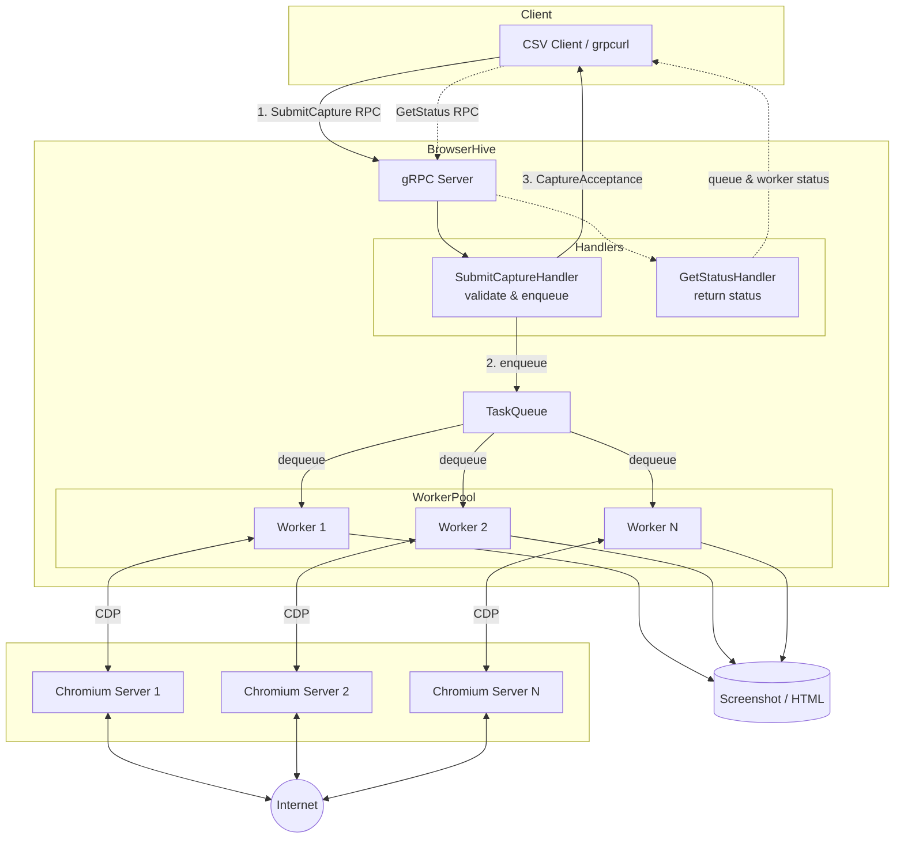

## Features

A server that captures web pages using [chromium-server-docker](https://github.com/uraitakahito/chromium-server-docker). The `BrowserHive` component in the Architecture diagram below represents this application's responsibility.

- **Fire-and-forget pattern**: Requests are accepted immediately and processed asynchronously
- **Worker pool**: Multiple workers process capture tasks concurrently
- **Multiple output formats**: PNG, JPEG screenshots and HTML capture
- **Stealth mode**: Uses [puppeteer-extra-plugin-stealth](https://github.com/berstend/puppeteer-extra/tree/master/packages/puppeteer-extra-plugin-stealth) to bypass bot detection, including Cloudflare WAF

## Architecture



## Setup

### Prerequisites

Run the setup script:

```sh
./setup.sh
```

This will:
- Download Dockerfile and docker-entrypoint.sh
- Clone the chromium-server-docker repository
- Create a .env file

### Starting the Development Environment

```sh
docker compose up -d
```

### Logging into the Container

```sh
docker exec -it browserhive-container /bin/zsh
```

Or use [fdshell](https://github.com/uraitakahito/dotfiles/blob/056c1b0132e720c08b4cb26bc9497b069db6e15d/zsh/myzshrc#L119-L127) (if dotfiles are configured):

```sh
fdshell /bin/zsh
```

### First-time Setup

```sh
docker exec -it browserhive-container sudo chown -R $(id -u):$(id -g) /zsh-volume
```

### Stopping the Environment

```sh
docker compose down
```

## Usage

Please run the following commands inside the Docker container.

### Build

Build the TypeScript source code before running:

```sh
npm run build
```

This command:
1. Generates TypeScript types from `.proto` files using `buf` and `ts-proto`
2. Compiles TypeScript to JavaScript

### gRPC Server

Start the gRPC server to accept capture requests via Protocol Buffers.

The server uses a **fire-and-forget** pattern: requests are accepted immediately and processed asynchronously by a worker pool. Multiple browser URLs can be specified to enable parallel processing.

```sh
LOG_LEVEL=info npm run server -- --browser-url http://chromium-server-1:9222 --browser-url http://chromium-server-2:9222 --output ./output/capture --reject-duplicate-urls | pino-pretty
```

**Using tsx:**

```sh
LOG_LEVEL=info npx tsx bin/server.ts --browser-url http://chromium-server-1:9222 --browser-url http://chromium-server-2:9222 --output ./output/capture --reject-duplicate-urls | pino-pretty
```

#### Calling the gRPC API

See [docs/grpcurl-usage.md](docs/grpcurl-usage.md) for detailed grpcurl usage examples.

### Example: CSV Client

Example client that sends capture requests from a CSV file (fire-and-forget).

The client sends requests and receives acceptance confirmations. Actual captures are processed asynchronously by the server. Check server logs for completion status.

**Usage:**

```sh
npx tsx examples/csv-client.ts --csv data/urls.csv --jpeg --html --limit 30 | pino-pretty
```

## Proto file

The proto file is located at `src/grpc/proto/browserhive/v1/capture.proto`.

TypeScript types are automatically generated from this file during build:
- Generated file: `src/grpc/generated/browserhive/v1/capture.ts`
- Tools: [buf](https://buf.build/) + [ts-proto](https://github.com/stephenh/ts-proto)

To regenerate types manually:

```sh
npm run proto:generate
```

## TLS (Transport Layer Security)

The server supports TLS for secure communication. See [docs/tls-certificates.md](docs/tls-certificates.md) for certificate generation instructions.

To start the server using the pre-prepared sample certificates and private keys, follow these steps:

```sh
LOG_LEVEL=info npm run server -- --browser-url http://chromium-server-1:9222 --browser-url http://chromium-server-2:9222 --output ./output/capture --tls-cert ./certs/sample-server.crt --tls-key ./certs/sample-server.key | pino-pretty
```

Start the client as follows:

```sh
npx tsx examples/csv-client.ts --csv data/urls.csv --jpeg --html --tls-ca-cert ./certs/sample-ca.crt --limit 50 | pino-pretty
```
