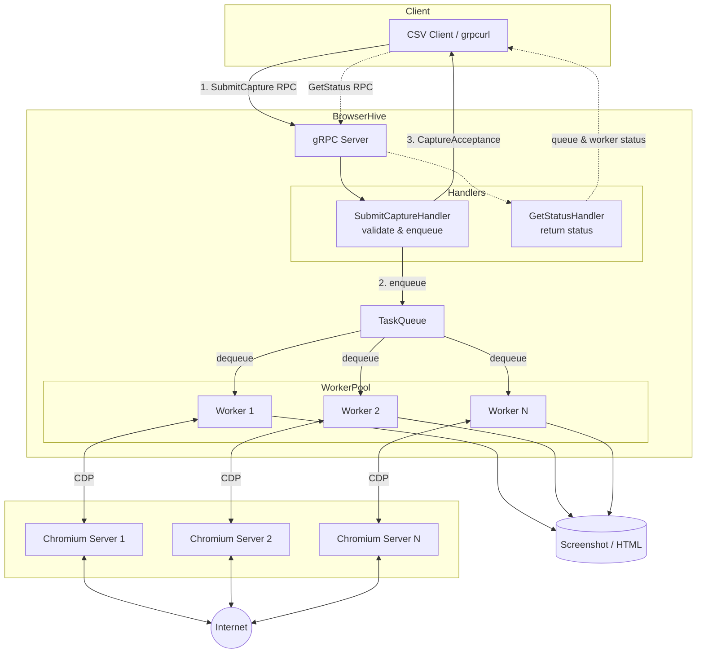

## Features

A server that captures web pages using [chromium-server-docker](https://github.com/uraitakahito/chromium-server-docker). The `BrowserHive` component in the Architecture diagram below represents this application's responsibility.

## Architecture



## Setup

### Chromium Server

**BrowserHive requires a separate Chromium server. Please refer to the README of [chromium-server-docker](https://github.com/uraitakahito/chromium-server-docker) to start the Chromium server.**

### Launching the development Docker container

Please download the required files by following these steps:

```
curl -L -O https://raw.githubusercontent.com/uraitakahito/hello-javascript/refs/heads/main/Dockerfile
curl -L -O https://raw.githubusercontent.com/uraitakahito/hello-javascript/refs/heads/main/docker-entrypoint.sh
chmod 755 docker-entrypoint.sh
```

**Detailed environment setup instructions are described at the beginning of the `Dockerfile`. Only the container start command differs from what's written in the Dockerfile. Please use the following command.**

```sh
#
# Build the Docker image:
#
PROJECT=$(basename `pwd`) && docker image build -t $PROJECT-image . --build-arg user_id=`id -u` --build-arg group_id=`id -g` --build-arg TZ=Asia/Tokyo
#
# Create a volume to persist the command history executed inside the Docker container.
# It is stored in the volume because the dotfiles configuration redirects the shell history there.
#   https://github.com/uraitakahito/dotfiles/blob/b80664a2735b0442ead639a9d38cdbe040b81ab0/zsh/myzshrc#L298-L305
#
docker volume create $PROJECT-zsh-history
#
# If you start two Chromium servers as shown in the linked reference (https://github.com/uraitakahito/chromium-server-docker/blob/6e08d1982c4ad78b845147d1e58f782e3d8ae3f2/Dockerfile#L48-L55), it will look like this:
#
docker container run -d --rm --init --mount type=volume,source=$PROJECT-zsh-history,target=/zsh-volume --mount type=bind,src=/run/host-services/ssh-auth.sock,dst=/run/host-services/ssh-auth.sock -e SSH_AUTH_SOCK=/run/host-services/ssh-auth.sock --mount type=bind,src=`pwd`,dst=/app --network chromium-network --name $PROJECT-container $PROJECT-image
```

## Usage

Please run the following commands inside the Docker container.

### Build

Build the TypeScript source code before running:

```sh
npm run build
```

This command:
1. Generates TypeScript types from `.proto` files using `buf` and `ts-proto`
2. Compiles TypeScript to JavaScript

### gRPC Server

Start the gRPC server to accept capture requests via Protocol Buffers.

The server uses a **fire-and-forget** pattern: requests are accepted immediately and processed asynchronously by a worker pool. Multiple browser URLs can be specified to enable parallel processing.

```sh
LOG_LEVEL=info npm run server -- --browser-url http://chromium-server-1:9222 --browser-url http://chromium-server-2:9222 --output ./output/capture --reject-duplicate-urls | pino-pretty
```

**Using tsx:**

```sh
LOG_LEVEL=info npx tsx bin/server.ts --browser-url http://chromium-server-1:9222 --browser-url http://chromium-server-2:9222 --output ./output/capture --reject-duplicate-urls | pino-pretty
```

#### Calling the gRPC API

See [docs/grpcurl-usage.md](docs/grpcurl-usage.md) for detailed grpcurl usage examples.

### Example: CSV Client

Example client that sends capture requests from a CSV file (fire-and-forget).

The client sends requests and receives acceptance confirmations. Actual captures are processed asynchronously by the server. Check server logs for completion status.

**Usage:**

```sh
npx tsx examples/csv-client.ts --csv data/urls.csv --jpeg --html --limit 30 | pino-pretty
```

## Proto file

The proto file is located at `src/grpc/proto/browserhive/v1/capture.proto`.

TypeScript types are automatically generated from this file during build:
- Generated file: `src/grpc/generated/browserhive/v1/capture.ts`
- Tools: [buf](https://buf.build/) + [ts-proto](https://github.com/stephenh/ts-proto)

To regenerate types manually:

```sh
npm run proto:generate
```

## TLS (Transport Layer Security)

The server supports TLS for secure communication. See [docs/tls-certificates.md](docs/tls-certificates.md) for certificate generation instructions.

To start the server using the pre-prepared sample certificates and private keys, follow these steps:

```sh
LOG_LEVEL=info npm run server -- --browser-url http://chromium-server-1:9222 --browser-url http://chromium-server-2:9222 --output ./output/capture --tls-cert ./certs/sample-server.crt --tls-key ./certs/sample-server.key | pino-pretty
```

Start the client as follows:

```sh
npx tsx examples/csv-client.ts --csv data/urls.csv --jpeg --html --tls-ca-cert ./certs/sample-ca.crt --limit 50 | pino-pretty
```
