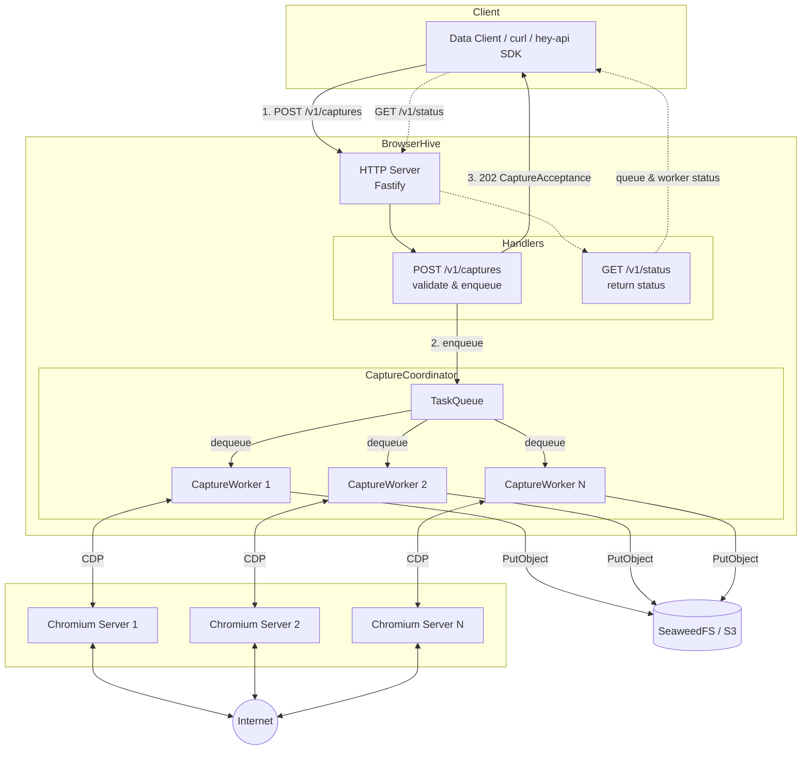

## Features

A server that captures web pages using [chromium-server-docker](https://github.com/uraitakahito/chromium-server-docker).

- **Fire-and-forget pattern**: Requests are accepted immediately and processed asynchronously
- **Capture coordinator**: Multiple workers process capture tasks concurrently
- **Multiple output formats**: PNG / WebP screenshots, HTML capture, PDF rendering (Chromium print pipeline, A4), MHTML single-file archives (CDP `Page.captureSnapshot`), and WACZ replayable archives (full network session, replay via [ReplayWeb.page](https://replayweb.page/))
- **S3-compatible artifact storage**: Every captured artifact is uploaded to a configured S3 bucket (SeaweedFS, AWS S3, Cloudflare R2, …) as `s3://<bucket>/[<keyPrefix>/]<filename>`.
- **Link extraction**: Optional `<a href>` extraction uploaded as `{taskId}_..._labels.links.json` alongside the screenshots — designed for use as the discovery side of an external crawl driver
- **Stealth mode**: Uses [puppeteer-extra-plugin-stealth](https://github.com/berstend/puppeteer-extra/tree/master/packages/puppeteer-extra-plugin-stealth) to bypass bot detection, including Cloudflare WAF
- **Banner / modal dismissal**: Per-request flag that strips known cookie-consent banners (OneTrust, Cookiebot, Quantcast, etc.) and large fixed/sticky overlays before capturing. Accepts a plain `boolean` for the curated default behaviour, or an inline `DismissSpec` object to customise per page (extra selectors, framework exclusions, heuristic thresholds). Best-effort by default — failures are swallowed so a malformed page or a typo cannot fail the capture; opt into strict mode with `failOnError: true` when a missing dismiss should fail the capture instead. See the OpenAPI reference for the full schema.
- **Per-task state isolation**: By default, per-task state (cookies / `localStorage` / DOM context) is wiped between tasks via `about:blank` + `Network.clearBrowserCookies`. The wipe is configurable per-server (`--no-reset-cookies` / `--no-reset-page-context` and the matching `BROWSERHIVE_RESET_*` env vars) and per-request (the `resetState` field on `POST /v1/captures`) — useful for SSO-walled crawls or stateful multi-page journeys against a single origin.
- **OpenAPI 3.1 contract**: [`src/http/openapi.yaml`](src/http/openapi.yaml) is the single source of truth — published as a Redoc reference at <https://uraitakahito.github.io/browserhive/>; request/response types and runtime validation are both driven from it.
- Used by [waggle](https://github.com/uraitakahito/waggle).

## Architecture


```mermaid
flowchart TB
    subgraph Client
        CLI[Data Client / curl / hey-api SDK]
    end

    subgraph BrowserHive["BrowserHive"]
        direction TB
        Server[HTTP Server<br/>Fastify]
        subgraph Handlers["Handlers"]
            SubmitCaptureHandler[POST /v1/captures<br/>validate & enqueue]
            GetStatusHandler[GET /v1/status<br/>return status]
        end
        subgraph CaptureCoordinator
            Queue[TaskQueue]
            Worker1[CaptureWorker 1]
            Worker2[CaptureWorker 2]
            Worker3[CaptureWorker N]
        end
    end

    subgraph ChromiumServers[" "]
        Browser1[Chromium Server 1]
        Browser2[Chromium Server 2]
        Browser3[Chromium Server N]
    end

    Internet((Internet))

    Storage[(SeaweedFS / S3)]

    CLI -->|"1. POST /v1/captures"| Server
    Server --> SubmitCaptureHandler
    SubmitCaptureHandler -->|"2. enqueue"| Queue
    SubmitCaptureHandler -->|"3. 202 CaptureAcceptance"| CLI
    CLI -.->|"GET /v1/status"| Server
    Server -.-> GetStatusHandler
    GetStatusHandler -.->|"queue & worker status"| CLI
    Queue -->|dequeue| Worker1
    Queue -->|dequeue| Worker2
    Queue -->|dequeue| Worker3
    Worker1 <-->|CDP| Browser1
    Worker2 <-->|CDP| Browser2
    Worker3 <-->|CDP| Browser3
    Browser1 <--> Internet
    Browser2 <--> Internet
    Browser3 <--> Internet
    Worker1 -->|"PutObject"| Storage
    Worker2 -->|"PutObject"| Storage
    Worker3 -->|"PutObject"| Storage
```

## Setup

### Prerequisites

Run the setup script:

```sh
./setup.sh
```

### Development Environment

See [docs/development-environment.md](docs/development-environment.md).

### Production Environment

See [docs/production-environment.md](docs/production-environment.md).

## Usage

Please run the following commands inside the Docker container.

### Build

```sh
npm run build
```

### HTTP Server

Start the HTTP server to accept capture requests via JSON over HTTP.

When `BROWSERHIVE_BROWSER_URLS` and the `BROWSERHIVE_S3_*` group are set (the dev/prod compose files already do this), the start command is just:

```sh
LOG_LEVEL=info npm run server | pino-pretty
```

CLI flags override env values; mix and match as needed:

```sh
LOG_LEVEL=info npm run server -- \
  --reject-duplicate-urls \
  --user-agent "Mozilla/5.0 (Macintosh; Intel Mac OS X 10_15_7) AppleWebKit/537.36 (KHTML, like Gecko) Chrome/143.0.0.0 Safari/537.36" \
  | pino-pretty
```

#### Environment variables

Every CLI flag has a `BROWSERHIVE_*` env-var equivalent. Resolution order is **CLI flag > env var > default**.

| CLI flag | Environment variable | Type / format |
|---|---|---|
| `--port <port>` | `BROWSERHIVE_PORT` | integer (1–65535) |
| `--browser-url <urls...>` | `BROWSERHIVE_BROWSER_URLS` | comma-separated list (required) |
| `--s3-endpoint <url>` | `BROWSERHIVE_S3_ENDPOINT` | URL (required) |
| `--s3-region <region>` | `BROWSERHIVE_S3_REGION` | string (default `us-east-1`) |
| `--s3-bucket <name>` | `BROWSERHIVE_S3_BUCKET` | string (required) |
| `--s3-access-key-id <id>` | `BROWSERHIVE_S3_ACCESS_KEY_ID` | string (required; prefer env to avoid `ps` leak) |
| `--s3-secret-access-key <secret>` | `BROWSERHIVE_S3_SECRET_ACCESS_KEY` | string (required; prefer env to avoid `ps` leak) |
| `--s3-key-prefix <prefix>` | `BROWSERHIVE_S3_KEY_PREFIX` | string (no trailing slash; default empty) |
| `--no-s3-force-path-style` | — | flip path-style addressing off (AWS S3 only; SeaweedFS / most self-hosted S3 require path-style) |
| `--page-load-timeout <ms>` | `BROWSERHIVE_PAGE_LOAD_TIMEOUT_MS` | positive integer |
| `--capture-timeout <ms>` | `BROWSERHIVE_CAPTURE_TIMEOUT_MS` | positive integer |
| `--task-timeout <ms>` | `BROWSERHIVE_TASK_TIMEOUT_MS` | positive integer (Layer B per-task safety net) |
| `--max-retry-count <n>` | `BROWSERHIVE_MAX_RETRY_COUNT` | non-negative integer |
| `--queue-poll-interval-ms <ms>` | `BROWSERHIVE_QUEUE_POLL_INTERVAL_MS` | positive integer |
| `--viewport-width <px>` | `BROWSERHIVE_VIEWPORT_WIDTH` | positive integer (server-wide default; per-request `viewport.width` overrides) |
| `--viewport-height <px>` | `BROWSERHIVE_VIEWPORT_HEIGHT` | positive integer (server-wide default; per-request `viewport.height` overrides) |
| `--screenshot-full-page` | `BROWSERHIVE_SCREENSHOT_FULL_PAGE` | `"true"`/`"1"` or `"false"`/`"0"` (server-wide default; per-request `fullPage` overrides) |
| `--screenshot-quality <n>` | `BROWSERHIVE_SCREENSHOT_QUALITY` | integer (1–100) |
| `--reject-duplicate-urls` | `BROWSERHIVE_REJECT_DUPLICATE_URLS` | `"true"`/`"1"` or `"false"`/`"0"` |
| `--no-reset-cookies` | `BROWSERHIVE_RESET_COOKIES` | `"true"`/`"1"` or `"false"`/`"0"` (server-wide default for the inter-task cookie wipe; per-request `resetState.cookies` overrides) |
| `--no-reset-page-context` | `BROWSERHIVE_RESET_PAGE_CONTEXT` | `"true"`/`"1"` or `"false"`/`"0"` (server-wide default for the inter-task `about:blank` navigation; per-request `resetState.pageContext` overrides) |
| `--user-agent <string>` | `BROWSERHIVE_USER_AGENT` | string |
| `--wacz-max-response-bytes <n>` | `BROWSERHIVE_WACZ_MAX_RESPONSE_BYTES` | positive integer (per-response body cap; default 20 MB) |
| `--wacz-max-task-bytes <n>` | `BROWSERHIVE_WACZ_MAX_TASK_BYTES` | positive integer (per-task cumulative body cap; default 200 MB) |
| `--wacz-max-pending-requests <n>` | `BROWSERHIVE_WACZ_MAX_PENDING_REQUESTS` | positive integer (in-flight tracking cap; default 5000) |
| `--wacz-block-pattern <patterns...>` | `BROWSERHIVE_WACZ_BLOCK_PATTERNS` | comma-separated globs (default bundled analytics list) |
| `--wacz-skip-content-types <prefixes...>` | `BROWSERHIVE_WACZ_SKIP_CONTENT_TYPES` | comma-separated MIME prefixes (default empty) |
| `--wacz-fuzzy-param <names...>` | `BROWSERHIVE_WACZ_FUZZY_PARAMS` | comma-separated query param names treated as cache-busters at replay time |
| `--tls-cert <path>` | `BROWSERHIVE_TLS_CERT` | path |
| `--tls-key <path>` | `BROWSERHIVE_TLS_KEY` | path |

The `data-client` example accepts two env vars: `BROWSERHIVE_SERVER` (default `http://localhost:8080`) and `BROWSERHIVE_TLS_CA_CERT` (informational; for actual CA pinning use `NODE_EXTRA_CA_CERTS`). Per-job flags (`--data`, `--png`, `--webp`, `--html`, `--links`, `--pdf`, `--mhtml`, `--wacz`, `--limit`, `--dismiss-banners`, `--accept-language`, `--viewport-width`, `--viewport-height`, `--full-page`) intentionally have no env equivalents.

#### Calling the HTTP API

The full operation reference (request/response schemas, status codes, request samples) is published as a static Redoc site on GitHub Pages — see [OpenAPI specification](#openapi-specification) below.

### Example: Data Client

Example client that sends capture requests from a YAML data file (fire-and-forget). The format and parser live in [`examples/data-file.ts`](examples/data-file.ts).

The client sends requests and receives acceptance confirmations. Actual captures are processed asynchronously by the server. Check server logs for completion status.

**Usage:**

Build first (the example is shipped only as TypeScript source):

```sh
npm run build
node dist/examples/data-client.js \
  --data data/smoke-test.yaml --webp --html --links --limit 30 \
  --accept-language "ja-JP,ja;q=0.9,en-US;q=0.8,en;q=0.7" \
  | pino-pretty
```

## Storage

See [docs/storage.md](docs/storage.md).

## TLS (Transport Layer Security)

The server supports TLS for secure communication. See [docs/tls-certificates.md](docs/tls-certificates.md) for certificate generation instructions.

## State Machines

The system uses [XState v5](https://stately.ai/docs) state machines with a Parent-Child Actor Model. See [docs/state-machines.md](docs/state-machines.md) for the lifecycle diagrams (`coordinatorMachine`, `captureWorkerMachine`) and the worker health-state table.
