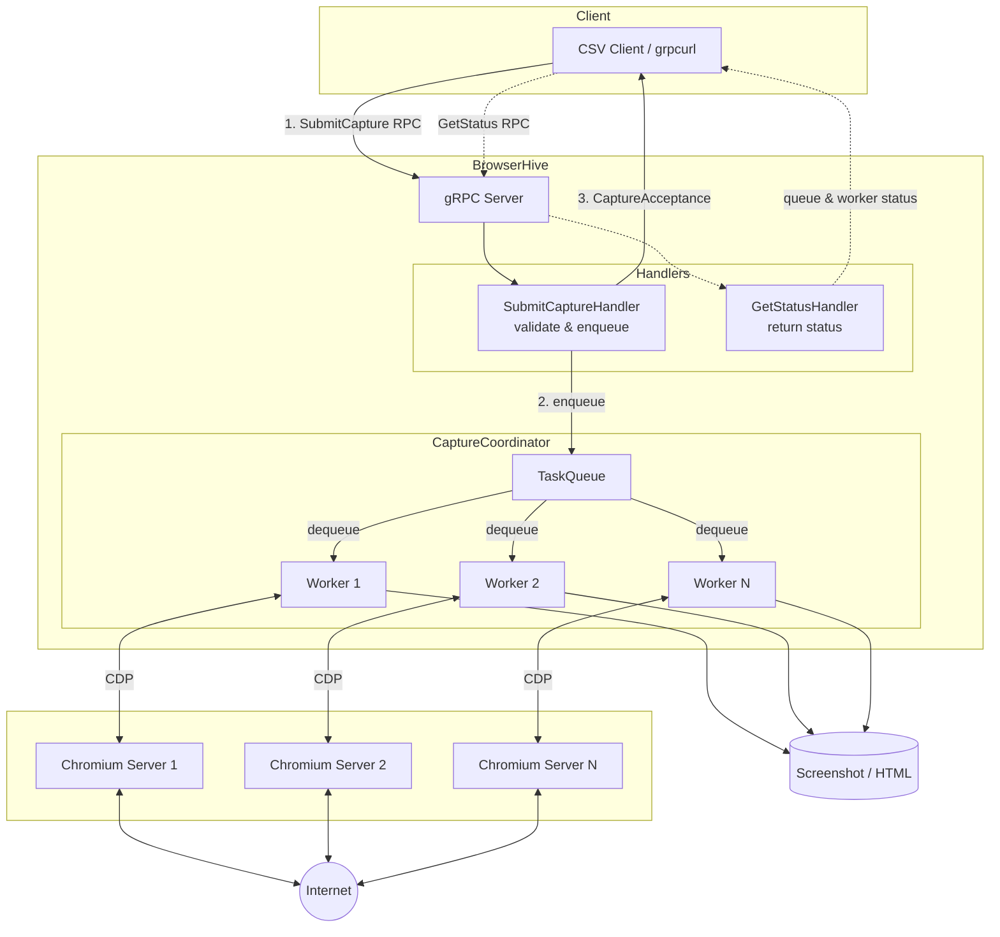
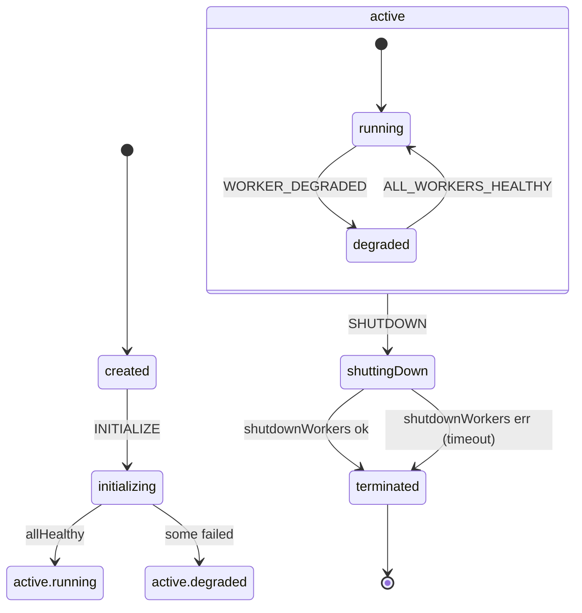
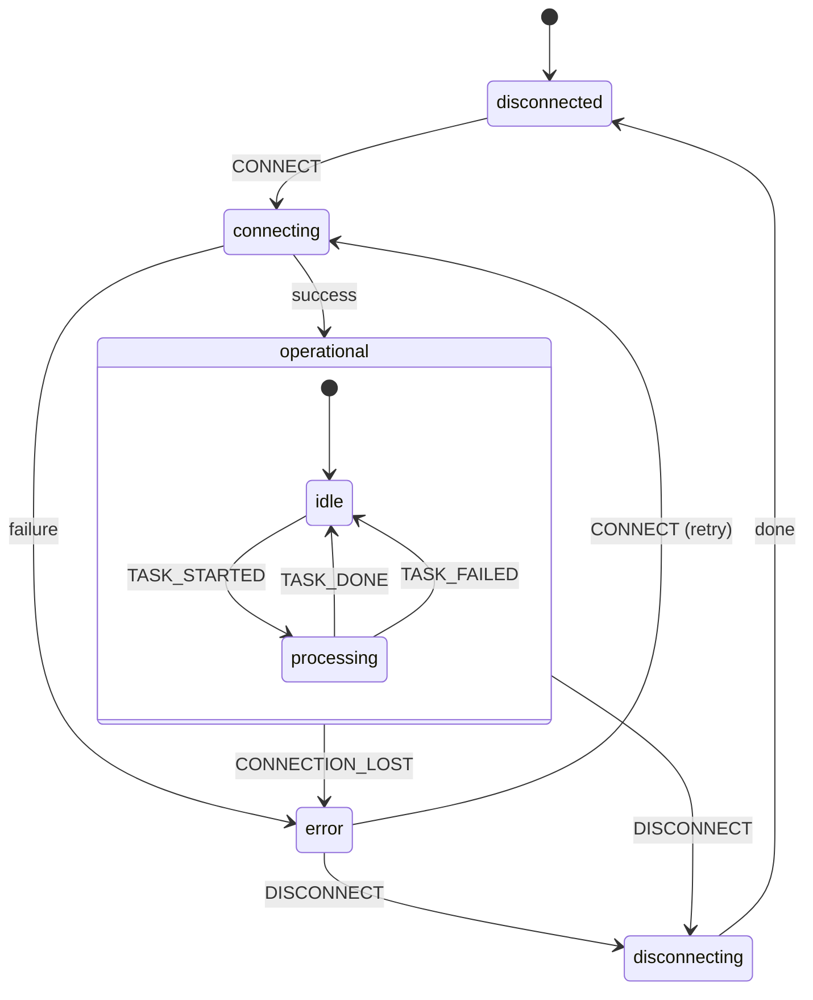

## Features

A server that captures web pages using [chromium-server-docker](https://github.com/uraitakahito/chromium-server-docker). The `BrowserHive` component in the Architecture diagram below represents this application's responsibility.

- **Fire-and-forget pattern**: Requests are accepted immediately and processed asynchronously
- **Capture coordinator**: Multiple workers process capture tasks concurrently
- **Multiple output formats**: PNG, JPEG screenshots and HTML capture
- **Stealth mode**: Uses [puppeteer-extra-plugin-stealth](https://github.com/berstend/puppeteer-extra/tree/master/packages/puppeteer-extra-plugin-stealth) to bypass bot detection, including Cloudflare WAF

## Architecture


```mermaid
flowchart TB
    subgraph Client
        CLI[CSV Client / grpcurl]
    end

    subgraph BrowserHive["BrowserHive"]
        direction TB
        Server[gRPC Server]
        subgraph Handlers["Handlers"]
            SubmitCaptureHandler[SubmitCaptureHandler<br/>validate & enqueue]
            GetStatusHandler[GetStatusHandler<br/>return status]
        end
        subgraph CaptureCoordinator
            Queue[TaskQueue]
            Worker1[Worker 1]
            Worker2[Worker 2]
            Worker3[Worker N]
        end
    end

    subgraph ChromiumServers[" "]
        Browser1[Chromium Server 1]
        Browser2[Chromium Server 2]
        Browser3[Chromium Server N]
    end

    Internet((Internet))

    Files[(Screenshot / HTML)]

    CLI -->|"1. SubmitCapture RPC"| Server
    Server --> SubmitCaptureHandler
    SubmitCaptureHandler -->|"2. enqueue"| Queue
    SubmitCaptureHandler -->|"3. CaptureAcceptance"| CLI
    CLI -.->|"GetStatus RPC"| Server
    Server -.-> GetStatusHandler
    GetStatusHandler -.->|"queue & worker status"| CLI
    Queue -->|dequeue| Worker1
    Queue -->|dequeue| Worker2
    Queue -->|dequeue| Worker3
    Worker1 <-->|CDP| Browser1
    Worker2 <-->|CDP| Browser2
    Worker3 <-->|CDP| Browser3
    Browser1 <--> Internet
    Browser2 <--> Internet
    Browser3 <--> Internet
    Worker1 --> Files
    Worker2 --> Files
    Worker3 --> Files
```

## State Machines

The system uses [XState v5](https://stately.ai/docs) state machines with a Parent-Child Actor Model.

### Coordinator Lifecycle

`running` and `degraded` are substates of a compound `active` state. The
`watchWorkerHealth` invoke and the `SHUTDOWN` transition live on `active`,
so they are unaffected by `running ↔ degraded` oscillations.

Init failures are non-fatal: partial or total connect failures land in
`active.degraded` instead of `terminated`. While in `active.degraded`, the
coordinator periodically retries failed workers (1s → 2s → 4s → … capped at
60s) and lifts back to `active.running` once every worker is healthy.
`submitCapture` is accepted while in any `active.*` substate as long as at
least one worker is operational.


```mermaid
stateDiagram-v2
    [*] --> created
    created --> initializing : INITIALIZE
    initializing --> active.running : allHealthy
    initializing --> active.degraded : some failed

    state active {
        [*] --> running
        running --> degraded : WORKER_DEGRADED
        degraded --> running : ALL_WORKERS_HEALTHY
    }

    active --> shuttingDown : SHUTDOWN
    shuttingDown --> terminated : shutdownWorkers ok
    shuttingDown --> terminated : shutdownWorkers err (timeout)
    terminated --> [*]
```

### Capture Worker

Each capture worker actor uses compound states. The `operational` state invokes a `fromCallback` worker loop that polls the task queue and processes captures. The `connecting` and `disconnecting` states invoke `fromPromise` actors that return `Result<void, ErrorDetails>` instead of throwing — the machine branches in `onDone` on `event.output.ok`. Disconnect failures still transition to `disconnected` (best-effort) but log the underlying error. From `error`, the coordinator's retry actor (running while in the `degraded` lifecycle) sends `CONNECT` to bring the worker back through `connecting`.


```mermaid
stateDiagram-v2
    [*] --> disconnected
    disconnected --> connecting : CONNECT

    connecting --> operational : success
    connecting --> error : failure

    state operational {
        [*] --> idle
        idle --> processing : TASK_STARTED
        processing --> idle : TASK_DONE
        processing --> idle : TASK_FAILED
    }

    operational --> error : CONNECTION_LOST
    operational --> disconnecting : DISCONNECT

    error --> connecting : CONNECT (retry)
    error --> disconnecting : DISCONNECT

    disconnecting --> disconnected : done
```

| State | Tags | Description |
|-------|------|-------------|
| `disconnected` | | Not connected to remote browser (initial or after disconnect) |
| `connecting` | | Connecting to remote browser (invoke) |
| `operational.idle` | `healthy`, `canProcess` | Ready to accept tasks |
| `operational.processing` | `healthy` | Processing a capture task |
| `error` | | Connection lost or connect failure |
| `disconnecting` | | Disconnecting browser (invoke) |

## Setup

### Prerequisites

Run the setup script:

```sh
./setup.sh
```

### Development Environment

```sh
docker compose -f compose.dev.yaml up -d
docker exec -it browserhive-container /bin/zsh
```

```sh
# inside the container, first time only:
sudo chown -R $(id -u):$(id -g) /zsh-volume

npm ci
npm run build
npm run server -- \
  --browser-url http://chromium-server-1:9222 \
  --browser-url http://chromium-server-2:9222 \
  --output ./output/capture | pino-pretty
```

Stop with:

```sh
docker compose -f compose.dev.yaml down
```

### Production Environment

```sh
docker compose -f compose.prod.yaml up -d --build
docker compose -f compose.prod.yaml logs -f browserhive

# verify
grpcurl -plaintext localhost:50051 browserhive.v1.CaptureService/GetStatus
```

Stop with:

```sh
docker compose -f compose.prod.yaml down
```

To build the production image standalone (e.g. to push to a registry):

```sh
docker build -f Dockerfile.prod -t browserhive:<version> .
```

## Usage

Please run the following commands inside the Docker container.

### Build

Build the TypeScript source code before running:

```sh
npm run build
```

This command:
1. Generates TypeScript types from `.proto` files using `buf` and `ts-proto`
2. Compiles TypeScript to JavaScript

### gRPC Server

Start the gRPC server to accept capture requests via Protocol Buffers.

The server uses a **fire-and-forget** pattern: requests are accepted immediately and processed asynchronously by the capture coordinator. Multiple browser URLs can be specified to enable parallel processing.

```sh
LOG_LEVEL=info npm run server -- --browser-url http://chromium-server-1:9222 --browser-url http://chromium-server-2:9222 --output ./output/capture --reject-duplicate-urls --user-agent "Mozilla/5.0 (Macintosh; Intel Mac OS X 10_15_7) AppleWebKit/537.36 (KHTML, like Gecko) Chrome/143.0.0.0 Safari/537.36" --accept-language "ja-JP,ja;q=0.9,en-US;q=0.8,en;q=0.7" | pino-pretty
```

**Using tsx:**

```sh
LOG_LEVEL=info npx tsx bin/server.ts --browser-url http://chromium-server-1:9222 --browser-url http://chromium-server-2:9222 --output ./output/capture --reject-duplicate-urls --user-agent "Mozilla/5.0 (Macintosh; Intel Mac OS X 10_15_7) AppleWebKit/537.36 (KHTML, like Gecko) Chrome/131.0.0.0 Safari/537.36" --accept-language "ja-JP,ja;q=0.9,en-US;q=0.8,en;q=0.7"| pino-pretty
```

#### Calling the gRPC API

See [docs/grpcurl-usage.md](docs/grpcurl-usage.md) for detailed grpcurl usage examples.

### Example: CSV Client

Example client that sends capture requests from a CSV file (fire-and-forget).

The client sends requests and receives acceptance confirmations. Actual captures are processed asynchronously by the server. Check server logs for completion status.

**Usage:**

```sh
npx tsx examples/csv-client.ts --csv data/urls.csv --jpeg --html --limit 30 | pino-pretty
```

## Proto file

The proto file is located at `src/grpc/proto/browserhive/v1/capture.proto`.

TypeScript types are automatically generated from this file during build:
- Generated file: `src/grpc/generated/browserhive/v1/capture.ts`
- Tools: [buf](https://buf.build/) + [ts-proto](https://github.com/stephenh/ts-proto)

To regenerate types manually:

```sh
npm run proto:generate
```

## TLS (Transport Layer Security)

The server supports TLS for secure communication. See [docs/tls-certificates.md](docs/tls-certificates.md) for certificate generation instructions.

To start the server using the pre-prepared sample certificates and private keys, follow these steps:

```sh
LOG_LEVEL=info npm run server -- --browser-url http://chromium-server-1:9222 --browser-url http://chromium-server-2:9222 --output ./output/capture --tls-cert ./certs/sample-server.crt --tls-key ./certs/sample-server.key --user-agent "Mozilla/5.0 (Macintosh; Intel Mac OS X 10_15_7) AppleWebKit/537.36 (KHTML, like Gecko) Chrome/131.0.0.0 Safari/537.36" | pino-pretty
```

Start the client as follows:

```sh
npx tsx examples/csv-client.ts --csv data/urls.csv --jpeg --html --tls-ca-cert ./certs/sample-ca.crt --limit 50 | pino-pretty
```
