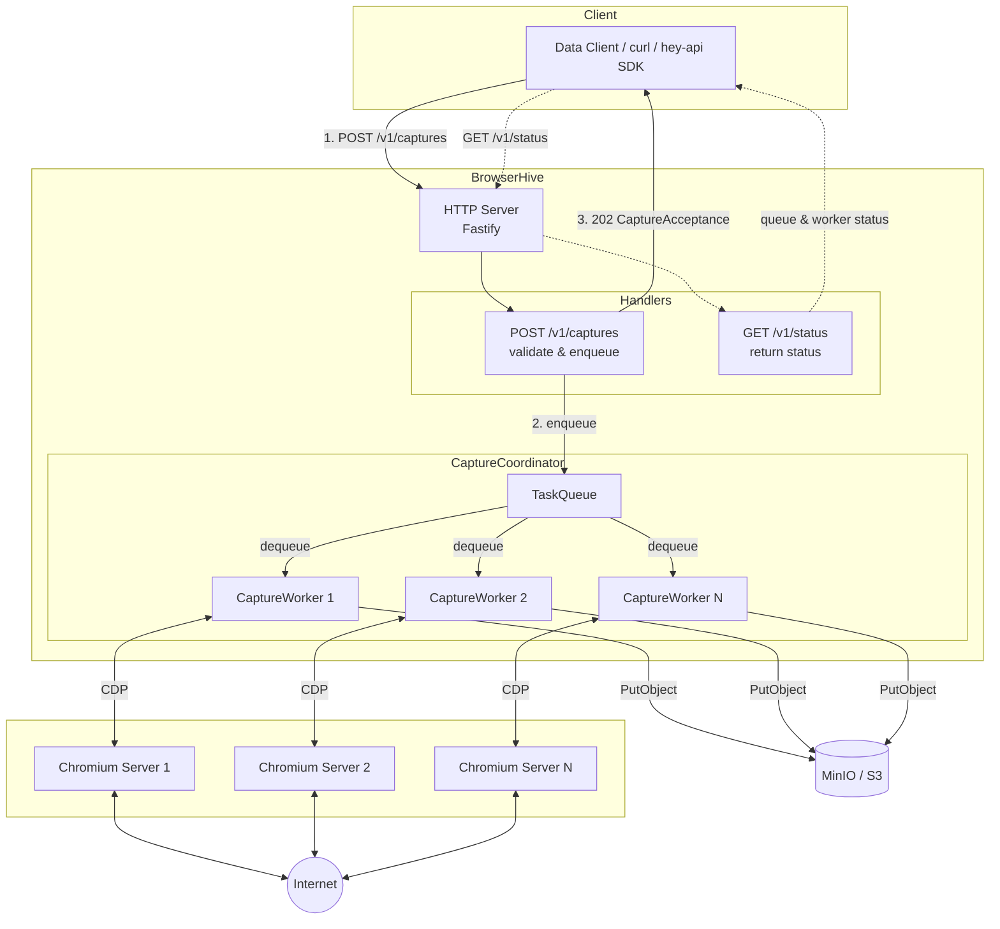

## Features

A server that captures web pages using [chromium-server-docker](https://github.com/uraitakahito/chromium-server-docker). The `BrowserHive` component in the Architecture diagram below represents this application's responsibility.

Used by [waggle](https://github.com/uraitakahito/waggle).

- **Fire-and-forget pattern**: Requests are accepted immediately and processed asynchronously
- **Capture coordinator**: Multiple workers process capture tasks concurrently
- **Multiple output formats**: PNG, JPEG screenshots, HTML capture, and PDF rendering (Chromium print pipeline, A4)
- **S3-compatible artifact storage**: Every captured artifact is uploaded to a configured S3 bucket (MinIO, AWS S3, Cloudflare R2, …) as `s3://<bucket>/[<keyPrefix>/]<filename>`. Both `compose.dev.yaml` and `compose.prod.yaml` ship with a self-hosted MinIO; point at an external store via `BROWSERHIVE_S3_ENDPOINT`.
- **Link extraction**: Optional `<a href>` extraction uploaded as `{taskId}_..._labels.links.json` alongside the screenshots — designed for use as the discovery side of an external crawl driver
- **Stealth mode**: Uses [puppeteer-extra-plugin-stealth](https://github.com/berstend/puppeteer-extra/tree/master/packages/puppeteer-extra-plugin-stealth) to bypass bot detection, including Cloudflare WAF
- **Banner / modal dismissal**: Per-request flag that strips known cookie-consent banners (OneTrust, Cookiebot, Quantcast, etc.) and large fixed/sticky overlays before capturing. Accepts a plain `boolean` for the curated default behaviour, or an inline `DismissSpec` object to customise per page (extra selectors, framework exclusions, heuristic thresholds). Best-effort by default — failures are swallowed so a malformed page or a typo cannot fail the capture; opt into strict mode with `failOnError: true` when a missing dismiss should fail the capture instead. See the OpenAPI reference for the full schema.
- **OpenAPI 3.1 contract**: [`src/http/openapi.yaml`](src/http/openapi.yaml) is the single source of truth — published as a Redoc reference at <https://uraitakahito.github.io/browserhive/>; request/response types and runtime validation are both driven from it.

## Architecture

Each "Worker" box below corresponds to one `CaptureWorker` instance — a
spawned `captureWorkerMachine` actor bundled with its `BrowserClient`.
Each worker holds a single persistent Chromium tab (the one
`chromium-server-docker` opens at startup) for its entire lifetime;
capture tasks navigate that same tab rather than opening a new one per
task. Per-task state (cookies / `localStorage` / DOM context) is wiped
between tasks via `about:blank` + `Network.clearBrowserCookies`.


```mermaid
flowchart TB
    subgraph Client
        CLI[Data Client / curl / hey-api SDK]
    end

    subgraph BrowserHive["BrowserHive"]
        direction TB
        Server[HTTP Server<br/>Fastify]
        subgraph Handlers["Handlers"]
            SubmitCaptureHandler[POST /v1/captures<br/>validate & enqueue]
            GetStatusHandler[GET /v1/status<br/>return status]
        end
        subgraph CaptureCoordinator
            Queue[TaskQueue]
            Worker1[CaptureWorker 1]
            Worker2[CaptureWorker 2]
            Worker3[CaptureWorker N]
        end
    end

    subgraph ChromiumServers[" "]
        Browser1[Chromium Server 1]
        Browser2[Chromium Server 2]
        Browser3[Chromium Server N]
    end

    Internet((Internet))

    Storage[(MinIO / S3)]

    CLI -->|"1. POST /v1/captures"| Server
    Server --> SubmitCaptureHandler
    SubmitCaptureHandler -->|"2. enqueue"| Queue
    SubmitCaptureHandler -->|"3. 202 CaptureAcceptance"| CLI
    CLI -.->|"GET /v1/status"| Server
    Server -.-> GetStatusHandler
    GetStatusHandler -.->|"queue & worker status"| CLI
    Queue -->|dequeue| Worker1
    Queue -->|dequeue| Worker2
    Queue -->|dequeue| Worker3
    Worker1 <-->|CDP| Browser1
    Worker2 <-->|CDP| Browser2
    Worker3 <-->|CDP| Browser3
    Browser1 <--> Internet
    Browser2 <--> Internet
    Browser3 <--> Internet
    Worker1 -->|"PutObject"| Storage
    Worker2 -->|"PutObject"| Storage
    Worker3 -->|"PutObject"| Storage
```

## Setup

### Prerequisites

Run the setup script:

```sh
./setup.sh
```

### Development Environment

`compose.dev.yaml` brings up everything the server needs in one shot —
two Chromium servers, a self-hosted MinIO (S3-compatible artifact store),
a one-shot `mc mb` init container that creates the `browserhive` bucket,
and the BrowserHive container itself. All `BROWSERHIVE_*` env vars are
already injected, so the in-container start command takes no CLI flags:

```sh
GH_TOKEN=$(gh auth token) docker compose -f compose.dev.yaml up -d
docker exec -it browserhive-container /bin/zsh
```

`GH_TOKEN` is intentionally **not** stored in `.env`. The token is fetched from the host's `gh` CLI (macOS Keychain-backed) at launch time and exists only in the running container's environment. If you forget the prefix, the container will still start but Claude Code / `gh` inside it will be unauthenticated.

```sh
# inside the container, first time only:
sudo chown -R $(id -u):$(id -g) /zsh-volume

npm ci
npm run build
npm run server | pino-pretty
```

Override individual settings ad hoc by either setting another env var or by passing the equivalent CLI flag (CLI > env > default). See [Environment variables](#environment-variables) for the full list.

Stop with:

```sh
docker compose -f compose.dev.yaml down
```

#### Inspecting Chromium via noVNC

The dev compose stack runs the development image for both chromium servers, which embeds Xvfb + x11vnc + noVNC. Open these URLs from the host browser to watch the running Chromium:

| Server | noVNC (browser) | Raw VNC |
|--------|-----------------|---------|
| chromium-server-1 | http://localhost:6080/ | `localhost:5901` |
| chromium-server-2 | http://localhost:6081/ | `localhost:5902` |

#### Browsing captured artifacts in MinIO

The bundled MinIO instance exposes its console at <http://localhost:9001>
(default credentials `minioadmin` / `minioadmin`, overridable via the
`MINIO_ROOT_USER` / `MINIO_ROOT_PASSWORD` env vars on `docker compose
up`). Captured artifacts land at `s3://browserhive/<filename>` and can
also be listed via `mc ls local/browserhive` after `mc alias set local
http://localhost:9000 minioadmin minioadmin`.

### Production Environment

`compose.prod.yaml` mirrors the dev stack — two Chromium servers, a
self-hosted MinIO + bucket-init container, and the BrowserHive
production image — and supplies all required configuration via
`BROWSERHIVE_*` environment variables; no `command:` overrides are
needed. The bundled MinIO is **not** published to host ports (only
`expose:`d on the internal network). Override `BROWSERHIVE_S3_ENDPOINT`
and the credential env vars to point at an external S3 (AWS, Cloudflare
R2, managed MinIO) instead.

```sh
docker compose -f compose.prod.yaml up -d --build
docker compose -f compose.prod.yaml logs -f browserhive

# verify
curl http://localhost:8080/v1/status
```

Stop with:

```sh
docker compose -f compose.prod.yaml down
```

> **Note:** The MinIO data volume (`browserhive-minio-prod-data`) holds
> every captured artifact. Plan its backup / lifecycle separately —
> `docker compose down -v` will wipe it. For external S3 deployments,
> the volume is unused.

To build the production image standalone (e.g. to push to a registry):

```sh
docker build -f Dockerfile.prod -t browserhive:<version> .
```

Standalone run, pointing at an external S3-compatible store:

```sh
docker run --rm -p 8080:8080 \
  -e BROWSERHIVE_BROWSER_URLS=http://chromium-server-1:9222 \
  -e BROWSERHIVE_S3_ENDPOINT=https://minio.example.com \
  -e BROWSERHIVE_S3_BUCKET=browserhive \
  -e BROWSERHIVE_S3_ACCESS_KEY_ID=... \
  -e BROWSERHIVE_S3_SECRET_ACCESS_KEY=... \
  browserhive:<version>
```

## Usage

Please run the following commands inside the Docker container.

### Build

```sh
npm run build
```

### HTTP Server

Start the HTTP server to accept capture requests via JSON over HTTP.

The server uses a **fire-and-forget** pattern: requests are accepted immediately and processed asynchronously by the capture coordinator. Multiple browser URLs can be specified to enable parallel processing.

When `BROWSERHIVE_BROWSER_URLS` and the `BROWSERHIVE_S3_*` group are set (the dev/prod compose files already do this), the start command is just:

```sh
LOG_LEVEL=info npm run server | pino-pretty
```

CLI flags override env values; mix and match as needed:

```sh
LOG_LEVEL=info npm run server -- \
  --reject-duplicate-urls \
  --user-agent "Mozilla/5.0 (Macintosh; Intel Mac OS X 10_15_7) AppleWebKit/537.36 (KHTML, like Gecko) Chrome/143.0.0.0 Safari/537.36" \
  | pino-pretty
```

`Accept-Language` is configured per request via the `acceptLanguage` field on
`POST /v1/captures` (see the OpenAPI reference below). When the field is
omitted, the upstream Chromium uses its built-in default.

#### Environment variables

Every CLI flag has a `BROWSERHIVE_*` env-var equivalent. Resolution order is **CLI flag > env var > default**.

| CLI flag | Environment variable | Type / format |
|---|---|---|
| `--port <port>` | `BROWSERHIVE_PORT` | integer (1–65535) |
| `--browser-url <urls...>` | `BROWSERHIVE_BROWSER_URLS` | comma-separated list (required) |
| `--s3-endpoint <url>` | `BROWSERHIVE_S3_ENDPOINT` | URL (required) |
| `--s3-region <region>` | `BROWSERHIVE_S3_REGION` | string (default `us-east-1`) |
| `--s3-bucket <name>` | `BROWSERHIVE_S3_BUCKET` | string (required) |
| `--s3-access-key-id <id>` | `BROWSERHIVE_S3_ACCESS_KEY_ID` | string (required; prefer env to avoid `ps` leak) |
| `--s3-secret-access-key <secret>` | `BROWSERHIVE_S3_SECRET_ACCESS_KEY` | string (required; prefer env to avoid `ps` leak) |
| `--s3-key-prefix <prefix>` | `BROWSERHIVE_S3_KEY_PREFIX` | string (no trailing slash; default empty) |
| `--no-s3-force-path-style` | — | flip path-style addressing off (AWS S3 only; MinIO requires path-style) |
| `--page-load-timeout <ms>` | `BROWSERHIVE_PAGE_LOAD_TIMEOUT_MS` | positive integer |
| `--capture-timeout <ms>` | `BROWSERHIVE_CAPTURE_TIMEOUT_MS` | positive integer |
| `--task-timeout <ms>` | `BROWSERHIVE_TASK_TIMEOUT_MS` | positive integer (Layer B per-task safety net) |
| `--max-retry-count <n>` | `BROWSERHIVE_MAX_RETRY_COUNT` | non-negative integer |
| `--queue-poll-interval-ms <ms>` | `BROWSERHIVE_QUEUE_POLL_INTERVAL_MS` | positive integer |
| `--viewport-width <px>` | `BROWSERHIVE_VIEWPORT_WIDTH` | positive integer |
| `--viewport-height <px>` | `BROWSERHIVE_VIEWPORT_HEIGHT` | positive integer |
| `--screenshot-full-page` | `BROWSERHIVE_SCREENSHOT_FULL_PAGE` | `"true"`/`"1"` or `"false"`/`"0"` |
| `--screenshot-quality <n>` | `BROWSERHIVE_SCREENSHOT_QUALITY` | integer (1–100) |
| `--reject-duplicate-urls` | `BROWSERHIVE_REJECT_DUPLICATE_URLS` | `"true"`/`"1"` or `"false"`/`"0"` |
| `--user-agent <string>` | `BROWSERHIVE_USER_AGENT` | string |
| `--tls-cert <path>` | `BROWSERHIVE_TLS_CERT` | path |
| `--tls-key <path>` | `BROWSERHIVE_TLS_KEY` | path |

The `data-client` example accepts two env vars: `BROWSERHIVE_SERVER` (default `http://localhost:8080`) and `BROWSERHIVE_TLS_CA_CERT` (informational; for actual CA pinning use `NODE_EXTRA_CA_CERTS`). Per-job flags (`--data`, `--png`, `--jpeg`, `--html`, `--links`, `--pdf`, `--limit`, `--dismiss-banners`, `--accept-language`) intentionally have no env equivalents.

#### Calling the HTTP API

The full operation reference (request/response schemas, status codes, request samples) is published as a static Redoc site on GitHub Pages — see [OpenAPI specification](#openapi-specification) below.

### Example: Data Client

Example client that sends capture requests from a YAML data file (fire-and-forget). The format and parser live in [`examples/data-file.ts`](examples/data-file.ts).

The client sends requests and receives acceptance confirmations. Actual captures are processed asynchronously by the server. Check server logs for completion status.

**Usage:**

Build first (the example is shipped only as TypeScript source):

```sh
npm run build
node dist/examples/data-client.js \
  --data data/smoke-test.yaml --jpeg --html --links --limit 30 \
  --accept-language "ja-JP,ja;q=0.9,en-US;q=0.8,en;q=0.7" \
  | pino-pretty
```

`--png` / `--jpeg` / `--html` / `--links` / `--pdf` のうち少なくとも 1 つを指定する必要がある（サーバ側で `validateCaptureFormats` がチェック）。

`data/accept-language.yaml` is a hand-curated subset of `data/nikkei225.yaml` whose top pages serve different content (or redirect to a different URL) for `ja` vs `en`. Useful as a regression / demo fixture for the `--accept-language` flag.

## Storage

Captured artifacts (PNG / JPEG / HTML / links JSON / PDF) are uploaded
to an S3-compatible object store via `@aws-sdk/client-s3`. Anything that
speaks the S3 API works — self-hosted MinIO, AWS S3, Cloudflare R2,
managed MinIO. `CaptureResult.{pngLocation,…}` and the worker's "Task
completed" log line carry an `s3://<bucket>/<key>` URI so downstream
consumers (e.g. [waggle](https://github.com/uraitakahito/waggle)) can
fetch them with the SDK of their choice.

The bucket must already exist — BrowserHive does not create it. Server
startup runs `HeadBucket` once as a fail-fast preflight; a missing
bucket or wrong credentials abort startup before any worker spawns.
Object keys are `[<keyPrefix>/]<filename>` where `<filename>` follows
the `{taskId}_..._{labels}.{ext}` pattern.

### Bundled MinIO

Both `compose.dev.yaml` and `compose.prod.yaml` ship with a self-hosted
MinIO service plus a one-shot `mc mb` init container that creates the
`browserhive` bucket on first start. Default root credentials are
`minioadmin` / `minioadmin`, overridable via the `MINIO_ROOT_USER` /
`MINIO_ROOT_PASSWORD` env vars on `docker compose up`. The dev compose
publishes the MinIO API + console to `localhost:9000` / `localhost:9001`;
the prod compose `expose:`s them only to the internal network.

### External S3

To point at an external store (AWS / R2 / managed MinIO) instead, set
the `BROWSERHIVE_S3_*` env vars on the BrowserHive container:

```yaml
environment:
  - BROWSERHIVE_S3_ENDPOINT=https://minio.example.com
  - BROWSERHIVE_S3_BUCKET=browserhive-prod
  - BROWSERHIVE_S3_REGION=us-east-1
  - BROWSERHIVE_S3_ACCESS_KEY_ID=...
  - BROWSERHIVE_S3_SECRET_ACCESS_KEY=...
```

For AWS S3 (virtual-hosted-style bucket addressing), pass
`--no-s3-force-path-style`. MinIO and most managed-MinIO providers
require the default path-style.

The `s3-access-key-id` and `s3-secret-access-key` values are accepted
on the command line for completeness, but prefer the
`BROWSERHIVE_S3_ACCESS_KEY_ID` / `BROWSERHIVE_S3_SECRET_ACCESS_KEY`
env vars so the secret does not appear in `ps`.

## TLS (Transport Layer Security)

The server supports TLS for secure communication. See [docs/tls-certificates.md](docs/tls-certificates.md) for certificate generation instructions.

### Starting the server

To start the server using the pre-prepared sample certificates and private keys:

```sh
LOG_LEVEL=info npm run server -- \
  --browser-url http://chromium-server-1:9222 \
  --browser-url http://chromium-server-2:9222 \
  --s3-endpoint http://minio:9000 --s3-bucket browserhive \
  --s3-access-key-id "$BROWSERHIVE_S3_ACCESS_KEY_ID" \
  --s3-secret-access-key "$BROWSERHIVE_S3_SECRET_ACCESS_KEY" \
  --tls-cert ./certs/sample-server.crt --tls-key ./certs/sample-server.key \
  --user-agent "Mozilla/5.0 (Macintosh; Intel Mac OS X 10_15_7) AppleWebKit/537.36 (KHTML, like Gecko) Chrome/131.0.0.0 Safari/537.36" \
  | pino-pretty
```

### Calling the server

When TLS is enabled, point clients at the HTTPS URL and supply the CA bundle.

For curl, use `--cacert`:

```bash
curl --cacert ./certs/sample-ca.crt https://localhost:8080/v1/status
```

For Node-based clients (including `examples/data-client.ts`), set `NODE_EXTRA_CA_CERTS=/path/to/ca.crt` before starting the process — Node's global `fetch` will pick the additional trust anchor up automatically:

```sh
NODE_EXTRA_CA_CERTS=./certs/sample-ca.crt \
  node dist/examples/data-client.js \
    --data data/smoke-test.yaml \
    --server https://localhost:8080 \
    --jpeg --html --limit 50 \
    --accept-language "ja-JP,ja;q=0.9,en-US;q=0.8,en;q=0.7" \
  | pino-pretty
```

## State Machines

The system uses [XState v5](https://stately.ai/docs) state machines with a Parent-Child Actor Model. See [docs/state-machines.md](docs/state-machines.md) for the lifecycle diagrams (`coordinatorMachine`, `captureWorkerMachine`) and the worker health-state table.
