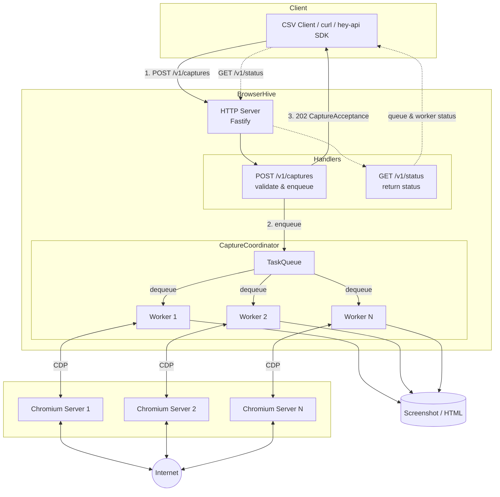
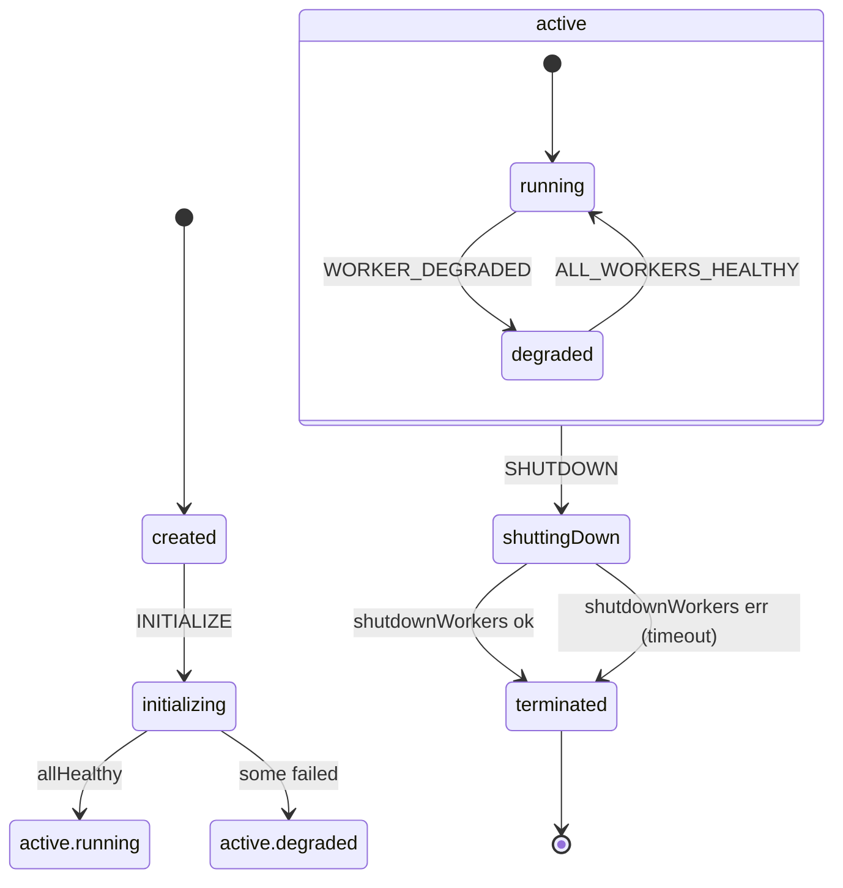
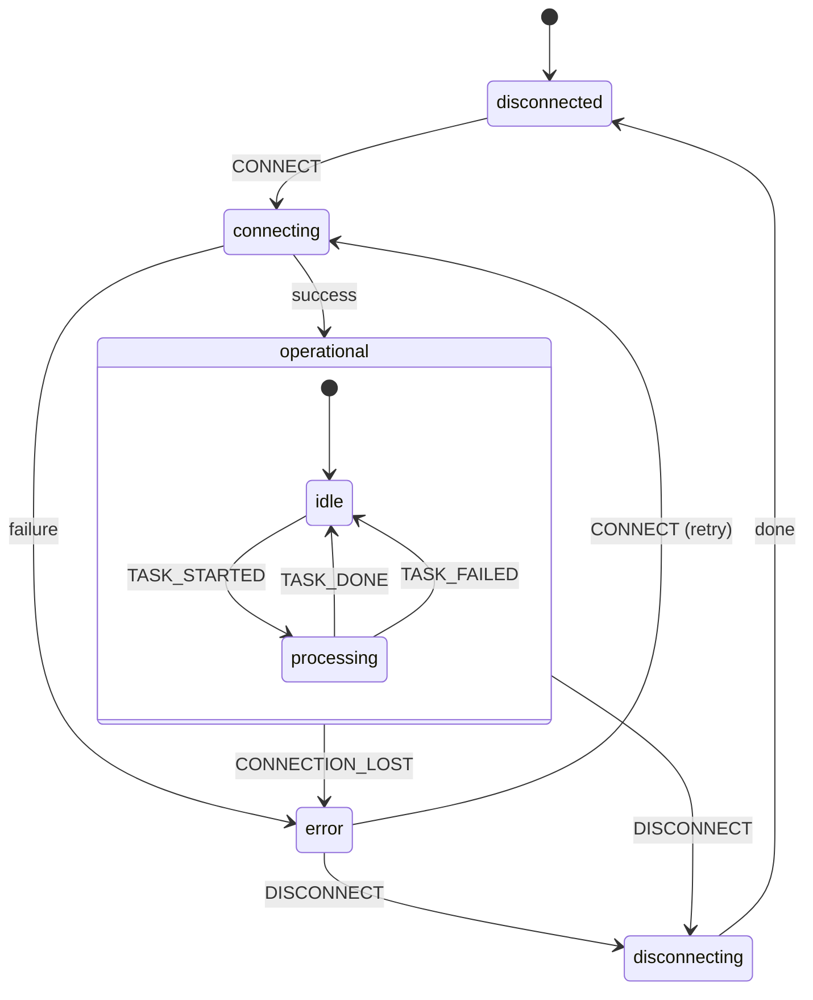

## Features

A server that captures web pages using [chromium-server-docker](https://github.com/uraitakahito/chromium-server-docker). The `BrowserHive` component in the Architecture diagram below represents this application's responsibility.

- **Fire-and-forget pattern**: Requests are accepted immediately and processed asynchronously
- **Capture coordinator**: Multiple workers process capture tasks concurrently
- **Multiple output formats**: PNG, JPEG screenshots and HTML capture
- **Stealth mode**: Uses [puppeteer-extra-plugin-stealth](https://github.com/berstend/puppeteer-extra/tree/master/packages/puppeteer-extra-plugin-stealth) to bypass bot detection, including Cloudflare WAF
- **Banner / modal dismissal**: Optional per-request flag that strips known cookie-consent banners (OneTrust, Cookiebot, Quantcast, etc.) and large fixed/sticky overlays before capturing — best-effort, never fails the capture
- **OpenAPI 3.1 contract**: [`src/http/openapi.yaml`](src/http/openapi.yaml) is the single source of truth — request/response types, validation, and Swagger UI (served at `/docs`) are all driven from it

## Architecture


```mermaid
flowchart TB
    subgraph Client
        CLI[CSV Client / curl / hey-api SDK]
    end

    subgraph BrowserHive["BrowserHive"]
        direction TB
        Server[HTTP Server<br/>Fastify]
        subgraph Handlers["Handlers"]
            SubmitCaptureHandler[POST /v1/captures<br/>validate & enqueue]
            GetStatusHandler[GET /v1/status<br/>return status]
        end
        subgraph CaptureCoordinator
            Queue[TaskQueue]
            Worker1[Worker 1]
            Worker2[Worker 2]
            Worker3[Worker N]
        end
    end

    subgraph ChromiumServers[" "]
        Browser1[Chromium Server 1]
        Browser2[Chromium Server 2]
        Browser3[Chromium Server N]
    end

    Internet((Internet))

    Files[(Screenshot / HTML)]

    CLI -->|"1. POST /v1/captures"| Server
    Server --> SubmitCaptureHandler
    SubmitCaptureHandler -->|"2. enqueue"| Queue
    SubmitCaptureHandler -->|"3. 202 CaptureAcceptance"| CLI
    CLI -.->|"GET /v1/status"| Server
    Server -.-> GetStatusHandler
    GetStatusHandler -.->|"queue & worker status"| CLI
    Queue -->|dequeue| Worker1
    Queue -->|dequeue| Worker2
    Queue -->|dequeue| Worker3
    Worker1 <-->|CDP| Browser1
    Worker2 <-->|CDP| Browser2
    Worker3 <-->|CDP| Browser3
    Browser1 <--> Internet
    Browser2 <--> Internet
    Browser3 <--> Internet
    Worker1 --> Files
    Worker2 --> Files
    Worker3 --> Files
```

## State Machines

The system uses [XState v5](https://stately.ai/docs) state machines with a Parent-Child Actor Model.

### Coordinator Lifecycle

`running` and `degraded` are substates of a compound `active` state. The
`watchWorkerHealth` invoke and the `SHUTDOWN` transition live on `active`,
so they are unaffected by `running ↔ degraded` oscillations.

Init failures are non-fatal: partial or total connect failures land in
`active.degraded` instead of `terminated`. While in `active.degraded`, the
coordinator periodically retries failed workers (1s → 2s → 4s → … capped at
60s) and lifts back to `active.running` once every worker is healthy.
`submitCapture` is accepted while in any `active.*` substate as long as at
least one worker is operational.


```mermaid
stateDiagram-v2
    [*] --> created
    created --> initializing : INITIALIZE
    initializing --> active.running : allHealthy
    initializing --> active.degraded : some failed

    state active {
        [*] --> running
        running --> degraded : WORKER_DEGRADED
        degraded --> running : ALL_WORKERS_HEALTHY
    }

    active --> shuttingDown : SHUTDOWN
    shuttingDown --> terminated : shutdownWorkers ok
    shuttingDown --> terminated : shutdownWorkers err (timeout)
    terminated --> [*]
```

### Capture Worker

Each capture worker actor uses compound states. The `operational` state invokes a `fromCallback` worker loop that polls the task queue and processes captures. The `connecting` and `disconnecting` states invoke `fromPromise` actors that return `Result<void, ErrorDetails>` instead of throwing — the machine branches in `onDone` on `event.output.ok`. Disconnect failures still transition to `disconnected` (best-effort) but log the underlying error. From `error`, the coordinator's retry actor (running while in the `degraded` lifecycle) sends `CONNECT` to bring the worker back through `connecting`.


```mermaid
stateDiagram-v2
    [*] --> disconnected
    disconnected --> connecting : CONNECT

    connecting --> operational : success
    connecting --> error : failure

    state operational {
        [*] --> idle
        idle --> processing : TASK_STARTED
        processing --> idle : TASK_DONE
        processing --> idle : TASK_FAILED
    }

    operational --> error : CONNECTION_LOST
    operational --> disconnecting : DISCONNECT

    error --> connecting : CONNECT (retry)
    error --> disconnecting : DISCONNECT

    disconnecting --> disconnected : done
```

| State | Tags | Description |
|-------|------|-------------|
| `disconnected` | | Not connected to remote browser (initial or after disconnect) |
| `connecting` | | Connecting to remote browser (invoke) |
| `operational.idle` | `healthy`, `canProcess` | Ready to accept tasks |
| `operational.processing` | `healthy` | Processing a capture task |
| `error` | | Connection lost or connect failure |
| `disconnecting` | | Disconnecting browser (invoke) |

## Setup

### Prerequisites

Run the setup script:

```sh
./setup.sh
```

### Development Environment

`compose.dev.yaml` already injects `BROWSERHIVE_BROWSER_URLS` and `BROWSERHIVE_OUTPUT_DIR`, so the in-container start command takes no CLI flags:

```sh
docker compose -f compose.dev.yaml up -d
docker exec -it browserhive-container /bin/zsh
```

```sh
# inside the container, first time only:
sudo chown -R $(id -u):$(id -g) /zsh-volume

npm ci
npm run build
npm run server | pino-pretty
```

Override individual settings ad hoc by either setting another env var or by passing the equivalent CLI flag (CLI > env > default). See [Environment variables](#environment-variables) for the full list.

Stop with:

```sh
docker compose -f compose.dev.yaml down
```

#### Inspecting Chromium via noVNC

The dev compose stack runs the development image for both chromium servers, which embeds Xvfb + x11vnc + noVNC. Open these URLs from the host browser to watch the running Chromium:

| Server | noVNC (browser) | Raw VNC |
|--------|-----------------|---------|
| chromium-server-1 | http://localhost:6080/ | `localhost:5901` |
| chromium-server-2 | http://localhost:6081/ | `localhost:5902` |

### Production Environment

`compose.prod.yaml` supplies all required configuration via `BROWSERHIVE_*` environment variables; no `command:` overrides are needed.

```sh
docker compose -f compose.prod.yaml up -d --build
docker compose -f compose.prod.yaml logs -f browserhive

# verify
curl http://localhost:8080/v1/status
```

Stop with:

```sh
docker compose -f compose.prod.yaml down
```

To build the production image standalone (e.g. to push to a registry):

```sh
docker build -f Dockerfile.prod -t browserhive:<version> .
```

Standalone run:

```sh
docker run --rm -p 8080:8080 -v "$(pwd)/output:/app/output" \
  -e BROWSERHIVE_BROWSER_URLS=http://chromium-server-1:9222 \
  -e BROWSERHIVE_OUTPUT_DIR=/app/output \
  browserhive:<version>
```

## Usage

Please run the following commands inside the Docker container.

### Build

Build the TypeScript source code before running:

```sh
npm run build
```

This command:
1. Generates TypeScript types and an operationId-keyed SDK from `src/http/openapi.yaml` using `@hey-api/openapi-ts` (`prebuild` hook)
2. Compiles TypeScript to JavaScript

### HTTP Server

Start the HTTP server to accept capture requests via JSON over HTTP. Swagger UI is served at `/docs`.

The server uses a **fire-and-forget** pattern: requests are accepted immediately and processed asynchronously by the capture coordinator. Multiple browser URLs can be specified to enable parallel processing.

When `BROWSERHIVE_BROWSER_URLS` and `BROWSERHIVE_OUTPUT_DIR` are set (the dev/prod compose files already do this), the start command is just:

```sh
LOG_LEVEL=info npm run server | pino-pretty
```

CLI flags override env values; mix and match as needed:

```sh
LOG_LEVEL=info npm run server -- \
  --reject-duplicate-urls \
  --user-agent "Mozilla/5.0 (Macintosh; Intel Mac OS X 10_15_7) AppleWebKit/537.36 (KHTML, like Gecko) Chrome/143.0.0.0 Safari/537.36" \
  --accept-language "ja-JP,ja;q=0.9,en-US;q=0.8,en;q=0.7" \
  | pino-pretty
```

#### Environment variables

Every CLI flag has a `BROWSERHIVE_*` env-var equivalent. Resolution order is **CLI flag > env var > default**.

| CLI flag | Environment variable | Type / format |
|---|---|---|
| `--port <port>` | `BROWSERHIVE_PORT` | integer (1–65535) |
| `--browser-url <urls...>` | `BROWSERHIVE_BROWSER_URLS` | comma-separated list (required) |
| `--output <dir>` | `BROWSERHIVE_OUTPUT_DIR` | path (required) |
| `--page-load-timeout <ms>` | `BROWSERHIVE_PAGE_LOAD_TIMEOUT_MS` | positive integer |
| `--capture-timeout <ms>` | `BROWSERHIVE_CAPTURE_TIMEOUT_MS` | positive integer |
| `--max-retry-count <n>` | `BROWSERHIVE_MAX_RETRY_COUNT` | non-negative integer |
| `--queue-poll-interval-ms <ms>` | `BROWSERHIVE_QUEUE_POLL_INTERVAL_MS` | positive integer |
| `--viewport-width <px>` | `BROWSERHIVE_VIEWPORT_WIDTH` | positive integer |
| `--viewport-height <px>` | `BROWSERHIVE_VIEWPORT_HEIGHT` | positive integer |
| `--screenshot-full-page` | `BROWSERHIVE_SCREENSHOT_FULL_PAGE` | `"true"`/`"1"` or `"false"`/`"0"` |
| `--screenshot-quality <n>` | `BROWSERHIVE_SCREENSHOT_QUALITY` | integer (1–100) |
| `--reject-duplicate-urls` | `BROWSERHIVE_REJECT_DUPLICATE_URLS` | `"true"`/`"1"` or `"false"`/`"0"` |
| `--user-agent <string>` | `BROWSERHIVE_USER_AGENT` | string |
| `--accept-language <string>` | `BROWSERHIVE_ACCEPT_LANGUAGE` | string |
| `--tls-cert <path>` | `BROWSERHIVE_TLS_CERT` | path |
| `--tls-key <path>` | `BROWSERHIVE_TLS_KEY` | path |

The `csv-client` example accepts two env vars: `BROWSERHIVE_SERVER` (default `http://localhost:8080`) and `BROWSERHIVE_TLS_CA_CERT` (informational; for actual CA pinning use `NODE_EXTRA_CA_CERTS`). Per-job flags (`--csv`, `--png`, `--jpeg`, `--html`, `--limit`, `--dismiss-banners`) intentionally have no env equivalents.

#### Calling the HTTP API

See [docs/http-api.md](docs/http-api.md) for curl examples and request/response details. Swagger UI is also available at <http://localhost:8080/docs> while the server is running.

### Example: CSV Client

Example client that sends capture requests from a CSV file (fire-and-forget).

The client sends requests and receives acceptance confirmations. Actual captures are processed asynchronously by the server. Check server logs for completion status.

**Usage:**

Build first (the example is shipped only as TypeScript source):

```sh
npm run build
node dist/examples/csv-client.js --csv data/urls.csv --jpeg --html --limit 30 | pino-pretty
```

## OpenAPI specification

The OpenAPI 3.1 contract is at `src/http/openapi.yaml` and is the **single source of truth** for request/response types and runtime validation.

TypeScript types and an operationId-keyed SDK (e.g. `submitCapture(...)`) are auto-generated during build (or `npm run openapi:generate`):
- Generated directory: `src/http/generated/` (gitignored, regenerated by `prebuild` / `pretest` / `prelint`)
- Tool: [@hey-api/openapi-ts](https://heyapi.dev/openapi-ts)
- Config: [`openapi-ts.config.ts`](openapi-ts.config.ts)
- The default client baseUrl is auto-extracted from `servers[0].url` in the spec, so callers do not need to supply a server address unless overriding (see [`examples/csv-client.ts`](examples/csv-client.ts)).

The same yaml is also dereferenced at server start and fed to Fastify's Ajv validator (per-route `schema`) and to `@fastify/swagger` for the Swagger UI at `/docs`.

## TLS (Transport Layer Security)

The server supports TLS for secure communication. See [docs/tls-certificates.md](docs/tls-certificates.md) for certificate generation instructions.

To start the server using the pre-prepared sample certificates and private keys, follow these steps:

```sh
LOG_LEVEL=info npm run server -- --browser-url http://chromium-server-1:9222 --browser-url http://chromium-server-2:9222 --output ./output/capture --tls-cert ./certs/sample-server.crt --tls-key ./certs/sample-server.key --user-agent "Mozilla/5.0 (Macintosh; Intel Mac OS X 10_15_7) AppleWebKit/537.36 (KHTML, like Gecko) Chrome/131.0.0.0 Safari/537.36" | pino-pretty
```

Start the client as follows (use `NODE_EXTRA_CA_CERTS` so that Node's global `fetch` trusts the self-signed CA):

```sh
NODE_EXTRA_CA_CERTS=./certs/sample-ca.crt \
  node dist/examples/csv-client.js \
    --csv data/urls.csv \
    --server https://localhost:8080 \
    --jpeg --html --limit 50 \
  | pino-pretty
```
