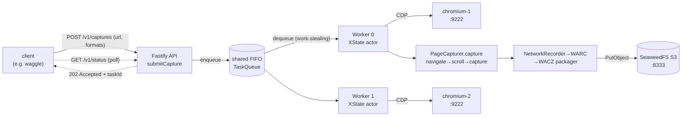
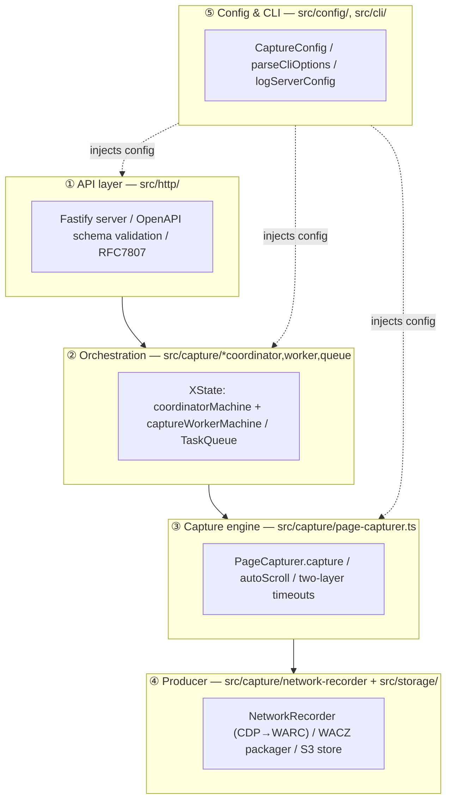
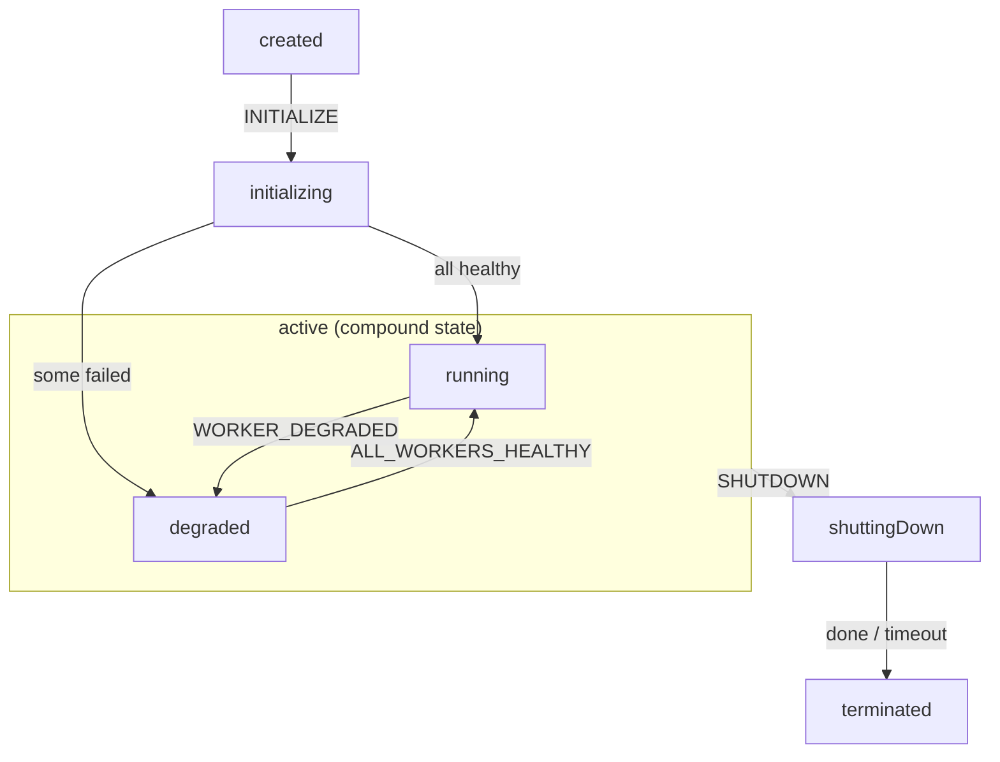
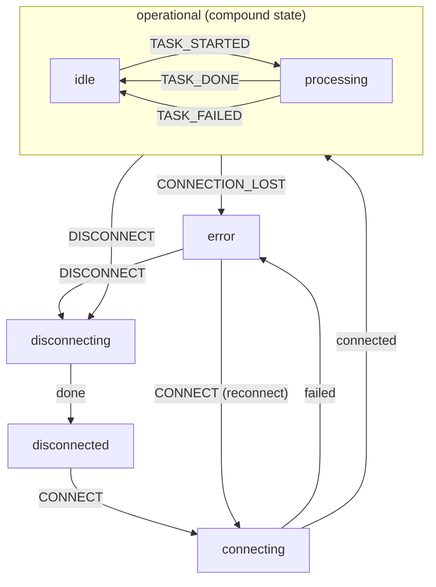
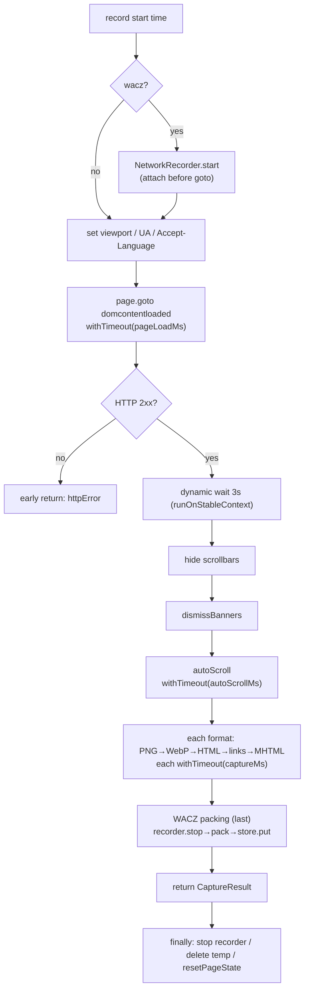
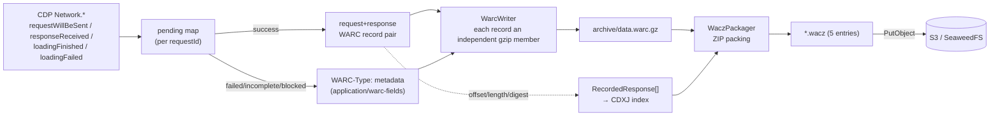
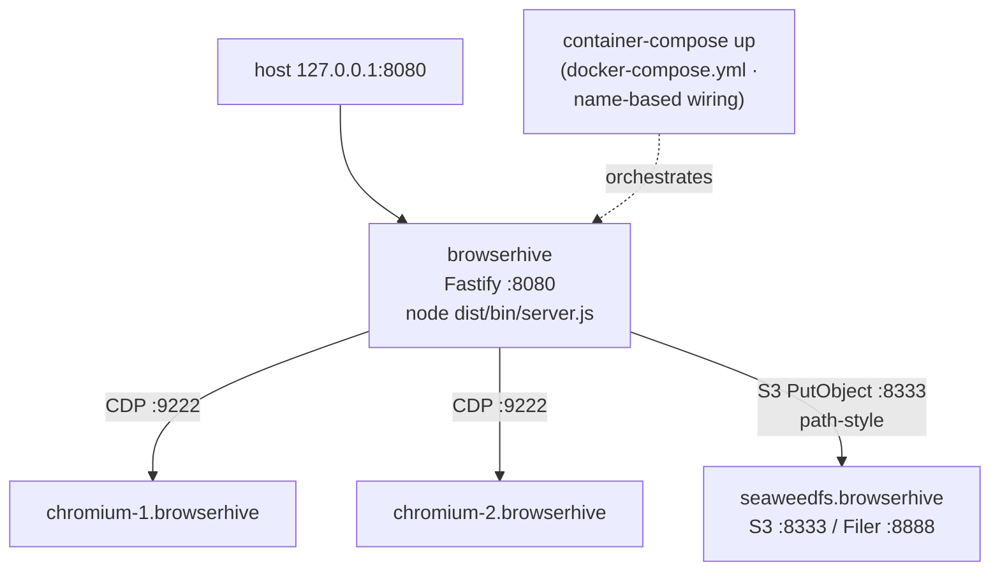

An HTTP server that captures web pages with headless Chromium and stores them
in S3 as **WACZ (Web Archive Collection Zipped)**. A Fastify API accepts
requests, an XState worker pool captures via puppeteer/CDP, and the result is
packed WARC→WACZ and stored.

:::note[In one sentence]
POST a URL to `POST /v1/captures` and it **returns a taskId with 202
immediately**, enqueueing onto an internal FIFO. **One XState worker per
browserURL** pulls from the shared queue by work-stealing and runs
`PageCapturer.capture` on its persistent Chromium tab. It produces
screenshots/HTML/MHTML/links/**WACZ**, records the network into WARC over
CDP, packs the WACZ, and stores it in S3. Poll progress with
`GET /v1/status`.
:::

**Key technologies:** `Fastify` · `OpenAPI 3.1 (ajv)` · `XState v5` · `puppeteer + CDP` ·
`archiver (ZIP)` · `@aws-sdk/client-s3` · `pino` · `RFC 7807`

## 0. One picture — from request to WACZ



*Fig. 0: Acceptance is asynchronous (202 right away). The actual capture runs
later on a worker, and the WACZ artifact is stored as one S3 object.*

:::note[The middle of a three-tier monorepo]
**waggle** (the sender that reads URLs from Postgres and POSTs to BrowserHive)
→ **browserhive** (this repo — the capture server) → [**chromium-server-docker**](https://uraitakahito.github.io/chromium-server-docker/)
(the CDP-driven Chromium backend, a git submodule). This document covers the
middle tier, browserhive.
:::

## 1. Five layers — directories and responsibilities



*Fig. 1: Top to bottom, "accept → distribute → execute → store". The config
layer (⑤) is injected into every layer.*

| Layer | Directory | Core | Responsibility |
|-------|-----------|------|----------------|
| ① API | `src/http/` | `HttpServer` / `handlers.ts` | HTTP acceptance, OpenAPI validation, Problem responses, bridging to the coordinator |
| ② Orchestration | `src/capture/*coordinator,worker,queue` | [`CaptureCoordinator`](/terminology/#g-CaptureCoordinator) + two XState machines | queue, worker pool, reconnect/retry, state |
| ③ Capture | `src/capture/page-capturer.ts` | `PageCapturer.capture` | page operations (navigate/scroll/every format) and timeout control |
| ④ Producer | `src/capture/network-recorder.ts` + `src/storage/` | [`NetworkRecorder`](/terminology/#g-NetworkRecorder) / `WaczPackager` / `ArtifactStore` | CDP→WARC recording, WACZ packing, S3 storage |
| ⑤ Config & CLI | `src/config/`, `src/cli/` | `CaptureConfig` / `server-cli.ts` | flags/env → config tree, startup log |

## 2. The life of a request — async acceptance and polling

The API is **just 2 endpoints** (no auth, `security: []`). Acceptance is
**fire-and-forget**: it returns `202` without waiting for the capture.

| Endpoint | Role | Response |
|----------|------|----------|
| `POST /v1/captures` | capture request (url + captureFormats…) | **202** `{accepted, taskId, correlationId?}` / 400 / 409 (duplicate URL) / 503 (no workers) |
| `GET /v1/status` | a **whole-pool** snapshot of queue and workers | 200 `{pending, processing, workers[], queue{...}}` |

:::caution[There is no per-task endpoint]
`GET /v1/captures/{taskId}` does not exist; `/v1/status` is a **global**
snapshot. Callers correlate `queue.pendingTasks` / `processingTasks` /
each worker's `currentTask` by `taskId`/`correlationId`.
:::

:::note[OpenAPI-first]
Routes are not hand-written: at build time the dereferenced OpenAPI supplies
the `body/querystring/response` schemas passed to `app.route({schema})`.
Fastify's Ajv validates and coerces **before the handler runs**. With
`removeAdditional:false`, unknown fields are not silently dropped — they are
a **400**. Validation errors are shaped into RFC 7807
`application/problem+json`.
:::

## 3. Orchestration — XState parent/child actors

:::tip[📘 Prerequisite: XState]
From here on, XState v5 machines are assumed. For `setup` / `spawn` /
`invoke` / `fromPromise` / `fromCallback` / guards / tags … and how
BrowserHive uses them, see
[→ XState primer + the features BrowserHive uses](/xstate-primer/).
:::

Not a thread-style "worker pool" but a parent/child model with **one XState
worker actor per browserURL**. All workers pull from **one shared
[`TaskQueue`](/terminology/#g-TaskQueue)** by work-stealing (2 chromium
workers → 2 workers).

### Parent: coordinatorMachine



### Child: captureWorkerMachine (one per URL)



*Fig. 2: The parent manages the overall running/degraded; each child manages
one browser's connect-to-process lifecycle. Partial initialization failure is
not fatal — it enters `active.degraded` (partial operation).*

### Worker states and tags

| State | Tags | Description |
|-------|------|-------------|
| `disconnected` | | Not connected to the remote browser (initial, or after disconnect) |
| `connecting` | | Connecting to the remote browser (invoke) |
| `operational.idle` | `healthy`, `canProcess` | Ready to accept tasks |
| `operational.processing` | `healthy` | Processing a capture task |
| `error` | | Connection lost or connect failure |
| `disconnecting` | | Disconnecting the browser (invoke) |

`submitCapture` is accepted while the coordinator is in any `active.*`
substate as long as at least one worker is operational. Disconnect
failures still transition to `disconnected` (best-effort) but log the
underlying error.

:::note[📄 Worker spawn & loop has the detailed page]
This section is the **overview**. For the step-by-step decomposition of
spawn → CONNECT → loop start → event-driven operation → the shared queue →
shutdown (with code injected from the real source), see
[→ Worker spawn & loop (in depth)](/worker-spawn-and-loop/).
Definitions of [`coordinatorMachine`](/terminology/#g-coordinatorMachine) /
[`captureWorkerMachine`](/terminology/#g-captureWorkerMachine) /
[`workerLoop`](/terminology/#g-workerLoop) live in the [Terminology](/terminology/) page.
:::

:::note[Retry and self-healing]
A failed task is `requeue`d while `retryCount < maxRetryCount` (default 2).
When a worker drops to `error`, the parent moves to `degraded` and
`retryFailedWorkers` re-sends `CONNECT` with **exponential backoff
(1s→2s→…→60s)**. When everyone recovers it returns to `running`. Tasks are
not pinned to a server; whichever worker is free pulls the next
(work-stealing).
:::

## 4. Capture engine — the order inside PageCapturer.capture and the two-layer timeouts

Against the **persistent tab** owned by
[`BrowserClient`](/terminology/#g-BrowserClient), `capture()` is a pure
executor that runs "configure → navigate → settle → scroll → capture each
format → pack WACZ" in order (it neither creates nor destroys tabs).



*Fig. 3: autoScroll sits "after banner dismissal, before format capture" —
it removes sticky elements, loads lazy resources into the WARC, and scrolls
back to the top for the screenshot. WACZ packing is **last** so traffic
triggered by the other formats is also in the WARC.*

**Layer A**: every await inside `capture()` is individually wrapped in
`withTimeout` (navigate=`pageLoadMs` 30s / autoScroll=`autoScrollMs` 20s /
each format=`captureMs` 10s). puppeteer has no built-in timeouts on
`evaluate`/`screenshot` etc., and a JS redirect that destroys the context
hangs forever without an exception.

**Layer B**: the whole `capture()` is wrapped in `withTimeout(taskTotalMs)`
(130s) as the final barrier. On firing it returns `status:"timeout"` and
walks away (the tab is persistent, so the next task's `goto` overwrites it).
It is sized wider than the sum of Layer A (~95s) and never fires in normal
operation.

```ts file="src/capture/browser-client.ts#layer-b-timeout"
```

### runOnStableContext (redirect recovery)

A recovery wrapper sitting **between** the two layers. It runs the operation
under Layer A and, only when it fails with "Execution context was
destroyed", waits for navigation and retries up to twice. Real-world top
pages (corporate sites, …) client-side-redirect right after DOMContentLoaded
and destroy the context — without this, screenshots reliably failed.

```ts file="src/capture/page-capturer.ts#stable-context-retry"
```

### Capture formats

| flag | How it is captured | Output |
|------|--------------------|--------|
| `png` / `webp` | `page.screenshot({fullPage, type, quality?})` | `image/png` / `image/webp` |
| `html` | `page.content()` | `text/html` |
| `links` | evaluate `a[href]` → extract http(s), dedupe | `application/json` |
| `mhtml` | CDP `Page.captureSnapshot{format:"mhtml"}` | `multipart/related` |
| `wacz` | NetworkRecorder's WARC → WaczPackager | `application/wacz+zip` |

Each format is stored via `store.put(filename, bytes, mime)` and the
destination (`s3://…` for S3) lands in the `*Location` fields of the
resulting `CaptureResult`. Filenames are
`{taskId}[_{correlationId}][_{labels}].{ext}`.

## 5. Producer pipeline — CDP → WARC → WACZ → S3



*Fig. 4: Network events are recorded into the WARC while each response's
offset/length/digest is noted, so the CDXJ is built without re-parsing. The
WARC is a concatenation of per-record independent gzip members, enabling
byte seeks by offset.*

### WACZ layout (ZIP, 5 entries)

| Path | Compression | Purpose |
|------|-------------|---------|
| `archive/data.warc.gz` | **STORE** | the WARC itself (already gzipped, stored uncompressed) |
| `pages/pages.jsonl` | DEFLATE | header line + 1 page; `ts` pins the replay time |
| `indexes/index.cdxj` | DEFLATE | SURT-sorted CDXJ (not gzipped) |
| `fuzzy.json` | DEFLATE | query-stripping rules (cache-buster counters) |
| `datapackage.json` | DEFLATE | Frictionless descriptor; holds `sha256:<hex>` of the other 4 resources |

※ browserhive's packager does **not** emit `datapackage-digest.json` (5
entries only). Digests use both encodings: WARC carries `sha256:<base32>`,
datapackage `sha256:<hex>`. Definitions in the
[glossary reference](/glossary-reference/#t-datapackagejson).

### metadata records for failed/incomplete exchanges (plan 3)

Failed, incomplete, blocked, or truncated exchanges are recorded not as
`response` but as `WARC-Type: metadata`. Plan 3 adds **resourceType /
blockedReason / status**, so consumers (waxlens) can tell an "ad-blocked
image" from a "real network failure" without parsing bodies.

```ts file="src/capture/network-recorder.ts#metadata-loadingfailed"
```

:::note[Recording robustness]
All mutations of the `pending` map run **synchronously before any await**
(to survive rapid redirect→response→loadingFinished bursts). WARC writes are
serialized through a single `writeQueue: Promise` so concatenated gzip
members never interleave. URLs matching the blocklist write **no record at
all** (distinct from skip/truncate, which keep request/response plus a
truncation metadata record).
:::

## 6. Configuration and deployment

### The config tree and the CLI

Three tiers: `BrowserHiveConfig → CoordinatorConfig → CaptureConfig`.
`parseCliOptions` assembles them with **flags > env > defaults** and hands
the same `CaptureConfig` to every browserURL. `logServerConfig` logs the
resolved configuration as one structured line at startup (S3 secrets
masked).

```text
BrowserHiveConfig
├─ http { port 8080, tls? }
└─ coordinator
   ├─ browserProfiles[] { browserURL, capture }
   │   capture:
   │   ├─ timeouts { pageLoadMs 30000, captureMs 10000,
   │   │            autoScrollMs 20000, taskTotalMs 130000 }
   │   ├─ viewport { 1280 x 800 }
   │   ├─ autoScroll { enabled, stepDelayMs 250, maxSteps 40, … }
   │   ├─ screenshot { fullPage false, quality? }
   │   ├─ resetPageState { cookies, pageContext }
   │   └─ wacz? { blockUrlPatterns, maxResponseBytes 20MiB,
   │             maxTaskBytes 200MiB, software, fuzzyParams }
   ├─ storage { endpoint, bucket, …, forcePathStyle }
   ├─ maxRetryCount 2 / queuePollIntervalMs 50
   └─ rejectDuplicateUrls false
```

```bash
# The env docker-compose.yml bakes into the browserhive container (static
# platform-DNS names — no IP collection anywhere)
BROWSERHIVE_BROWSER_URLS=http://chromium-1.browserhive:9222,http://chromium-2.browserhive:9222,http://chromium-3.browserhive:9222
BROWSERHIVE_S3_ENDPOINT=http://seaweedfs.browserhive:8333
BROWSERHIVE_S3_BUCKET=browserhive
BROWSERHIVE_S3_FORCE_PATH_STYLE=true   # SeaweedFS requires path-style
```

Timeouts all carry the `*Ms` suffix (units visible in the identifier — a
repo convention). CLI option names like `--page-load-timeout` are a separate
surface, independent of the `timeouts` fields.

### Deployment topology (4 containers)



*Fig. 5: Every container is an Apple Container VM. Wiring is name-based:
the one-time `container system dns create browserhive` domain lets
containers (and the host) resolve each other as `<service>.browserhive`.
There is no orchestrator-side readiness probing — the S3 bucket init lives
inside seaweedfs's entrypoint, browserhive retries missing workers itself
(degraded mode, capped backoff), and consumers wait via curl / the E2E
globalSetup. Only browserhive's 8080 is published to the host.*

:::note[S3 addressing]
The bundled SeaweedFS cannot resolve virtual-hosted style
(`browserhive.<endpoint>:8333`), so **path-style**
(`<endpoint>:8333/browserhive/<key>`) is forced. Point
`BROWSERHIVE_S3_ENDPOINT` at AWS/R2 and set force-path-style to false and
the same image works against external stores.
:::

## 7. Key-file cheat sheet (a map into the code)

No line numbers (they drift). Jump by symbol in your IDE for the latest
location of each item.

| Concern | File | Contents |
|---------|------|----------|
| Process entry | `bin/main.ts` | `main()`: CLI parse → startServer → SIGINT/TERM |
| CLI / config | `src/cli/server-cli.ts` | `parseCliOptions`: argv + env → config |
| Composition root | `src/bootstrap.ts` | `startServer`: builds Coordinator + HttpServer |
| HTTP server | `src/http/http-server.ts` | `HttpServer`: Fastify/Ajv/Problem/route registration |
| Handlers | `src/http/handlers.ts` | `submitCapture` / `getStatus` |
| Orchestration facade | `src/capture/capture-coordinator.ts` | [`CaptureCoordinator`](/terminology/#g-CaptureCoordinator): enqueue/initialize/status |
| Parent machine | `src/capture/coordinator-machine.ts` | [`coordinatorMachine`](/terminology/#g-coordinatorMachine): `created→active{running/degraded}→terminated` |
| Child machine | `src/capture/capture-worker.ts` | [`captureWorkerMachine`](/terminology/#g-captureWorkerMachine): `disconnected→operational{idle/processing}→error` |
| Worker loop | `src/capture/worker-loop.ts` | [`workerLoop`](/terminology/#g-workerLoop): dequeue→process→emit events |
| Queue | `src/capture/task-queue.ts` | [`TaskQueue`](/terminology/#g-TaskQueue): FIFO + processing/completed sets |
| Browser connect/process | `src/capture/browser-client.ts` | [`BrowserClient`](/terminology/#g-BrowserClient): `process` (Layer B), `connect`, owns the persistent tab |
| Capture proper | `src/capture/page-capturer.ts` | the whole `capture()` + `withTimeout`/`runOnStableContext` |
| Network recording | `src/capture/network-recorder.ts` | [`NetworkRecorder`](/terminology/#g-NetworkRecorder): CDP→WARC, pending/writeQueue, metadata records |
| WARC build/write | `src/storage/warc/builders.ts` / `writer.ts` | record construction / per-record gzip members |
| WACZ packing | `src/storage/wacz/packager.ts` | hash 5 resources into a ZIP (WARC=STORE) |
| S3 store | `src/storage/s3-compatible-store.ts` | `put`→`s3://bucket/key` |
| Config types | `src/config/types.ts` | `CaptureConfig` et al. |
| CLI/config assembly | `src/cli/server-cli.ts` | `parseCliOptions` / `buildServerConfig` / `logServerConfig` |
| Deployment | `docker-compose.yml` / `Dockerfile.prod` | Apple Container via container-compose (S3 + worker×1–3 + server) |
