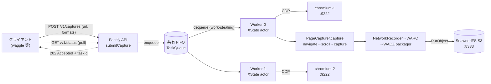
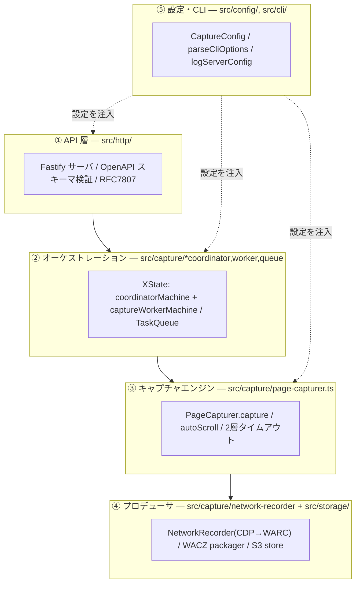
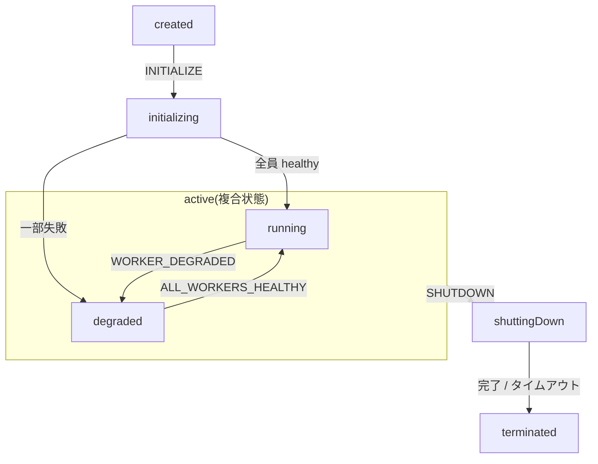
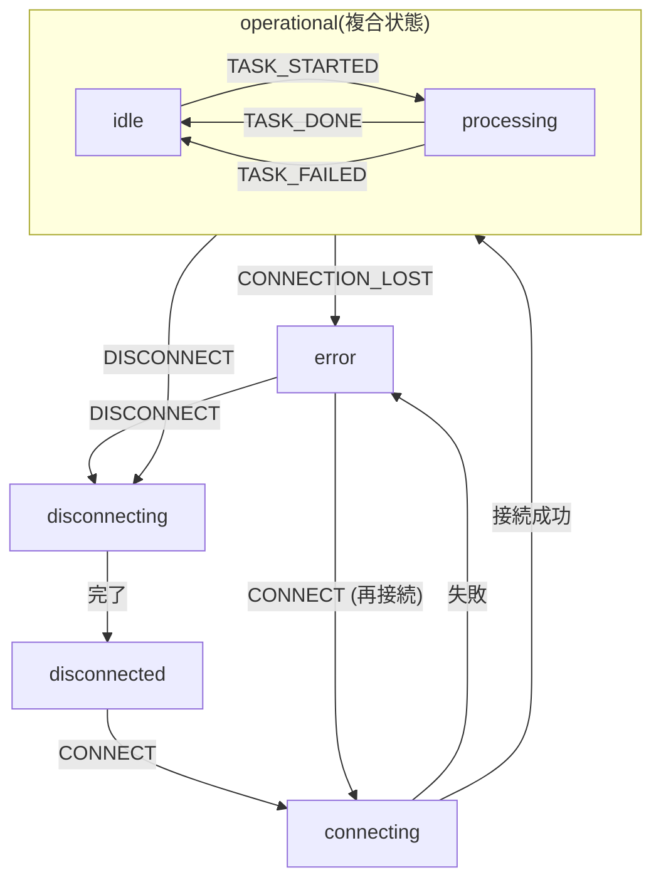
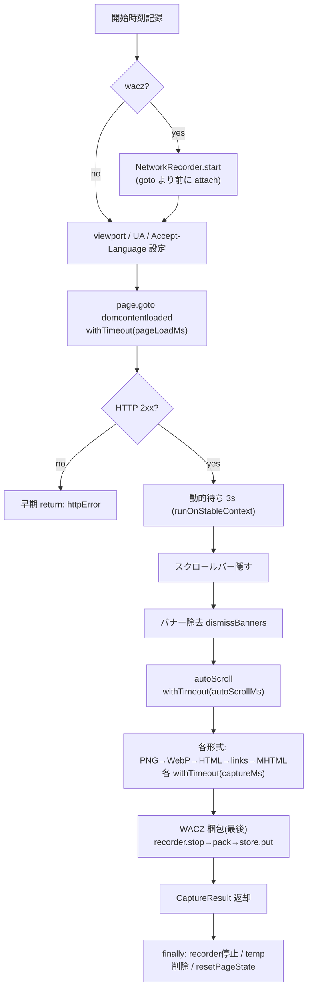
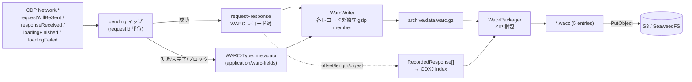
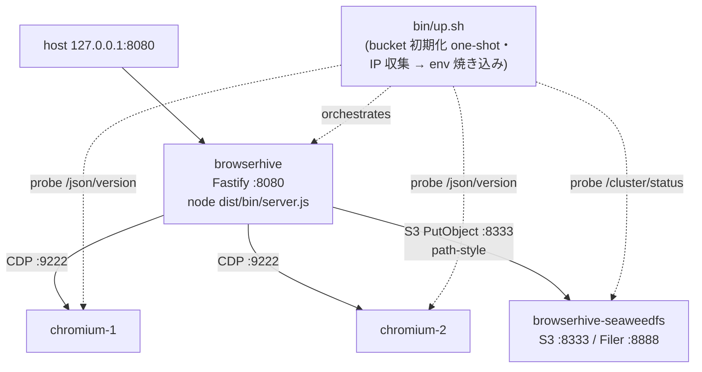

ヘッドレス Chromium で Web ページをキャプチャし、**WACZ(Web Archive Collection Zipped)**
として S3 に保存する HTTP サーバ。Fastify の API が受け付け、XState のワーカープールが
puppeteer/CDP でキャプチャし、WARC→WACZ に固めて保存する。

:::note[一文で]
`POST /v1/captures` に URL を投げると **202 で taskId を即返し**、内部の FIFO キューに積む。
**browserURL ごとに 1 つの XState ワーカー**が共有キューから work-stealing で取り出し、保持して
いる Chromium タブで `PageCapturer.capture` を実行。スクショ/HTML/MHTML/リンク/**WACZ** を生成し、
ネットワークは CDP で WARC に記録、WACZ に固めて S3 に保存する。進捗は `GET /v1/status` で
ポーリングする。
:::

**主要技術:** `Fastify` · `OpenAPI 3.1 (ajv)` · `XState v5` · `puppeteer + CDP` ·
`archiver (ZIP)` · `@aws-sdk/client-s3` · `pino` · `RFC 7807`

## 0. 一枚絵 ― リクエストから WACZ まで



*図0: 受付は非同期(即 202)。実キャプチャはワーカーが後から実行し、成果物 WACZ は S3 に
1 オブジェクトとして保存される。*

:::note[3 階層モノレポの真ん中]
**waggle**(URL を Postgres から読んで BrowserHive に POST する出し手)→ **browserhive**
(この repo・キャプチャサーバ)→ [**chromium-server-docker**](https://uraitakahito.github.io/chromium-server-docker/ja/)(CDP で操作される Chromium
バックエンド、git submodule)。本書は中段の browserhive を解説する。
:::

## 1. 5 層構成 ― ディレクトリと責務



*図1: 上から下へ「受付 → 配分 → 実行 → 保存」。設定層(⑤)が全層へ注入される。*

| 層 | ディレクトリ | 中心 | 責務 |
|----|--------------|------|------|
| ① API | `src/http/` | `HttpServer` / `handlers.ts` | HTTP 受付・OpenAPI 検証・Problem 応答・coordinator へ橋渡し |
| ② オーケストレーション | `src/capture/*coordinator,worker,queue` | [`CaptureCoordinator`](/terminology/#g-CaptureCoordinator) + 2 つの XState machine | キュー・ワーカープール・再接続/リトライ・状態管理 |
| ③ キャプチャ | `src/capture/page-capturer.ts` | `PageCapturer.capture` | ページ操作の実行(navigate/scroll/各形式の取得)・タイムアウト制御 |
| ④ プロデューサ | `src/capture/network-recorder.ts` + `src/storage/` | [`NetworkRecorder`](/terminology/#g-NetworkRecorder) / `WaczPackager` / `ArtifactStore` | CDP→WARC 記録・WACZ 梱包・S3 保存 |
| ⑤ 設定・CLI | `src/config/`, `src/cli/` | `CaptureConfig` / `server-cli.ts` | フラグ/env→設定木・起動ログ |

## 2. リクエストの一生 ― 非同期な受付とポーリング

API は **2 エンドポイントだけ**(認証なし・`security: []`)。受付は**ファイア&フォーゲット**で、
キャプチャ完了を待たずに `202` を返す。

| エンドポイント | 役割 | 応答 |
|----------------|------|------|
| `POST /v1/captures` | キャプチャ依頼(url + captureFormats…) | **202** `{accepted, taskId, correlationId?}` / 400 / 409(重複URL) / 503(ワーカー無) |
| `GET /v1/status` | キュー・ワーカープールの**全体**スナップショット | 200 `{pending, processing, workers[], queue{...}}` |

:::caution[タスク単位の取得口は無い]
`GET /v1/captures/{taskId}` は存在せず、`/v1/status` は**全体**スナップショット。呼び出し側は
`queue.pendingTasks` / `processingTasks` / worker の `currentTask` を `taskId`/`correlationId` で
突き合わせて追う。
:::

:::note[OpenAPI ファースト]
ルートは手書きせず、ビルド時に dereference した OpenAPI から `body/querystring/response` スキーマを
取り出して `app.route({schema})` に渡す。Fastify の Ajv が**ハンドラ実行前に**検証・型強制。
`removeAdditional:false` なので未知フィールドは黙って消えず **400** になる。検証エラーは
RFC 7807 `application/problem+json` に整形される。
:::

## 3. オーケストレーション ― XState の親子アクター

:::tip[📘 前提知識:XState]
この節以降は XState v5 の状態機械が前提。`setup` / `spawn` / `invoke` / `fromPromise` /
`fromCallback` / guard / tags …の基本と BrowserHive での使い方は
[→ XState 入門 + BrowserHive で使う機能](/xstate-primer/)を参照。
:::

スレッド的な「ワーカープール」ではなく、**browserURL ごとに 1 つの XState ワーカーアクター**を
持つ親子モデル。全ワーカーは**1 つの共有 [`TaskQueue`](/terminology/#g-TaskQueue)**から
work-stealing で取り出す(chromium worker 2 台 → 2 ワーカー)。

### 親:coordinatorMachine



### 子:captureWorkerMachine(URL ごと)



*図2: 親が全体の running/degraded を管理し、子が 1 ブラウザの接続〜処理を管理。初期化の一部失敗は
致命ではなく `active.degraded` 入り(部分稼働)。*

### worker の状態とタグ

| 状態 | タグ | 説明 |
|-------|------|-------------|
| `disconnected` | | リモートブラウザ未接続(初期状態・切断後) |
| `connecting` | | リモートブラウザへ接続中(invoke) |
| `operational.idle` | `healthy`, `canProcess` | タスク受け入れ可能 |
| `operational.processing` | `healthy` | キャプチャタスクを処理中 |
| `error` | | 接続喪失または接続失敗 |
| `disconnecting` | | ブラウザ切断中(invoke) |

`submitCapture` は、少なくとも 1 worker が operational であれば、coordinator が
`active.*` のどの substate にいる間も受理される。切断の失敗も(ベストエフォートで)
`disconnected` へ遷移するが、元のエラーはログに残す。

:::note[📄 ワーカーの生成とループは詳説ページへ]
この節は**概要**。生成(spawn)→ 接続(CONNECT)→ ループ起動 → イベント駆動 → 共有キュー →
停止までの**段階的な分解**(実ソースから注入したコード片つき)は
[→ ワーカーの生成とループ(詳説)](/worker-spawn-and-loop/)を参照。
[`coordinatorMachine`](/terminology/#g-coordinatorMachine) /
[`captureWorkerMachine`](/terminology/#g-captureWorkerMachine) /
[`workerLoop`](/terminology/#g-workerLoop) の定義は[用語集](/terminology/)に。
:::

:::note[リトライと自己修復]
失敗タスクは `retryCount < maxRetryCount`(既定 2)なら `requeue`。ワーカーが `error` に落ちると
親が `degraded` へ移り、`retryFailedWorkers` が **指数バックオフ(1s→2s→…→60s)**で `CONNECT` を
再送。全員回復で `running` に戻る。タスクは特定サーバに固定されず、空いたワーカーが次を引く
(work-stealing)。
:::

## 4. キャプチャエンジン ― PageCapturer.capture の順序と 2 層タイムアウト

[`BrowserClient`](/terminology/#g-BrowserClient) が保持する**常設タブ**に対し、`capture()` は
「設定→移動→整える→スクロール→各形式取得→WACZ梱包」を順に実行する純粋な実行器(タブの生成/破棄は
しない)。



*図3: autoScroll は「バナー除去後・各形式取得前」に置く ― スティッキー要素を消し、遅延読み込み
リソースを WARC に載せ、スクショ用に最上部へ戻すため。WACZ 梱包は**最後**(他形式が誘発した通信も
WARC に含めるため)。*

**Layer A**: `capture()` 内の各 await を個別に `withTimeout` で包む(navigate=`pageLoadMs` 30s /
autoScroll=`autoScrollMs` 20s / 各形式=`captureMs` 10s)。puppeteer は `evaluate`/`screenshot` 等に
組込タイムアウトが無く、JS リダイレクトで context が壊れると無例外で永久ハングするため。

**Layer B**: `capture()` 全体を `withTimeout(taskTotalMs)`(130s)で包む最終防壁。発火時は
`status:"timeout"` を返して放置(タブは常設なので次タスクの `goto` が上書き)。Layer A の総和
(~95s)より広く設計され、平常時は決して発火しない。

```ts file="src/capture/browser-client.ts#layer-b-timeout"
```

### runOnStableContext(リダイレクト復帰)

2 層の**間**に座る回復ラッパ。operation を Layer A で実行し、「Execution context was destroyed」で
失敗した時だけ `waitForNavigation` して最大 2 回リトライ。実在のトップページ(企業サイト等)が
DOMContentLoaded 直後に client-side リダイレクトし context を壊す問題への対策で、これが無いと
スクショが必ず失敗していた。

```ts file="src/capture/page-capturer.ts#stable-context-retry"
```

### キャプチャ形式

| flag | 取得方法 | 出力 |
|------|----------|------|
| `png` / `webp` | `page.screenshot({fullPage, type, quality?})` | `image/png` / `image/webp` |
| `html` | `page.content()` | `text/html` |
| `links` | `a[href]` を evaluate→http(s) 抽出・重複排除 | `application/json` |
| `mhtml` | CDP `Page.captureSnapshot{format:"mhtml"}` | `multipart/related` |
| `wacz` | NetworkRecorder の WARC → WaczPackager | `application/wacz+zip` |

各形式は `store.put(filename, bytes, mime)` で保存し、結果 `CaptureResult` の `*Location` に保存先
(S3 なら `s3://…`)を載せる。ファイル名は `{taskId}[_{correlationId}][_{labels}].{ext}`。

## 5. プロデューサパイプライン ― CDP → WARC → WACZ → S3



*図4: 通信イベントを WARC に記録しつつ、各 response の offset/length/digest を控えて CDXJ を
再パースなしで構築。WARC は per-record の独立 gzip member 連結なので、offset でバイトシークできる。*

### WACZ レイアウト(ZIP・5 エントリ)

| パス | 圧縮 | 用途 |
|------|------|------|
| `archive/data.warc.gz` | **STORE** | WARC 本体(既に gzip 済みなので無圧縮格納) |
| `pages/pages.jsonl` | DEFLATE | ヘッダ行 + 1 page。`ts` が replay の時刻を固定 |
| `indexes/index.cdxj` | DEFLATE | SURT ソート済 CDXJ(非 gzip) |
| `fuzzy.json` | DEFLATE | クエリ除去ルール(キャッシュバスター対策) |
| `datapackage.json` | DEFLATE | Frictionless 記述子。他 4 資源の `sha256:<hex>` を保持 |

※ browserhive の packager は `datapackage-digest.json` を**出さない**(5 エントリのみ)。digest は
2 エンコード併用:WARC は `sha256:<base32>`、datapackage は `sha256:<hex>`。各語の定義は
[用語リファレンス](/glossary-reference/#t-datapackagejson)を参照。

### failed/incomplete の metadata レコード(案 3)

失敗・未完了・ブロック・打ち切りの通信は `response` ではなく `WARC-Type: metadata` として記録。
案 3 で **resourceType / blockedReason / status** を付与し、消費側(waxlens)が本文をパースせず
「広告ブロックされた画像」と「本物のネットワーク障害」を区別できる。

```ts file="src/capture/network-recorder.ts#metadata-loadingfailed"
```

:::note[記録の堅さ]
`pending` マップの変更は全て **await の前に同期実行**(redirect→response→loadingFinished の高速
連射に耐えるため)。WARC 書き込みは単一の `writeQueue: Promise` で直列化し、連結 gzip member が
交錯しないようにする。ブロックリスト一致 URL は**レコードを一切書かない**(skip/truncate は
request/response + 打ち切り metadata を残すのと別)。
:::

## 6. 設定とデプロイ

### 設定木と CLI

`BrowserHiveConfig → CoordinatorConfig → CaptureConfig` の 3 階層。`parseCliOptions` が
**フラグ > env > 既定**の優先で組み立て、同一 `CaptureConfig` を全 browserURL に配る。
`logServerConfig` が起動時に解決済み設定を 1 行の構造化ログで出す(S3 シークレットはマスク)。

```text
BrowserHiveConfig
├─ http { port 8080, tls? }
└─ coordinator
   ├─ browserProfiles[] { browserURL, capture }
   │   capture:
   │   ├─ timeouts { pageLoadMs 30000, captureMs 10000,
   │   │            autoScrollMs 20000, taskTotalMs 130000 }
   │   ├─ viewport { 1280 x 800 }
   │   ├─ autoScroll { enabled, stepDelayMs 250, maxSteps 40, … }
   │   ├─ screenshot { fullPage false, quality? }
   │   ├─ resetPageState { cookies, pageContext }
   │   └─ wacz? { blockUrlPatterns, maxResponseBytes 20MiB,
   │             maxTaskBytes 200MiB, software, fuzzyParams }
   ├─ storage { endpoint, bucket, …, forcePathStyle }
   ├─ maxRetryCount 2 / queuePollIntervalMs 50
   └─ rejectDuplicateUrls false
```

```bash
# bin/up.sh が browserhive コンテナに焼き込む env(IP は起動時に収集)
BROWSERHIVE_BROWSER_URLS=http://192.168.64.x:9222,http://192.168.64.y:9222
BROWSERHIVE_S3_ENDPOINT=http://192.168.64.z:8333
BROWSERHIVE_S3_BUCKET=browserhive
BROWSERHIVE_S3_FORCE_PATH_STYLE=true   # SeaweedFS は path-style 必須
```

タイムアウトは全て `*Ms` 接尾辞(識別子で単位が分かる・リポ慣習)。CLI オプション名
`--page-load-timeout` 等は別サーフェスで `timeouts` フィールドとは独立。

### デプロイ・トポロジ(4 コンテナ)



*図5: 全コンテナは Apple Container の VM(192.168.64.0/24 で相互 IP 直結)。
compose のサービス名 DNS と `depends_on` は `bin/up.sh` の「逐次起動 + 外部プローブ
(Chromium `/json/version`、SeaweedFS `/cluster/status`)+ IP 収集 → env 焼き込み」に
置き換わった。ホストに公開されるのは browserhive の 8080 のみ。*

:::note[S3 アドレッシング]
バンドルされた SeaweedFS は仮想ホスト形式(`browserhive.<endpoint>:8333`)を解決できないため
**path-style**(`<endpoint>:8333/browserhive/<key>`)を強制。`BROWSERHIVE_S3_ENDPOINT` を AWS/R2 に
向け force-path-style を false にすれば同一イメージで外部ストアも使える。
:::

## 7. 主要ファイル早見表(コードへの地図)

行番号は載せない(ドリフトするため)。各ファイルの最新位置は IDE の記号ジャンプで辿るのが速い。

| 関心事 | ファイル | 中身 |
|--------|----------|------|
| プロセス起点 | `bin/server.ts` | `main()`: CLI parse → startServer → SIGINT/TERM |
| 合成ルート | `src/cli/server-cli.ts` | `startServer`: Coordinator + HttpServer 構築 |
| HTTP サーバ | `src/http/server.ts` | `HttpServer`: Fastify/Ajv/Problem/ルート登録 |
| 受付ハンドラ | `src/http/handlers.ts` | `submitCapture` / `getStatus` |
| オーケストレーション facade | `src/capture/capture-coordinator.ts` | [`CaptureCoordinator`](/terminology/#g-CaptureCoordinator): enqueue/initialize/status |
| 親 machine | `src/capture/coordinator-machine.ts` | [`coordinatorMachine`](/terminology/#g-coordinatorMachine): `created→active{running/degraded}→terminated` |
| 子 machine | `src/capture/capture-worker.ts` | [`captureWorkerMachine`](/terminology/#g-captureWorkerMachine): `disconnected→operational{idle/processing}→error` |
| ワーカーループ | `src/capture/worker-loop.ts` | [`workerLoop`](/terminology/#g-workerLoop): dequeue→process→イベント送出 |
| キュー | `src/capture/task-queue.ts` | [`TaskQueue`](/terminology/#g-TaskQueue): FIFO + processing/completed Set |
| ブラウザ接続/処理 | `src/capture/browser-client.ts` | [`BrowserClient`](/terminology/#g-BrowserClient): `process`(Layer B), `connect`, 常設タブ保持 |
| キャプチャ本体 | `src/capture/page-capturer.ts` | `capture()` 全工程 + `withTimeout`/`runOnStableContext` |
| ネットワーク記録 | `src/capture/network-recorder.ts` | [`NetworkRecorder`](/terminology/#g-NetworkRecorder): CDP→WARC、pending/writeQueue、metadata レコード |
| WARC 構築/書込 | `src/storage/warc/builders.ts` / `writer.ts` | レコード生成 / per-record gzip member |
| WACZ 梱包 | `src/storage/wacz/packager.ts` | 5 資源を hash して ZIP(WARC=STORE) |
| S3 ストア | `src/storage/s3-compatible-store.ts` | `put`→`s3://bucket/key` |
| 設定型 | `src/config/types.ts` | `CaptureConfig` ほか |
| CLI/設定組立 | `src/cli/server-cli.ts` | `parseCliOptions` / `buildServerConfig` / `logServerConfig` |
| デプロイ | `bin/up.sh` / `Dockerfile.prod` | Apple Container 4 コンテナ構成(S3 + worker×N + 本体) |
