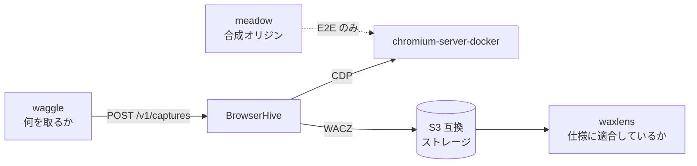

BrowserHive は、ウェブアーカイブを取得・検証・駆動する小さなリポジトリ群のひとつです。
このページはその地図です ― 各リポジトリが何をし、BrowserHive とどう接しているか。

## BrowserHive が土台にしているもの

### chromium-server-docker

<https://github.com/uraitakahito/chromium-server-docker> ·
[ドキュメント](https://uraitakahito.github.io/chromium-server-docker/)

Chrome DevTools Protocol を公開した Chromium を動かすコンテナイメージ。
**BrowserHive 自身はブラウザを起動しません** ―
各ワーカーは CDP でこれに接続します。
だからこそワーカープールは、サーバを再起動せずに増減・入れ替えができます。

**git submodule** で固定しているので、
キャプチャは常に「テスト済みの Chromium ビルド」に対して再現できます。

### meadow

<https://github.com/uraitakahito/meadow> ·
[ドキュメント](https://uraitakahito.github.io/meadow/ja/)

E2E テストがキャプチャ対象にするフィクスチャオリジン。
**それぞれが 1 つの失敗だけを引き起こすように作られたページ**を返す Fastify サーバです ―
キャプチャの最中に自分でナビゲートするページ、スクロールしないと読み込まれない画像、
遅すぎる本文、2 回失敗してから成功するオリジン。

E2E テストを実在のサイトに向けると、BrowserHive と同じくらいインターネットをテストすることになります。
meadow は**その失敗を決定論的にし、オフラインでも使えるように**します。

こちらも **git submodule** で、同時に workspace パッケージでもあります ―
[開発環境](/ja/development-environment/)を参照してください。

## BrowserHive を動かすもの

### waggle

<https://github.com/uraitakahito/waggle> ·
[ドキュメント](https://uraitakahito.github.io/waggle/ja/)

Postgres のテーブルから URL を読んで BrowserHive に投げ、
返ってきたものをアーカイブ台帳に記録します。
BrowserHive が答えるのは**「これをキャプチャせよ」**であり、
waggle が決めるのは**何を、誰のために取るか、そして誰が結果を読んでよいか**です。

BrowserHive の OpenAPI 仕様を直接取り込んでクライアントを生成しているため、
**破壊的な API 変更は実行時ではなく waggle のビルドで表面化します**。

## 出力を検証するもの

### waxlens

<https://github.com/uraitakahito/waxlens> ·
[ドキュメント](https://uraitakahito.github.io/waxlens/ja/)

[WACZ](https://specs.webrecorder.net/wacz/1.1.1/) アーカイブの
**プロデューサ非依存**なバリデータ。
BrowserHive が作ったものを含め、アーカイブを渡すと
ルール単位で適合・不適合を報告します。

非依存であることは意図的です ―
**プロデューサと同じ前提で書かれたバリデータは、その前提自体が誤っている場合を捕まえられません。**

### waxlens-corpus

<https://github.com/uraitakahito/waxlens-corpus>

waxlens のルールを検証するための WACZ 標本集。
各ルールを違反させるアーカイブと、全ルールを通る正常系のアーカイブが入っています。
BrowserHive が使うものではありませんが、
**バリデータの判定に重みを与えているのはこれ**です。

## 仕様

### WACZ

[仕様](https://specs.webrecorder.net/wacz/1.1.1/) ·
[日本語訳](https://uraitakahito.github.io/specs/wacz/1.1.1/)

BrowserHive が出力する形式。WARC データとそのメタデータを ZIP にまとめたものです。
仕様が要求することと、BrowserHive が**意図的に**素直な解釈から外れている箇所は
[WACZ の内部構造](/ja/wacz-internals/)にあります。

### Data Package

[仕様](https://datapackage.org/)

WACZ はこの標準に従った `datapackage.json` を内包しており、
読み手は**展開せずに中身を知る**ことができます。

## 全体の繋がり

点線はテストにしか存在しない経路です。
本番では Chromium が実際のウェブを訪れ、
**テストが「意図した失敗」を必要とするときだけ** meadow がその代わりを務めます。
