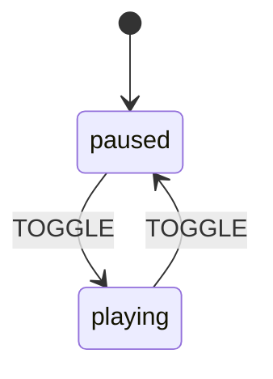
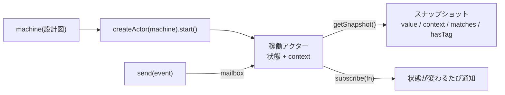
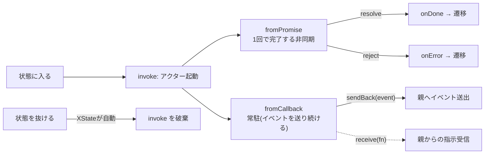
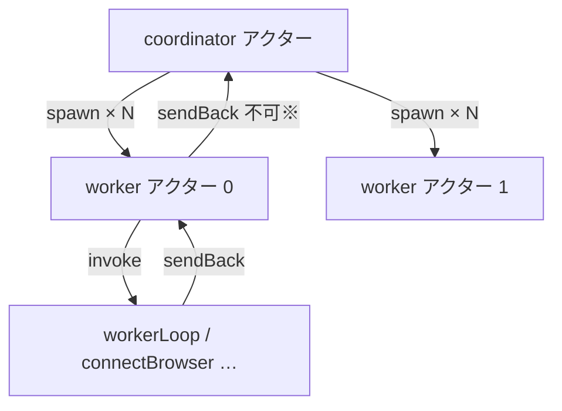

BrowserHive のオーケストレーションは XState v5 の状態機械でできている。ソースを読む前提として、XState の基本(前半)と、BrowserHive が実際に使う機能(後半)をコードに沿って解説する。

:::note[30 秒サマリ]
XState の**状態機械**は「いま**どの状態**か」「**イベント**で**どの状態へ遷移**するか」を宣言的に書く道具。動かすと**アクター**になり、`send(event)` で動かし `getSnapshot()` で覗く。状態機械は **booleans の散らばり**(`isConnecting` / `isBusy` / `hasError` …)を**1 つの「現在状態」**に畳み、ありえない組合せを**構造的に排除**する。

BrowserHive は v5 の**アクターモデル**を使う:coordinator アクターが worker アクターを **spawn** し、worker は **invoke** で `fromPromise`(接続)/ `fromCallback`(処理ループ)アクターを動かし、結果を**イベントで親へ報告**する。
:::

## ― Part A:XState の基本 ―

## A1. なぜ状態機械か ― boolean の沼を畳む

「接続中?」「処理中?」「エラー?」をバラバラの boolean で持つと、`isConnecting && hasError` のような**ありえない組合せ**が表現できてしまい、分岐が爆発する。状態機械は「現在は **1 つの状態**」と決め、**どのイベントでどこへ動くか**だけを書く。**到達不能・矛盾した状態が型と構造で消える**のが最大の利点。

:::tip[たとえ]
信号機。「赤・黄・青」は同時に点かない(=排他状態)。「タイマー満了(イベント)で次へ」だけ決めればよい。boolean 3 つ(`red/yellow/green`)だと「赤かつ青」が書けてしまう。
:::

## A2. 4 つの核 ― State / Event / Transition / Context



*図A: 最小の機械(再生/一時停止)。**状態** paused/playing、**イベント** TOGGLE、**遷移**は矢印。これを XState で書くと↓*

```ts
// 最小の機械(XState v5・一般例)。paused ⇄ playing を切り替え、再生開始(paused→playing)のたび playCount を +1。
import { setup, assign, createActor } from "xstate";

const player = setup({
  // types = 値ではなく「型」だけ宣言する場所。`{} as T` は「中身は空・型は T」の書き方。
  types: {
    context: {} as { playCount: number }, // この機械が持つ context の型
    events:  {} as { type: "TOGGLE" },    // 受け取りうるイベント(ここでは TOGGLE だけ)
  },
}).createMachine({
  initial: "paused",         // 開始状態
  context: { playCount: 0 }, // context の初期値
  states: {
    paused: {                 // ← 状態 paused の定義(状態名は自由に付けられる)
      on: {                   //   on = この状態での「イベント → 遷移」対応表(on は XState の予約キー)
        TOGGLE: {             //   TOGGLE を受けたら…
          target: "playing",                                    //     playing へ遷移し
          actions: assign({ playCount: ({ context }) => context.playCount + 1 }), // +1
        },
      },
    },
    playing: {
      on: { TOGGLE: "paused" },  // playing で TOGGLE → paused。短縮形(target だけ・actions なし)
    },
  },
});
```

### コードの構造 ― 入れ子を分解する

config は**入れ子のオブジェクト**。骨組みだけにするとこう:

```ts
createMachine({
  initial,              // ← どの状態から始めるか
  context,              // ← 状態名で表せないデータの初期値
  states: {             // ← 取りうる状態の一覧
    <状態名>: {
      on: {             // ← この状態での「イベント → 遷移」対応表
        <イベント名>: <遷移>     // ← 遷移は 2 通りの書き方(下記)
      }
    }
  }
})
```

**遷移の書き方は 2 通り**あり、「移るだけ」か「移る＋副作用」かで選ぶ:

- **短縮形** `TOGGLE: "paused"` ― 文字列は**遷移先の状態名**。「TOGGLE が来たら paused へ移るだけ」。
- **完全形** `TOGGLE: { target: "playing", actions: … }` ― `target`(遷移先)に加え、`actions`(遷移のついでに走る副作用)を書ける。

`assign({ playCount: ({ context }) => context.playCount + 1 })` は「context の `playCount` を**現在値 +1 に置き換える**」副作用。関数にするのは**今の context / event を読んで新しい値を計算**するため(`({ context }) => …` が現在の context を受け取っている)。

### TOGGLE を送るたびに何が起きるか(実行トレース)

アクターに `send({ type: "TOGGLE" })` を繰り返したときの動き。**今いる状態の `on.TOGGLE` を引いて**、その遷移を適用する:

| 今の状態 | 今の playCount | TOGGLE で引く遷移 | 結果 |
|----------|----------------|-------------------|------|
| `paused` | 0 | `{ target:"playing", actions:+1 }` | `playing` / playCount **1** |
| `playing` | 1 | `"paused"`(短縮形・actions なし) | `paused` / playCount 1(**不変**) |
| `paused` | 1 | `{ target:"playing", actions:+1 }` | `playing` / playCount **2** |

ポイントは「**playCount が増えるのは `paused→playing` のときだけ**」 ― `playing→paused` の遷移には `actions` が無いから。**状態(paused/playing)と context(playCount)は別々に動く**のが見て取れる。これが「状態=モード / context=付随データ」の感覚。

各概念の語義は用語集の該当語へ(📖):[State(状態)](/glossary-reference/#t-state) / [Event(イベント)](/glossary-reference/#t-event) / [Transition(遷移)](/glossary-reference/#t-transition) / [Context](/glossary-reference/#t-context)。

:::note[状態 vs context]
**状態**=「離散的なモード」(数えられる)、**context**=「連続値・任意データ」(カウンタ、エラー履歴、現在のタスク等)。BrowserHive の worker なら状態=`operational`、context=`processedCount` / `currentTask`。
:::

## A3. アクター ― 機械を「動かす」と何になるか

機械(`createMachine` の戻り値)は**設計図**。`createActor(machine).start()` で**稼働インスタンス=アクター**になる。アクターは現在状態+context を抱え、**イベントを受け取って**遷移し、**外から観測**できる。



*図B: アクターは「送る(send)/覗く(getSnapshot)/購読(subscribe)」で外と関わる。内部状態は直接いじれない ― イベント経由のみ*

```ts
// アクターの操作(一般例)
const actor = createActor(player);
actor.subscribe((snap) => console.log(snap.value, snap.context.playCount)); // 変化を購読
actor.start();                          // → "paused"
actor.send({ type: "TOGGLE" });        // → "playing",  playCount 1
actor.getSnapshot().value;             // "playing"
actor.getSnapshot().matches("playing");  // true(状態判定)
```

:::note[アクターモデルが肝(v5)]
XState v5 は**アクター中心**。1 つのアクターは別アクターを **spawn**(動的生成)や **invoke**(状態に紐づけ起動)でき、互いに**イベントで通信**する。BrowserHive の coordinator→worker→loop の階層がまさにこれ(後半)。
:::

## A4. 副作用 ― actions / assign / guards / invoke・spawn

状態機械は「純粋な遷移」だけでなく、遷移の**ついでに副作用**を起こせる。BrowserHive で多用するのは [**actions**](/glossary-reference/#t-action)(同期副作用)/ [**assign**](/glossary-reference/#t-assign)(context 更新)/ [**guards**](/glossary-reference/#t-guard)(遷移可否の条件)/ [**invoke**](/glossary-reference/#t-invoke)・[**spawn**](/glossary-reference/#t-spawn)(別アクター起動)の 4 種(各語は用語集の該当語にリンク)。ここでは特に重要な **guard での枝分かれ**を見る。

1 つのイベントに**複数の遷移を配列**で書くと、**上から最初に guard を満たした枝**だけが選ばれる(BrowserHive のリトライ判定がこれ):

```ts
// guard 配列(上から最初に通った枝が勝つ)
on: { TASK_FAILED: [
  { guard: "canRetry", target: "idle", actions: "retryTask" },   // 予算が残っていれば
  {                      target: "idle", actions: "markComplete" }, // それ以外(諦め)
]}
```

## A5. setup() ― v5 の「型付き部品箱」

v5 では `setup({...})` で**部品(types / actors / guards / actions)を先に登録**し、`createMachine` 内では**文字列名で参照**する。これで型が通り、機械定義が宣言的に読める。BrowserHive の両機械はこの形。

```ts
// setup の骨格(BrowserHive も全部この形)
setup({
  types:  { context: {} as Ctx, input: {} as In, events: {} as Ev },  // 型
  actors: { connectBrowser, workerLoop /* … */ },   // invoke できるアクター群
  guards: { canRetry: ({ context, event }) => … },  // 条件
  actions:{ setCurrentTask: assign({ … }) },         // 副作用
}).createMachine({
  id: "…", initial: "…", context: ({ input }) => ({ … }), states: { … },
});
```

:::tip[前半まとめ]
機械=状態+イベント+遷移+context の設計図。`createActor().start()` で**アクター**になり、`send`/`getSnapshot`/`subscribe` で扱う。副作用は **actions / assign / guards / invoke・spawn**。v5 は **setup() で部品登録 → 名前参照**。これだけ分かれば BrowserHive の機械が読める。
:::

## ― Part B:BrowserHive が使う機能 ―

これ以降の BrowserHive 側のコード片は**理解のための抜粋**。**実ソースからビルド時に注入した完全版**は[ワーカーの生成とループ](/worker-spawn-and-loop/)に、各部品の正体・役割の定義は[用語集](/terminology/)にまとまっているので、実際のコードを追いたいときはそちらを参照。

## B1. 2 つの機械と「状態の形」(compound / final)

BrowserHive は親子 2 機械。どちらも**compound state(入れ子の状態)**を使う:`active` の中に `running`/`degraded`、`operational` の中に `idle`/`processing`。親の `active` に付けた `invoke` や `on:{SHUTDOWN}` は、内部の `running↔degraded` 往復に**影響されない**(これが入れ子の効用)。終端は `type:"final"`(coordinator の `terminated`)。

```ts
// coordinator-machine.ts ― compound state「active」(抜粋)
active: {
  invoke: { src: "watchWorkerHealth" },  // active の間ずっと稼働(running/degraded 不問)
  on: { SHUTDOWN: "shuttingDown" },        // active のどの substate からでも効く
  initial: "running",
  states: {
    running:  { on: { WORKER_DEGRADED:    "degraded" } },
    degraded: { invoke: { src: "retryFailedWorkers" }, on: { ALL_WORKERS_HEALTHY: "running" } },
  },
},
terminated: { type: "final" },         // 終端状態
```

実コードに即した [`coordinatorMachine`](/terminology/#g-coordinatorMachine) / [`captureWorkerMachine`](/terminology/#g-captureWorkerMachine) の全体は[用語集](/terminology/)と[ワーカーの生成とループ](/worker-spawn-and-loop/)を参照。

:::note[型付きイベント]
イベントは**判別 union**で型定義する。worker 機械の例:`{type:"CONNECT"} | {type:"TASK_DONE"; task; result} | {type:"CONNECTION_LOST"; task; message} | …`。各遷移ハンドラ内で `event.task` 等に型安全にアクセスできる。
:::

## B2. invoke と 2 種のアクター ― fromPromise / fromCallback

状態に `invoke` を付けると、**その状態にいる間だけ**別アクターが動き、**状態を抜けると自動で停止**する。BrowserHive は 2 種を使い分ける。



*図C: **fromPromise**=「やって結果を返す」一発仕事(onDone/onError で分岐)。**fromCallback**=「動き続けて随時 sendBack」常駐ワーカー*

### fromPromise ― 一発の非同期(接続・初期化・切断・終了)

Promise を返すだけ。`onDone` の `event.output` に解決値が入り、**guard 付き配列**で結果に応じて分岐できる。

```ts
// capture-worker.ts ― connecting 状態が connectBrowser(fromPromise)を invoke
connectBrowser: fromPromise(async ({ input }) => input.client.connect()),  // Result<void,Err> を返す
// …states.connecting:
invoke: {
  src: "connectBrowser",
  input: ({ context }) => ({ client: context.runtime.client }),
  onDone: [
    { guard: ({ event }) => event.output.ok, target: "operational" },  // 成功
    { target: "error", actions: assign({ /* errorHistory 追記 */ }) },     // 失敗
  ],
}
```

:::note[throw しない設計]
BrowserHive の `fromPromise` は `Result<void, ErrorDetails>` を**返す**(reject しない)。だから `onError` ではなく `onDone` 内で `event.output.ok` を guard 分岐する。例外ではなく値で失敗を扱う流儀。
:::

### fromCallback ― 常駐(処理ループ・健全性監視・再接続)

関数が `{ sendBack, receive, input }` を受け取り、**動き続けながら親へイベントを送る**。返り値の関数が**後始末**(状態を抜けた時に呼ばれる)。`workerLoop` がこれ。

```ts
// worker-loop.ts ― fromCallback の骨格
export const workerLoopCallback = fromCallback(({ sendBack, receive, input }) => {
  let running = true;
  const loop = async () => {
    while (running) {
      const task = input.taskQueue.dequeue();
      if (!task) { await sleep(input.pollIntervalMs); continue; }
      sendBack({ type: "TASK_STARTED", task });   // ← 親(worker 機械)へイベント
      /* … client.process → TASK_DONE / TASK_FAILED / CONNECTION_LOST を sendBack … */
    }
  };
  void loop();
  receive(() => { running = false; });    // 親からの停止メッセージ
  return () => { running = false; };       // 後始末:状態(operational)を抜ける時に呼ばれる
});
```

|  | `fromPromise` | `fromCallback` |
|--|---------------|----------------|
| 寿命 | 1 回 resolve/reject で終わり | 常駐(明示停止 or 状態離脱まで) |
| 親への通知 | `onDone` / `onError` | `sendBack(event)` を随時 |
| 親からの指示 | なし | `receive(fn)` |
| BrowserHive | connectBrowser / disconnectBrowser / initializeWorkers / shutdownWorkers | workerLoop / watchWorkerHealth / retryFailedWorkers |

## B3. spawn と親子アクター ― coordinator が worker を生む

`invoke` が「状態に紐づく 1 つのアクター」なのに対し、`spawn` は**動的に複数のアクターを生成**して context に保持する。coordinator は `initializing` の `entry` で **browserURL の数だけ** worker アクターを `spawn` する。



*図D: 3 階層。coordinator が worker を spawn、worker が loop 等を invoke。※ spawn された子→親への自動 sendBack は無く、BrowserHive は親が子を `subscribe` して健全性を監視する(watchWorkerHealth)*

```ts
// coordinator-machine.ts ― entry で spawn、ref を context に保持
entry: assign({
  workers: ({ context, spawn }) =>
    context.config.browserProfiles.map((profile, index) => {
      const client = new BrowserClient(index, profile, context.store);
      const ref = spawn("captureWorker", { id: `worker-${index}`, input: { /* maxRetryCount, runtime… */ } });
      return new CaptureWorker(ref, client);  // ref = ActorRef(send/subscribe/getSnapshot できる取っ手)
    }),
})
```

`spawn` が生む [`captureWorkerMachine`](/terminology/#g-captureWorkerMachine) / [`workerLoop`](/terminology/#g-workerLoop) / [`BrowserClient`](/terminology/#g-BrowserClient) を実コードで追うなら[ワーカーの生成とループ](/worker-spawn-and-loop/)へ。

:::note[invoke と spawn の違い]
**invoke**=「この状態の間だけの 1 アクター、状態を抜けたら自動停止」(workerLoop)。**spawn**=「いま N 個作って context に持ち、寿命を自分で管理」(worker 群)。個数が動的・寿命が状態と別なら spawn。
:::

## B4. guard / tags / 機械の外から触る API

### guard ― リトライ予算の判定

```ts
// capture-worker.ts ― 名前付き guard を setup で登録し、遷移配列で参照
guards: { canRetry: ({ context, event }) =>
  (event.type === "TASK_FAILED" || event.type === "CONNECTION_LOST") &&
  event.task.retryCount < context.maxRetryCount },
```

### tags ― 状態を「ラベル」で束ねて外から判定

状態に `tags` を付け、`snapshot.hasTag("…")` で**状態名を直接知らずに**性質を問える。`operational` に `"healthy"`、`operational.idle` に `"canProcess"`。

```ts
// capture-worker.ts
operational: { tags: ["healthy"], initial: "idle", states: { idle: { tags: ["canProcess"] }, processing: {} } }
// 利用側(CaptureWorker.isHealthy):
get isHealthy() { return this.ref.getSnapshot().hasTag("healthy"); }
```

### 機械の外から触る ― createActor / send / getSnapshot / matches / subscribe

クラス([`CaptureCoordinator`](/terminology/#g-CaptureCoordinator) / `CaptureWorker`)が機械の**取っ手**になり、ドメイン操作を公開する。

```ts
// capture-coordinator.ts ― ルートアクターを起動して send/getSnapshot で操作
this.lifecycleActor = createActor(coordinatorMachine, { input: { config, store } });
this.lifecycleActor.start();
// …
this.lifecycleActor.send({ type: "INITIALIZE" });                 // イベント注入
get isActive() { return this.lifecycleActor.getSnapshot().matches("active"); }  // 状態判定(入れ子も {active:"running"})
```

:::note[`matches` の入れ子記法]
`matches("active")` は `active.*` の**どの substate でも true**。特定なら `matches({ active: "running" })`。BrowserHive は「稼働中か」を `matches("active")`、「全員健全か」を `matches({active:"running"})` で見分ける。
:::

## B5. 早見表 ― XState 機能 → BrowserHive 使用箇所

| XState 機能 | 役割 | BrowserHive での使用 |
|-------------|------|----------------------|
| `setup().createMachine()` | 型付き部品 → 機械定義 | coordinatorMachine / captureWorkerMachine |
| compound state | 状態の入れ子 | `active{running,degraded}` / `operational{idle,processing}` |
| `type:"final"` | 終端状態 | coordinator の `terminated` |
| typed events(union) | イベントの型安全 | CONNECT / TASK_DONE / CONNECTION_LOST … |
| `entry` + `assign` + `spawn` | 状態突入時に context 構築・子生成 | `initializing` で worker 群を spawn |
| `invoke` + `fromPromise` | 一発の非同期(onDone/onError) | connectBrowser / disconnectBrowser / initializeWorkers / shutdownWorkers |
| `invoke` + `fromCallback` | 常駐アクター(sendBack/receive) | workerLoop / watchWorkerHealth / retryFailedWorkers |
| `guard` + 遷移配列 | 条件分岐(最初に通る枝) | `canRetry` → requeue / 諦め |
| `tags` + `hasTag` | 状態にラベル、外から性質判定 | `healthy` / `canProcess` |
| nested target | 入れ子状態へ遷移 | `target:"active.running"` |
| actor API(`createActor`/`send`/`getSnapshot`/`matches`/`subscribe`) | 機械を外から駆動・観測 | CaptureCoordinator / CaptureWorker / watchWorkerHealth |

:::tip[次に読む]
この表の右列を頭に入れて [**ワーカーの生成とループ**](/worker-spawn-and-loop/) を読むと、spawn→invoke→sendBack の流れがコードで追えるはず。
:::
