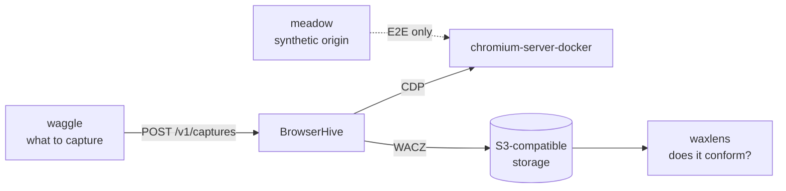

BrowserHive is one piece of a small set of repositories that capture, validate
and drive web archives. This page is the map: what each one does, and how it
touches BrowserHive.

## What BrowserHive is built on

### chromium-server-docker

<https://github.com/uraitakahito/chromium-server-docker> ·
[Docs](https://uraitakahito.github.io/chromium-server-docker/)

A container image running Chromium with the Chrome DevTools Protocol exposed.
BrowserHive never launches a browser itself — every worker connects over CDP to
one of these, which is why the worker pool can be scaled and replaced without
restarting the server.

Pinned as a **git submodule**, so a capture is always reproducible against the
Chromium build it was tested with.

### meadow

<https://github.com/uraitakahito/meadow> ·
[Docs](https://uraitakahito.github.io/meadow/)

The fixture origin the end-to-end suite captures against — a Fastify server that
serves pages designed to trigger one failure each: a page that navigates itself
mid-capture, images that only load on scroll, a body that arrives too slowly, an
origin that fails twice and then succeeds.

Pointing the E2E suite at a real website would test the internet as much as
BrowserHive. meadow makes the failure deterministic and available offline.

Also a **git submodule**, and a workspace package — see
[Development environment](/development-environment/).

## What drives BrowserHive

### waggle

<https://github.com/uraitakahito/waggle> ·
[Docs](https://uraitakahito.github.io/waggle/)

Reads URLs from a Postgres table and submits them to a BrowserHive instance,
then records what came back in an archive ledger. BrowserHive answers *"capture
this"*; waggle decides *what* to capture, *for whom*, and who may read the
result afterwards.

It consumes BrowserHive's OpenAPI spec directly — its client is generated from
it, so a breaking API change surfaces in waggle's build rather than at runtime.

## What checks the output

### waxlens

<https://github.com/uraitakahito/waxlens> ·
[Docs](https://uraitakahito.github.io/waxlens/)

A producer-independent validator for [WACZ](https://specs.webrecorder.net/wacz/1.1.1/)
archives. Point it at an archive — including one BrowserHive produced — and it
reports rule by rule what conforms and what does not.

Independent on purpose: a validator written against the same assumptions as the
producer cannot catch the assumptions themselves being wrong.

### waxlens-corpus

<https://github.com/uraitakahito/waxlens-corpus>

Sample WACZ archives that exercise waxlens's rules — one archive per rule that
violates it, plus a clean archive that passes them all. Not something
BrowserHive uses, but it is what gives the validator's verdict weight.

## Specifications

### WACZ

[Specification](https://specs.webrecorder.net/wacz/1.1.1/) ·
[日本語訳](https://uraitakahito.github.io/specs/wacz/1.1.1/)

The format BrowserHive emits: WARC data plus its metadata, packaged as a ZIP.
What the format requires and where BrowserHive deliberately diverges from a
literal reading is covered in [WACZ internals](/wacz-internals/).

### Data Package

[Specification](https://datapackage.org/)

WACZ embeds a `datapackage.json` following this standard, which is how a reader
discovers what is inside the archive without unpacking it.

## How they fit together

The dotted edge is the one that only exists in tests: in production Chromium
visits the real web, and meadow stands in for it when the suite needs a failure
on demand.
