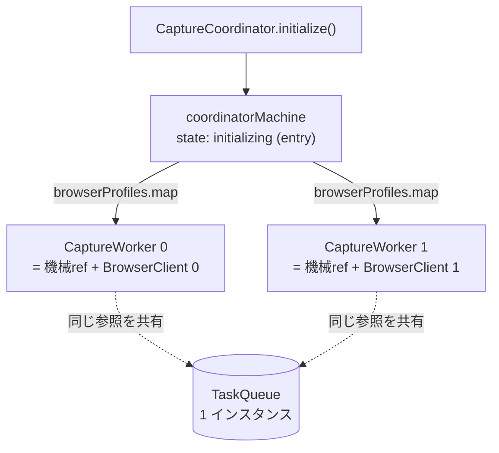
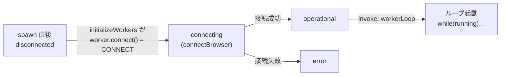
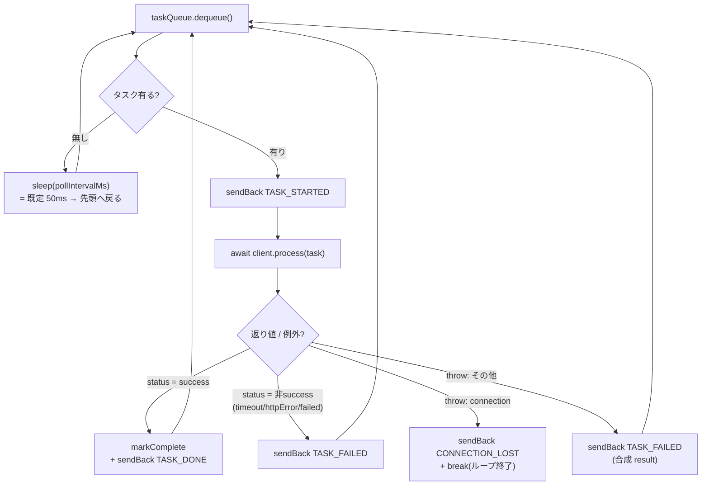
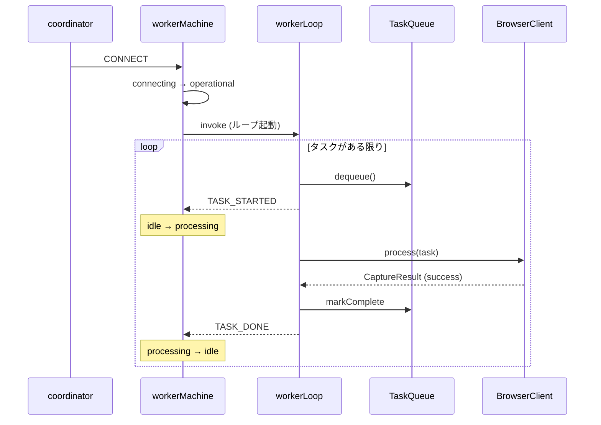

BrowserHive が「browserURL ごとに 1 つのワーカー」を生み出し、各ワーカーが
共有キューからタスクを取り続ける仕組みを、コードに沿って分解する。
ページ中のコード片は **browserhive の実ソースからビルド時に注入**しているので、
コードが変われば自動で追従する(手書きコピーではない)。

:::note[最初に要点(ここだけで全体像)]
1 ワーカーは **2 つの部品**でできている ―― **① 状態機械 `captureWorkerMachine`**
(接続してるか・処理中か等を管理する“台帳”)と、**② 作業ループ `workerLoop`**
(キューからタスクを取って実際に処理する“実働”)。ループは**機械が `operational`
の間だけ起動される子アクター**で、処理の結果を**イベントで機械に報告**し、機械が
それを見て「次のタスク可」「リトライ」等を決める。両者は**イベントで会話**する。

**生成は** coordinator が `browserProfiles`(= browserURL 群)を `map` して
**プロファイルごとに 1 アクターを spawn** ― ただし生まれた直後は `disconnected` で、
**ループはまだ回らない**。`CONNECT` 成功で `operational` に入って初めてループが起動する。
:::

:::tip[📘 前提知識:XState]
本ページは XState v5 の用語(`spawn` / `invoke` / `fromCallback` / `sendBack` /
guard / tags …)を使う。これらが初めてなら先に
[→ XState 入門 + BrowserHive で使う機能](/xstate-primer/)を読むと理解が早い。
:::

## 1. 登場人物 ― 「台帳」と「実働」を分ける

混乱しやすいのは「状態機械」と「ループ」が別物だという点。ここを最初に切り分ける。
各部品の**正体・役割の定義は[用語集](/terminology/)**にまとめてあるので、ここでは
**どのファイルに居るか**と、最重要の**「台帳(機械)」と「実働(ループ)」の切り分け**
だけ押さえる。

| 部品 | ファイル | 台帳 / 実働 |
|------|----------|-------------|
| [`CaptureCoordinator`](/terminology/#g-CaptureCoordinator) | `capture-coordinator.ts` | ―(ファサード) |
| [`coordinatorMachine`](/terminology/#g-coordinatorMachine) | `coordinator-machine.ts` | 台帳(親) |
| [`captureWorkerMachine`](/terminology/#g-captureWorkerMachine) | `capture-worker.ts` | **台帳(子)** |
| `CaptureWorker` | `capture-worker.ts` | 取っ手 |
| [`workerLoop`](/terminology/#g-workerLoop) | `worker-loop.ts` | **実働** |
| [`BrowserClient`](/terminology/#g-BrowserClient) | `browser-client.ts` | 実働(タブ保持) |
| [`TaskQueue`](/terminology/#g-TaskQueue) | `task-queue.ts` | 共有データ |

:::note[たとえ]
`captureWorkerMachine` は社員の**勤怠ボード**(「出社/接続済み/作業中/エラー」)。
`workerLoop` は社員**本人の作業**。本人は仕事の進捗を**付箋(イベント)**でボードに
貼り、ボードはそれを見て状態を更新する。ボードが「出社中(operational)」の札に
なっている間だけ、本人は働く。
:::

## 2. 生成 ― プロファイルごとに 1 アクター、キューは 1 つを共有

親機械が `initializing` に入った瞬間(entry)、`browserProfiles` を `map` して
**1 プロファイル = 1 ワーカーアクター**を `spawn` する。2 つの chromium-server を
指定すれば 2 ワーカー。各ワーカーには**同じ `taskQueue` 参照**を渡す。



*図1: spawn は browserURL の数だけ。全ワーカーが**同一 TaskQueue**を参照する
(コピーではなく参照渡し)ので二重処理が起きない。*

```ts file="src/capture/coordinator-machine.ts#spawn-workers"
```

:::caution[spawn しただけでは働かない]
生まれたワーカー機械の初期状態は `disconnected`。実働ループ(`workerLoop`)は
`operational` 状態でしか invoke されないので、**この時点ではまだ 1 件も処理しない**。
次節の `CONNECT` が要る。
:::

## 3. ループの起動条件 ― CONNECT 成功 → operational

spawn 直後、`initializeWorkers` アクターが**各ワーカーに `CONNECT` を送り**、全員が
落ち着く(operational か error)まで待つ。`CONNECT` → `connecting`(ブラウザ接続)
→ 成功で `operational`。**この `operational` の `invoke` としてループが起動する**。



*図2: 「生成(spawn)」と「ループ稼働」は別段階。CONNECT 成功で `operational` に
入って初めてループが回り始める。*

各ワーカーに `CONNECT` を送って settle を待つ(`initializeWorkers` の核):

```ts file="src/capture/coordinator-actors.ts#connect-and-settle"
```

`operational` がループ(`workerLoop`)を invoke する:

```ts file="src/capture/capture-worker.ts#operational-invoke"
```

:::note[なぜ invoke なのか]
ループを `operational` の `invoke` にすると、**状態を抜けた瞬間
(error/disconnecting/shutdown)に XState が自動でループを破棄**してくれる
(後述の cleanup)。状態とループの寿命が一致する。
:::

## 4. ループ本体 ― 取り出し → 処理 → 報告

ループは `fromCallback` で書かれた素朴な `while`。やることは「キューから 1 件取る →
無ければ少し寝る → あれば処理 → 結果に応じてイベントを親機械へ送る」の繰り返し。



*図3: 1 イテレーションの分岐。**成功は markComplete してから TASK_DONE**。失敗は
判断を親機械に委ね(TASK_FAILED)、**接続喪失だけはループを break** して機械を
error へ落とす。*

```ts file="src/capture/worker-loop.ts#loop-body"
```

:::note[なぜ成功時だけループ側で `markComplete` するのか]
失敗(`TASK_FAILED`/`CONNECTION_LOST`)は「リトライするか/諦めるか」で `requeue` か
`markComplete` かが変わる。その判断は**retry 予算を持つ親機械**にあるので、ループは
**報告だけ**して機械に任せる。成功は迷いが無いのでループ側で即 `markComplete`。
:::

## 5. イベントが機械を駆動する ― ループと台帳の会話

ループが送る 4 イベントを、親(ワーカー)機械がこう受ける。**processing 状態の中で**
TASK_DONE/TASK_FAILED を、**operational レベルで** CONNECTION_LOST を裁く(後者は
idle/processing どちらでも拾えるように一段上に置いてある)。

| ループ→機械のイベント | 機械の反応 | キュー操作 |
|------------------------|------------|------------|
| `TASK_STARTED` | `idle → processing`(currentTask 記録) | ―(dequeue 済) |
| `TASK_DONE` | `processing → idle`(processedCount++) | markComplete(ループが実施済) |
| `TASK_FAILED` | retry 予算内 → `idle`(retryTask)/ 尽きたら `idle`(failure 記録) | **requeue** または **markComplete** |
| `CONNECTION_LOST` | retry 予算内/尽きたの2分岐とも `→ error` | **requeue** または **markComplete** |

`processing` の中の裁き(`TASK_FAILED` は guard で 2 分岐):

```ts file="src/capture/capture-worker.ts#processing-transitions"
```

`canRetry` は `task.retryCount < maxRetryCount`(既定 2)。`retryTask` は
`taskQueue.requeue(task)`(retryCount を +1 して末尾へ)。

:::caution[CONNECTION_LOST だけ `break` する理由]
接続が切れたタブでは以降の処理ができない。だからループは **1 回 CONNECTION_LOST を
送って `break`(=ループ終了)**。機械は `error` へ落ち、ループ invoke も破棄される。
復帰は**親 coordinator の degraded リトライ**が `error` ワーカーに `CONNECT` を再送して
行う(→ また connecting → operational → 新しいループ起動)。
:::

## 6. 共有キューと work-stealing ― なぜ二重処理しないか

`TaskQueue` は **1 インスタンス**を全ワーカーで共有(参照渡し)。`dequeue` は配列の
`shift`(FIFO)で、取り出した `taskId` を `processing` 集合へ移す。これにより**同じ
タスクを 2 ワーカーが取ることはない**(早い者勝ち=work-stealing)。タスクは特定の
chromium-server に固定されず、手が空いたワーカーが次を引く。

取り出し ― 先頭を取って `processing` へ移す:

```ts file="src/capture/task-queue.ts#dequeue"
```

差し戻し ― `processing` から外し、retryCount を +1 して末尾へ:

```ts file="src/capture/task-queue.ts#requeue"
```

完了 ― `processing` から外し `completed` へ:

```ts file="src/capture/task-queue.ts#markComplete"
```

| 集合 | 意味 | 遷移 |
|------|------|------|
| `queue[]` | 待機中(FIFO) | enqueue で末尾追加 / dequeue で先頭除去 |
| `processing` | 取り出され処理中 | dequeue で追加 / markComplete・requeue で除去 |
| `completed` | 完了(成功 or 諦め) | markComplete で追加 |

`/v1/status` はこの 3 集合の数と `peekPending`(先頭 N 件)で全体像を出す。
`processing` に入れて完了で必ず除く設計なので、**失敗時に `requeue`/`markComplete` の
どちらかを必ず呼ぶ**(= タスクが processing に居座らない)ことが重要 ―
CONNECTION_LOST にも task を載せて機械に裁かせるのはこのため。

## 7. 停止と後始末

ループの寿命は `operational` 状態に紐づく。`fromCallback` は **① 親からの停止信号
(receive)** と **② アクター破棄時の cleanup(return する関数)** の両方で
`running=false` にして安全に抜ける。

```ts file="src/capture/worker-loop.ts#loop-lifecycle"
```

つまり `operational` を抜ける契機 ―― `DISCONNECT`(→ disconnecting)、
`CONNECTION_LOST`(→ error)、shutdown ―― のどれでも、XState が invoke を捨て、
この cleanup が走って `while(running)` が止まる。次に `operational` に入れば
**新しいループが改めて invoke される**(状態とループが 1:1 で生き死にする)。

## 8. 全体シーケンス(1 タスクの一生)



*図4: CONNECT で operational に入りループ起動 → 各タスクは
dequeue→process→(成功なら)markComplete+TASK_DONE。失敗系は
TASK_FAILED/CONNECTION_LOST で機械が requeue/諦めを判断。*

:::tip[まとめ]
**生成**=プロファイルごとに 1 アクター spawn(キューは 1 つ共有)。**起動**=CONNECT
成功で operational に入り、その invoke としてループが回る。**ループ**=dequeue→process
→結果をイベントで報告。**機械**=そのイベントで idle/processing/error を更新し、失敗時の
リトライ可否(requeue / 諦め)を裁く。**停止**=operational を抜けると invoke 破棄で
running=false。
:::
