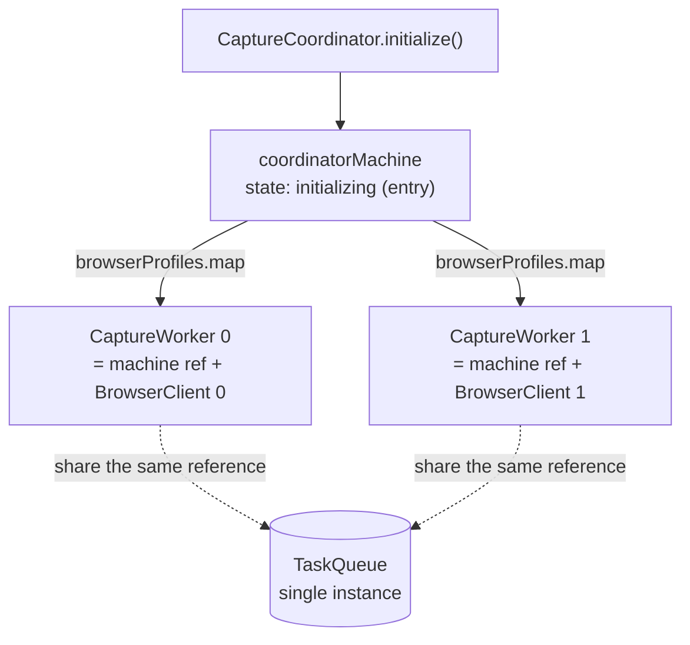
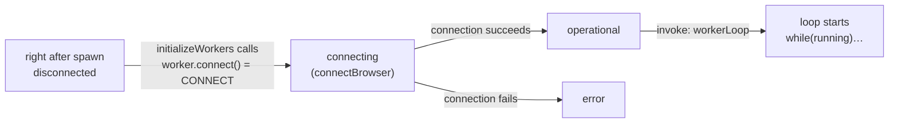
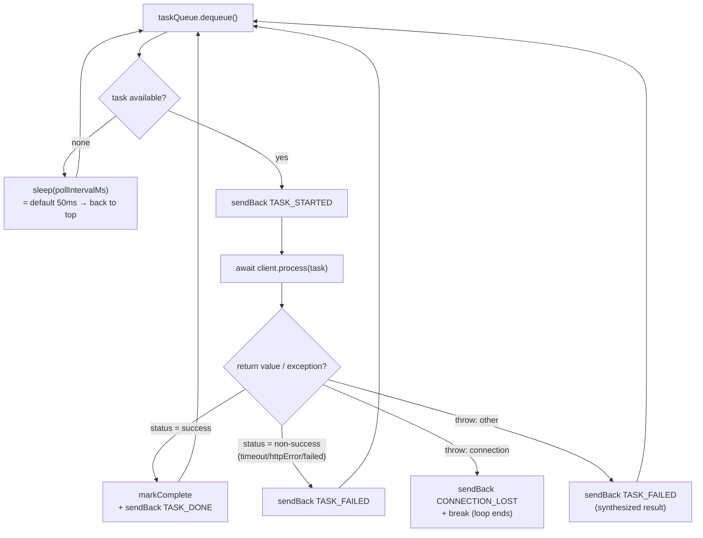
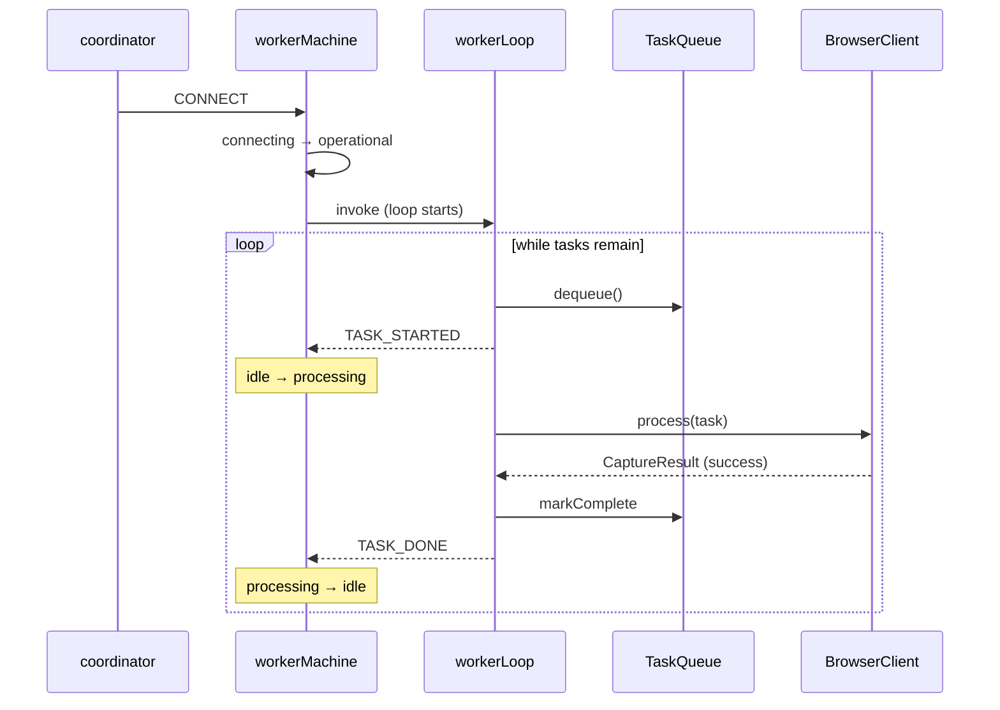

This page breaks down, along the code, how BrowserHive spawns "one worker
per browserURL" and how each worker keeps pulling tasks from the shared
queue. The code snippets on this page are **injected at build time from the
real browserhive source**, so they follow the code automatically (they are
not hand-written copies).

:::note[The gist first (the whole picture in one box)]
One worker is made of **two parts** — **① the state machine
`captureWorkerMachine`** (the "ledger" that tracks connected / processing /
etc.) and **② the work loop `workerLoop`** (the "hands" that pull tasks from
the queue and actually process them). The loop is a **child actor invoked
only while the machine is in `operational`**; it **reports results to the
machine as events**, and the machine uses them to decide "ready for the next
task", "retry", and so on. The two talk **exclusively through events**.

**Spawning**: the coordinator `map`s over `browserProfiles` (= the
browserURLs) and **spawns one actor per profile** — but a freshly spawned
worker sits in `disconnected` and **the loop is not running yet**. Only when
`CONNECT` succeeds does it enter `operational`, and only then does the loop
start.
:::

:::tip[📘 Prerequisite: XState]
This page uses XState v5 terms (`spawn` / `invoke` / `fromCallback` /
`sendBack` / guard / tags …). If they are new to you, read
[→ XState primer + the features BrowserHive uses](/xstate-primer/) first.
:::

## 1. The cast — separating the "ledger" from the "hands"

The easy confusion is that the "state machine" and the "loop" are different
things, so we cut that apart first. The **identity and role of each part is
defined in the [Terminology](/terminology/)** page; here we only pin down
**which file each lives in** and the all-important **ledger (machine) vs
hands (loop)** split.

| Part | File | Ledger / hands |
|------|------|----------------|
| [`CaptureCoordinator`](/terminology/#g-CaptureCoordinator) | `capture-coordinator.ts` | — (facade) |
| [`coordinatorMachine`](/terminology/#g-coordinatorMachine) | `coordinator-machine.ts` | Ledger (parent) |
| [`captureWorkerMachine`](/terminology/#g-captureWorkerMachine) | `capture-worker.ts` | **Ledger (child)** |
| `CaptureWorker` | `capture-worker.ts` | Handle |
| [`workerLoop`](/terminology/#g-workerLoop) | `worker-loop.ts` | **Hands** |
| [`BrowserClient`](/terminology/#g-BrowserClient) | `browser-client.ts` | Hands (owns the tab) |
| [`TaskQueue`](/terminology/#g-TaskQueue) | `task-queue.ts` | Shared data |

:::note[Analogy]
`captureWorkerMachine` is an employee's **attendance board** ("in the
office / connected / working / error"). `workerLoop` is the employee's
**actual work**. The employee posts progress to the board as **sticky notes
(events)**, and the board updates its state accordingly. The employee works
only while the board shows the "present (operational)" tag.
:::

## 2. Spawning — one actor per profile, one queue shared by all

The moment the parent machine enters `initializing` (entry), it `map`s over
`browserProfiles` and **spawns one worker actor per profile**. Point it at
two chromium workers and you get two workers. Every worker receives **the
same `taskQueue` reference**.



*Fig. 1: One spawn per browserURL. Every worker references the **same
TaskQueue** (passed by reference, not copied), so no task is processed
twice.*

```ts file="src/capture/coordinator-machine.ts#spawn-workers"
```

:::caution[Spawning alone does no work]
A freshly spawned worker machine starts in `disconnected`. The work loop
(`workerLoop`) is only invoked in the `operational` state, so **nothing is
processed at this point**. The `CONNECT` of the next section is required.
:::

## 3. What starts the loop — CONNECT success → operational

Right after spawning, the `initializeWorkers` actor **sends `CONNECT` to
every worker** and waits until everyone settles (operational or error).
`CONNECT` → `connecting` (browser connection) → on success `operational`.
**The loop is invoked as the `invoke` of this `operational` state.**



*Fig. 2: "Spawning" and "loop running" are separate phases. Only after
CONNECT succeeds and the machine enters `operational` does the loop start
turning.*

Sending `CONNECT` to every worker and awaiting settle (the core of
`initializeWorkers`):

```ts file="src/capture/coordinator-actors.ts#connect-and-settle"
```

`operational` invokes the loop (`workerLoop`):

```ts file="src/capture/capture-worker.ts#operational-invoke"
```

:::note[Why invoke]
Making the loop the `invoke` of `operational` means **XState automatically
disposes the loop the moment the state is left** (error / disconnecting /
shutdown — see cleanup below). The state's lifetime and the loop's lifetime
coincide.
:::

## 4. The loop body — dequeue → process → report

The loop is a plain `while` written with `fromCallback`. It repeats: "take
one item from the queue → if none, sleep a bit → if there is one, process it
→ send the machine an event according to the result."



*Fig. 3: One iteration's branches. **Success runs markComplete and then
TASK_DONE**. Failures defer the judgement to the parent machine
(TASK_FAILED); **only connection loss breaks the loop**, dropping the
machine into error.*

```ts file="src/capture/worker-loop.ts#loop-body"
```

:::note[Why only success calls `markComplete` inside the loop]
For failures (`TASK_FAILED` / `CONNECTION_LOST`), whether to `requeue` or
`markComplete` depends on "retry or give up" — a judgement that belongs to
**the parent machine, which owns the retry budget**. So the loop **only
reports** and leaves it to the machine. Success has no ambiguity, so the
loop calls `markComplete` immediately.
:::

## 5. Events drive the machine — the loop/ledger conversation

The four events the loop sends, and how the parent (worker) machine receives
them: TASK_DONE / TASK_FAILED are judged **inside the processing state**,
CONNECTION_LOST **at the operational level** (placed one level up so it can
be caught in either idle or processing).

| Event (loop → machine) | Machine's reaction | Queue operation |
|------------------------|--------------------|-----------------|
| `TASK_STARTED` | `idle → processing` (records currentTask) | — (already dequeued) |
| `TASK_DONE` | `processing → idle` (processedCount++) | markComplete (already done by the loop) |
| `TASK_FAILED` | within retry budget → `idle` (retryTask) / exhausted → `idle` (records failure) | **requeue** or **markComplete** |
| `CONNECTION_LOST` | both branches (budget left / exhausted) `→ error` | **requeue** or **markComplete** |

The judgement inside `processing` (`TASK_FAILED` branches on a guard):

```ts file="src/capture/capture-worker.ts#processing-transitions"
```

`canRetry` is `task.retryCount < maxRetryCount` (default 2). `retryTask` is
`taskQueue.requeue(task)` (increments retryCount and appends to the tail).

:::caution[Why only CONNECTION_LOST `break`s]
A tab whose connection is gone cannot process anything further. So the loop
**sends CONNECTION_LOST once and `break`s (= ends the loop)**. The machine
falls to `error`, and the loop invoke is disposed. Recovery is done by **the
parent coordinator's degraded retry**, which re-sends `CONNECT` to the
`error` worker (→ connecting again → operational → a fresh loop starts).
:::

## 6. The shared queue and work-stealing — why nothing is processed twice

`TaskQueue` is **a single instance** shared by every worker (by reference).
`dequeue` is an array `shift` (FIFO) that also moves the taken `taskId` into
the `processing` set. Hence **no two workers can take the same task**
(first-come-first-served = work-stealing). Tasks are not pinned to a
particular chromium worker; whichever worker is free pulls the next one.

Dequeue — take the head and move it into `processing`:

```ts file="src/capture/task-queue.ts#dequeue"
```

Requeue — remove from `processing`, increment retryCount, append to the tail:

```ts file="src/capture/task-queue.ts#requeue"
```

Complete — remove from `processing` and add to `completed`:

```ts file="src/capture/task-queue.ts#markComplete"
```

| Set | Meaning | Transitions |
|-----|---------|-------------|
| `queue[]` | Waiting (FIFO) | enqueue appends / dequeue removes the head |
| `processing` | Taken and in flight | added by dequeue / removed by markComplete · requeue |
| `completed` | Done (success or given up) | added by markComplete |

`/v1/status` reports the sizes of these three sets plus `peekPending` (the
first N entries). Because the design adds to `processing` and always removes
on completion, it is essential that **failures always call either `requeue`
or `markComplete`** (= no task squats in `processing`) — which is exactly
why CONNECTION_LOST also carries the task, so the machine can judge it.

## 7. Stopping and cleanup

The loop's lifetime is tied to the `operational` state. The `fromCallback`
sets `running=false` and exits safely through both **① a stop signal from
the parent (receive)** and **② the cleanup on actor disposal (the returned
function)**.

```ts file="src/capture/worker-loop.ts#loop-lifecycle"
```

That is: whichever way `operational` is left — `DISCONNECT`
(→ disconnecting), `CONNECTION_LOST` (→ error), or shutdown — XState drops
the invoke, this cleanup runs, and `while(running)` stops. The next time the
machine enters `operational`, **a brand-new loop is invoked** (state and
loop live and die 1:1).

## 8. Full sequence (the life of one task)



*Fig. 4: CONNECT enters operational and starts the loop → each task is
dequeue → process → (on success) markComplete + TASK_DONE. Failure paths go
through TASK_FAILED / CONNECTION_LOST and the machine decides requeue vs
give-up.*

:::tip[Summary]
**Spawn** = one actor per profile (one shared queue). **Start** = CONNECT
success enters operational, whose invoke runs the loop. **Loop** = dequeue →
process → report results as events. **Machine** = updates
idle/processing/error from those events and judges retry-ability on failure
(requeue / give up). **Stop** = leaving operational disposes the invoke and
sets running=false.
:::
