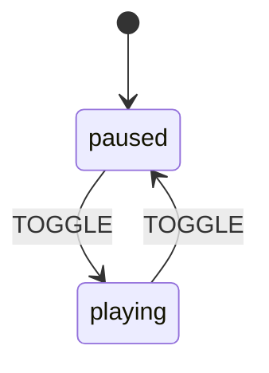
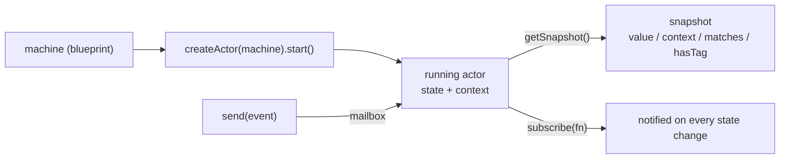
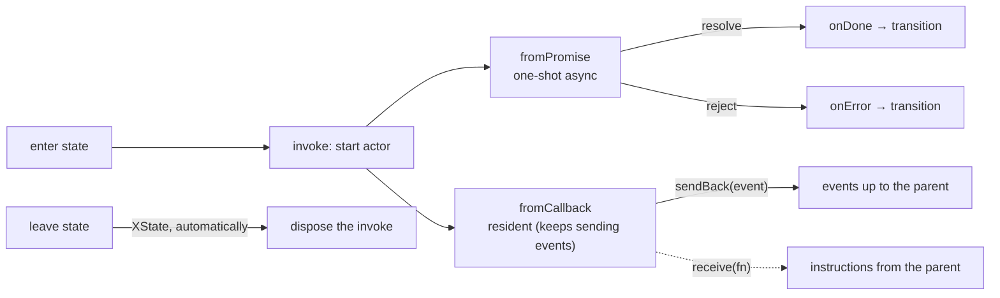
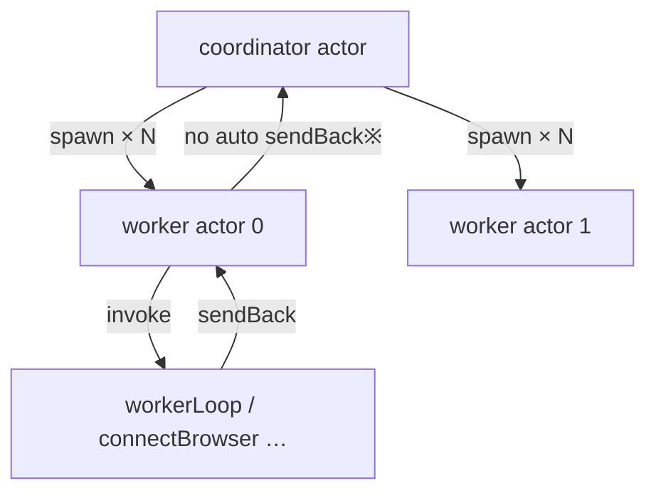

BrowserHive's orchestration is built from XState v5 state machines. As groundwork for reading the source, this page covers the XState fundamentals (Part A) and the features BrowserHive actually uses (Part B), following the code.

:::note[30-second summary]
An XState **state machine** is a tool for declaring "which **state** we are in now" and "which **event** causes a **transition** to which state". Running one produces an **actor**: drive it with `send(event)` and peek with `getSnapshot()`. A state machine folds a **scatter of booleans** (`isConnecting` / `isBusy` / `hasError` …) into **one "current state"**, ruling out impossible combinations **structurally**.

BrowserHive uses v5's **actor model**: the coordinator actor **spawn**s worker actors, each worker **invoke**s `fromPromise` (connection) / `fromCallback` (processing loop) actors, and results are **reported to the parent as events**.
:::

## — Part A: XState fundamentals —

## A1. Why state machines — folding the boolean swamp

Holding "connecting?", "busy?", "error?" as separate booleans lets you express **impossible combinations** like `isConnecting && hasError`, and the branching explodes. A state machine decides "we are in exactly **one state**" and only writes **which event moves us where**. The biggest win: **unreachable and contradictory states disappear by type and structure**.

:::tip[Analogy]
A traffic light. Red, yellow, and green never shine at once (= exclusive states). You only decide "on timer expiry (an event), advance to the next". With three booleans (`red/yellow/green`) you could write "red and green".
:::

## A2. The four cores — State / Event / Transition / Context



*Fig. A: A minimal machine (play/pause). **States** paused/playing, **event** TOGGLE, **transitions** are the arrows. In XState this becomes ↓*

```ts
// A minimal machine (XState v5, generic example). Toggles paused ⇄ playing and
// increments playCount every time playback starts (paused→playing).
import { setup, assign, createActor } from "xstate";

const player = setup({
  // types = the place to declare *types* only, not values. `{} as T` means "empty value, typed as T".
  types: {
    context: {} as { playCount: number }, // the shape of this machine's context
    events:  {} as { type: "TOGGLE" },    // the events it can receive (only TOGGLE here)
  },
}).createMachine({
  initial: "paused",         // starting state
  context: { playCount: 0 }, // initial context value
  states: {
    paused: {                 // ← definition of state "paused" (state names are free-form)
      on: {                   //   on = this state's "event → transition" table (a reserved XState key)
        TOGGLE: {             //   when TOGGLE arrives…
          target: "playing",                                    //     transition to playing, and
          actions: assign({ playCount: ({ context }) => context.playCount + 1 }), // +1
        },
      },
    },
    playing: {
      on: { TOGGLE: "paused" },  // TOGGLE in playing → paused. Shorthand (target only, no actions)
    },
  },
});
```

### The shape of the code — unpacking the nesting

The config is a **nested object**. Reduced to its skeleton:

```ts
createMachine({
  initial,              // ← which state to start in
  context,              // ← initial values of data that state names cannot express
  states: {             // ← the set of possible states
    <stateName>: {
      on: {             // ← this state's "event → transition" table
        <eventName>: <transition>     // ← two ways to write a transition (below)
      }
    }
  }
})
```

**Transitions come in two spellings**, chosen by "just move" vs "move + side effect":

- **Shorthand** `TOGGLE: "paused"` — the string is **the target state name**. "On TOGGLE, just move to paused."
- **Full form** `TOGGLE: { target: "playing", actions: … }` — besides `target`, you can attach `actions` (side effects that run with the transition).

`assign({ playCount: ({ context }) => context.playCount + 1 })` is the side effect "replace `playCount` in context with **its current value +1**". It is a function so it can **read the current context / event and compute the new value** (`({ context }) => …` receives the current context).

### What happens on each TOGGLE (execution trace)

The behavior as you repeatedly `send({ type: "TOGGLE" })` to the actor: **look up `on.TOGGLE` of the current state** and apply that transition:

| Current state | Current playCount | Transition looked up for TOGGLE | Result |
|---------------|-------------------|--------------------------------|--------|
| `paused` | 0 | `{ target:"playing", actions:+1 }` | `playing` / playCount **1** |
| `playing` | 1 | `"paused"` (shorthand, no actions) | `paused` / playCount 1 (**unchanged**) |
| `paused` | 1 | `{ target:"playing", actions:+1 }` | `playing` / playCount **2** |

The point: **playCount only grows on `paused→playing`** — the `playing→paused` transition has no `actions`. You can see that **state (paused/playing) and context (playCount) move independently**. That is the "state = mode / context = accompanying data" intuition.

For each concept's definition, see the glossary entries (📖): [State](/glossary-reference/#t-state) / [Event](/glossary-reference/#t-event) / [Transition](/glossary-reference/#t-transition) / [Context](/glossary-reference/#t-context).

:::note[State vs context]
**State** = a "discrete mode" (countable); **context** = "continuous values / arbitrary data" (counters, error history, the current task, …). For a BrowserHive worker: state = `operational`, context = `processedCount` / `currentTask`.
:::

## A3. Actors — what a machine becomes when you "run" it

A machine (the return value of `createMachine`) is a **blueprint**. `createActor(machine).start()` turns it into a **running instance = an actor**. The actor holds the current state + context, **receives events** to transition, and can be **observed from outside**.



*Fig. B: An actor interacts with the outside through "send / getSnapshot / subscribe". You never poke the internal state directly — events only.*

```ts
// Operating an actor (generic example)
const actor = createActor(player);
actor.subscribe((snap) => console.log(snap.value, snap.context.playCount)); // subscribe to changes
actor.start();                          // → "paused"
actor.send({ type: "TOGGLE" });        // → "playing",  playCount 1
actor.getSnapshot().value;             // "playing"
actor.getSnapshot().matches("playing");  // true (state test)
```

:::note[The actor model is the heart of v5]
XState v5 is **actor-centric**. One actor can **spawn** other actors (dynamic creation) or **invoke** them (bound to a state), and they **communicate via events**. BrowserHive's coordinator→worker→loop hierarchy is exactly this (Part B).
:::

## A4. Side effects — actions / assign / guards / invoke·spawn

State machines are not just pure transitions; they can raise **side effects along with** a transition. BrowserHive leans on four kinds: [**actions**](/glossary-reference/#t-action) (synchronous side effects) / [**assign**](/glossary-reference/#t-assign) (context updates) / [**guards**](/glossary-reference/#t-guard) (conditions on transitions) / [**invoke**](/glossary-reference/#t-invoke)·[**spawn**](/glossary-reference/#t-spawn) (starting other actors) — each linked to its glossary entry. Here we look at the especially important **branching with guards**.

Writing **multiple transitions as an array** for one event selects **the first branch whose guard passes, top-down** (this is BrowserHive's retry decision):

```ts
// guard array (the first passing branch wins)
on: { TASK_FAILED: [
  { guard: "canRetry", target: "idle", actions: "retryTask" },   // if budget remains
  {                      target: "idle", actions: "markComplete" }, // otherwise (give up)
]}
```

## A5. setup() — v5's "typed parts box"

In v5 you **register the parts (types / actors / guards / actions) first** with `setup({...})`, then **reference them by string name** inside `createMachine`. Types flow through and the machine definition reads declaratively. Both BrowserHive machines take this shape.

```ts
// The setup skeleton (all of BrowserHive follows this shape)
setup({
  types:  { context: {} as Ctx, input: {} as In, events: {} as Ev },  // types
  actors: { connectBrowser, workerLoop /* … */ },   // actors available to invoke
  guards: { canRetry: ({ context, event }) => … },  // conditions
  actions:{ setCurrentTask: assign({ … }) },         // side effects
}).createMachine({
  id: "…", initial: "…", context: ({ input }) => ({ … }), states: { … },
});
```

:::tip[Part A recap]
A machine = a blueprint of states + events + transitions + context. `createActor().start()` makes it an **actor**, handled via `send`/`getSnapshot`/`subscribe`. Side effects are **actions / assign / guards / invoke·spawn**. v5 = **register parts in setup(), reference by name**. That is all you need to read BrowserHive's machines.
:::

## — Part B: the features BrowserHive uses —

The BrowserHive code snippets from here on are **excerpts for understanding**. The **complete versions, injected at build time from the real source**, live in [Worker spawn & loop](/worker-spawn-and-loop/), and the identity/role of each part is defined in the [Terminology](/terminology/) page — go there to follow the actual code.

## B1. The two machines and the "shape" of states (compound / final)

BrowserHive has a parent and a child machine. Both use **compound states (nested states)**: `running`/`degraded` inside `active`, and `idle`/`processing` inside `operational`. An `invoke` or `on:{SHUTDOWN}` attached to the parent's `active` is **unaffected** by the internal `running↔degraded` shuttling (that is the point of nesting). The terminal is `type:"final"` (the coordinator's `terminated`).

```ts
// coordinator-machine.ts — the compound state "active" (excerpt)
active: {
  invoke: { src: "watchWorkerHealth" },  // runs the whole time we are in active (running/degraded alike)
  on: { SHUTDOWN: "shuttingDown" },        // works from any substate of active
  initial: "running",
  states: {
    running:  { on: { WORKER_DEGRADED:    "degraded" } },
    degraded: { invoke: { src: "retryFailedWorkers" }, on: { ALL_WORKERS_HEALTHY: "running" } },
  },
},
terminated: { type: "final" },         // terminal state
```

For the full, code-accurate [`coordinatorMachine`](/terminology/#g-coordinatorMachine) / [`captureWorkerMachine`](/terminology/#g-captureWorkerMachine), see the [Terminology](/terminology/) page and [Worker spawn & loop](/worker-spawn-and-loop/).

:::note[Typed events]
Events are typed as a **discriminated union**. The worker machine's example: `{type:"CONNECT"} | {type:"TASK_DONE"; task; result} | {type:"CONNECTION_LOST"; task; message} | …`. Inside each transition handler you access `event.task` etc. type-safely.
:::

## B2. invoke and the two actor kinds — fromPromise / fromCallback

Attach an `invoke` to a state and another actor runs **only while in that state**, stopping **automatically on exit**. BrowserHive uses two kinds.



*Fig. C: **fromPromise** = a "do it and return the result" one-shot (branch via onDone/onError). **fromCallback** = a resident worker that "keeps running and sendBacks as it goes".*

### fromPromise — one-shot async (connect / initialize / disconnect / shutdown)

Just return a Promise. The resolved value arrives in `onDone`'s `event.output`, and a **guarded array** branches on the result.

```ts
// capture-worker.ts — the connecting state invokes connectBrowser (fromPromise)
connectBrowser: fromPromise(async ({ input }) => input.client.connect()),  // returns Result<void,Err>
// …states.connecting:
invoke: {
  src: "connectBrowser",
  input: ({ context }) => ({ client: context.runtime.client }),
  onDone: [
    { guard: ({ event }) => event.output.ok, target: "operational" },  // success
    { target: "error", actions: assign({ /* append errorHistory */ }) },     // failure
  ],
}
```

:::note[A no-throw design]
BrowserHive's `fromPromise`s **return** `Result<void, ErrorDetails>` (they do not reject). Hence failures are guard-branched on `event.output.ok` inside `onDone` rather than in `onError`. Failure travels as a value, not an exception.
:::

### fromCallback — resident (processing loop / health watch / reconnection)

The function receives `{ sendBack, receive, input }`, and **keeps running while sending events to the parent**. The returned function is the **cleanup** (called when the state is left). `workerLoop` is one of these.

```ts
// worker-loop.ts — the fromCallback skeleton
export const workerLoopCallback = fromCallback(({ sendBack, receive, input }) => {
  let running = true;
  const loop = async () => {
    while (running) {
      const task = input.taskQueue.dequeue();
      if (!task) { await sleep(input.pollIntervalMs); continue; }
      sendBack({ type: "TASK_STARTED", task });   // ← event to the parent (worker machine)
      /* … client.process → sendBack TASK_DONE / TASK_FAILED / CONNECTION_LOST … */
    }
  };
  void loop();
  receive(() => { running = false; });    // stop message from the parent
  return () => { running = false; };       // cleanup: called when leaving the state (operational)
});
```

|  | `fromPromise` | `fromCallback` |
|--|---------------|----------------|
| Lifetime | ends after one resolve/reject | resident (until explicit stop or state exit) |
| Notifying the parent | `onDone` / `onError` | `sendBack(event)` any time |
| Instructions from the parent | none | `receive(fn)` |
| In BrowserHive | connectBrowser / disconnectBrowser / initializeWorkers / shutdownWorkers | workerLoop / watchWorkerHealth / retryFailedWorkers |

## B3. spawn and parent/child actors — the coordinator births the workers

Where `invoke` is "one actor bound to a state", `spawn` **dynamically creates multiple actors** and keeps them in context. The coordinator `spawn`s **as many worker actors as there are browserURLs** in the `entry` of `initializing`.



*Fig. D: Three tiers. The coordinator spawns workers; workers invoke the loop etc. ※ A spawned child has no automatic sendBack to its parent — BrowserHive has the parent `subscribe` to each child to watch health (watchWorkerHealth).*

```ts
// coordinator-machine.ts — spawn in entry, keep the refs in context
entry: assign({
  workers: ({ context, spawn }) =>
    context.config.browserProfiles.map((profile, index) => {
      const client = new BrowserClient(index, profile, context.store);
      const ref = spawn("captureWorker", { id: `worker-${index}`, input: { /* maxRetryCount, runtime… */ } });
      return new CaptureWorker(ref, client);  // ref = ActorRef (a handle with send/subscribe/getSnapshot)
    }),
})
```

To follow the [`captureWorkerMachine`](/terminology/#g-captureWorkerMachine) / [`workerLoop`](/terminology/#g-workerLoop) / [`BrowserClient`](/terminology/#g-BrowserClient) that `spawn` produces in the real code, see [Worker spawn & loop](/worker-spawn-and-loop/).

:::note[invoke vs spawn]
**invoke** = "one actor for the duration of this state; auto-stop on exit" (workerLoop). **spawn** = "create N now, hold them in context, manage the lifetime yourself" (the worker set). If the count is dynamic or the lifetime differs from a state's, spawn.
:::

## B4. guards / tags / the outside-the-machine API

### guard — judging the retry budget

```ts
// capture-worker.ts — a named guard registered in setup, referenced from the transition array
guards: { canRetry: ({ context, event }) =>
  (event.type === "TASK_FAILED" || event.type === "CONNECTION_LOST") &&
  event.task.retryCount < context.maxRetryCount },
```

### tags — bundle states under a "label", tested from outside

Attach `tags` to states and ask about properties **without knowing state names** via `snapshot.hasTag("…")`: `"healthy"` on `operational`, `"canProcess"` on `operational.idle`.

```ts
// capture-worker.ts
operational: { tags: ["healthy"], initial: "idle", states: { idle: { tags: ["canProcess"] }, processing: {} } }
// consumer side (CaptureWorker.isHealthy):
get isHealthy() { return this.ref.getSnapshot().hasTag("healthy"); }
```

### Touching the machine from outside — createActor / send / getSnapshot / matches / subscribe

Classes ([`CaptureCoordinator`](/terminology/#g-CaptureCoordinator) / `CaptureWorker`) act as the machine's **handles**, exposing domain operations.

```ts
// capture-coordinator.ts — start the root actor and drive it via send/getSnapshot
this.lifecycleActor = createActor(coordinatorMachine, { input: { config, store } });
this.lifecycleActor.start();
// …
this.lifecycleActor.send({ type: "INITIALIZE" });                 // inject an event
get isActive() { return this.lifecycleActor.getSnapshot().matches("active"); }  // state test (nested too: {active:"running"})
```

:::note[`matches` and nesting]
`matches("active")` is true in **any substate of `active.*`**. For a specific one, `matches({ active: "running" })`. BrowserHive distinguishes "running at all" with `matches("active")` from "everyone healthy" with `matches({active:"running"})`.
:::

## B5. Cheat sheet — XState feature → where BrowserHive uses it

| XState feature | Role | Used in BrowserHive |
|----------------|------|---------------------|
| `setup().createMachine()` | typed parts → machine definition | coordinatorMachine / captureWorkerMachine |
| compound state | nested states | `active{running,degraded}` / `operational{idle,processing}` |
| `type:"final"` | terminal state | the coordinator's `terminated` |
| typed events (union) | type-safe events | CONNECT / TASK_DONE / CONNECTION_LOST … |
| `entry` + `assign` + `spawn` | build context / spawn children on state entry | spawning the worker set in `initializing` |
| `invoke` + `fromPromise` | one-shot async (onDone/onError) | connectBrowser / disconnectBrowser / initializeWorkers / shutdownWorkers |
| `invoke` + `fromCallback` | resident actor (sendBack/receive) | workerLoop / watchWorkerHealth / retryFailedWorkers |
| `guard` + transition array | conditional branch (first passing wins) | `canRetry` → requeue / give up |
| `tags` + `hasTag` | label states, test properties externally | `healthy` / `canProcess` |
| nested target | transition into a nested state | `target:"active.running"` |
| actor API (`createActor`/`send`/`getSnapshot`/`matches`/`subscribe`) | drive & observe from outside | CaptureCoordinator / CaptureWorker / watchWorkerHealth |

:::tip[Read next]
With the right column of this table in mind, read [**Worker spawn & loop**](/worker-spawn-and-loop/) — the spawn→invoke→sendBack flow should now be traceable in the code.
:::
