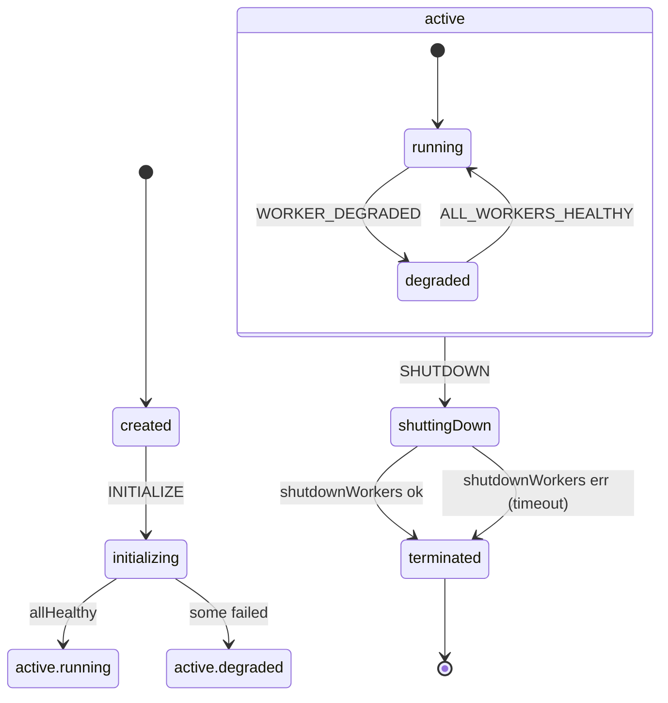
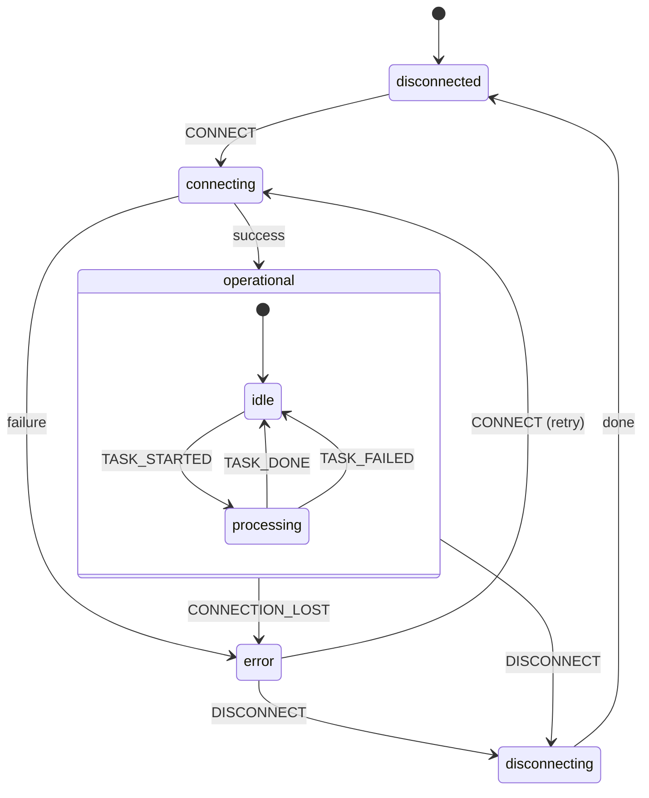

# State Machines

The system uses [XState v5](https://stately.ai/docs) state machines with a Parent-Child Actor Model.

## Coordinator Lifecycle

`running` and `degraded` are substates of a compound `active` state. The
`watchWorkerHealth` invoke and the `SHUTDOWN` transition live on `active`,
so they are unaffected by `running ↔ degraded` oscillations.

Init failures are non-fatal: partial or total connect failures land in
`active.degraded` instead of `terminated`. While in `active.degraded`, the
coordinator periodically retries failed workers (1s → 2s → 4s → … capped at
60s) and lifts back to `active.running` once every worker is healthy.
`submitCapture` is accepted while in any `active.*` substate as long as at
least one worker is operational.

## Capture Worker

Each capture worker actor uses compound states. The `operational` state invokes a `fromCallback` worker loop that polls the task queue and processes captures. The `connecting` and `disconnecting` states invoke `fromPromise` actors that return `Result<void, ErrorDetails>` instead of throwing — the machine branches in `onDone` on `event.output.ok`. Disconnect failures still transition to `disconnected` (best-effort) but log the underlying error. From `error`, the coordinator's retry actor (running while in the `degraded` lifecycle) sends `CONNECT` to bring the worker back through `connecting`.

| State | Tags | Description |
|-------|------|-------------|
| `disconnected` | | Not connected to remote browser (initial or after disconnect) |
| `connecting` | | Connecting to remote browser (invoke) |
| `operational.idle` | `healthy`, `canProcess` | Ready to accept tasks |
| `operational.processing` | `healthy` | Processing a capture task |
| `error` | | Connection lost or connect failure |
| `disconnecting` | | Disconnecting browser (invoke) |
